# Introdução

Antes de aplicar técnicas estatísticas em contextos de negócios, é importante situar o vocabulário e os principais conceitos utilizados no mercado de trabalho ao redor de dados: **Papéis e Profissionais da Área de Dados**, **Conceitos Tecnológicos** e **Jargões de Negócio**, encerrando com uma reflexão sobre **Mercado vs. Academia**.

Slides originais disponíveis [AQUI](https://github.com/renanxcortes/teaching/raw/refs/heads/main/Estatistica_Aplicada_Negocios/slides/1_introducao_teorica.pdf).

# Papéis e Profissionais da Área de Dados

Qual a diferença entre os papéis e profissionais da área de dados (Cientista, Analista, Engenheiro, etc.)? Antes de responder, vale um contexto histórico sobre como esses papéis surgiram e ganharam destaque.

> "the sexiest job in the next 10 years will be statisticians." — Hal Varian (2009), economista-chefe do Google de 2002 até agosto de 2025 (aposentou-se).

{width="300px"}

> "Statistics is now the sexiest job around" — Hans Rosling (2011), em documentário da BBC.

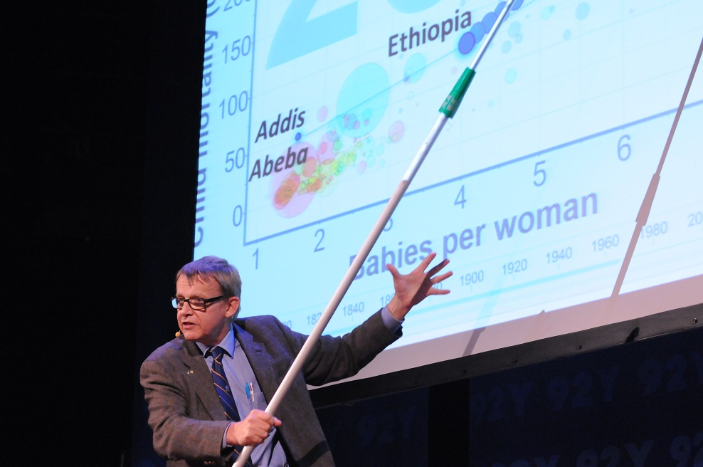{width="300px"}

Em outubro de 2012, Thomas H. Davenport e D.J. Patil publicaram o famoso artigo *"Data Scientist: The Sexiest Job of the 21st Century"*, no qual afirmam:

> "Cientistas de Dados hoje são como os *quants* de Wall Street nas décadas de 80 e 90."

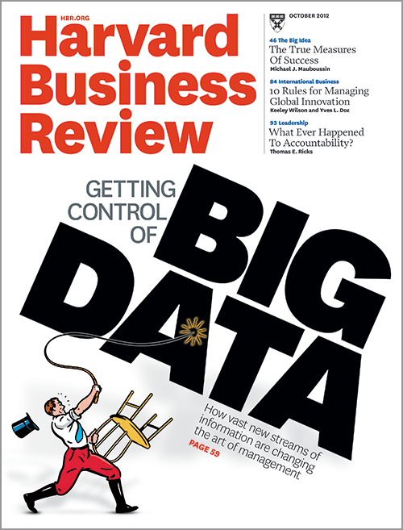

Mas, apesar de tanto destaque na mídia:

> "Não existe espaço para heroísmo em Data Science" — Neylson Crepalde (2020), Data Scientist e Sr. Generative AI Strategist @ AWS | PhD

Ou seja: existe de fato esse profissional "unicórnio" no mercado? E será que as empresas sabem como procurá-lo?

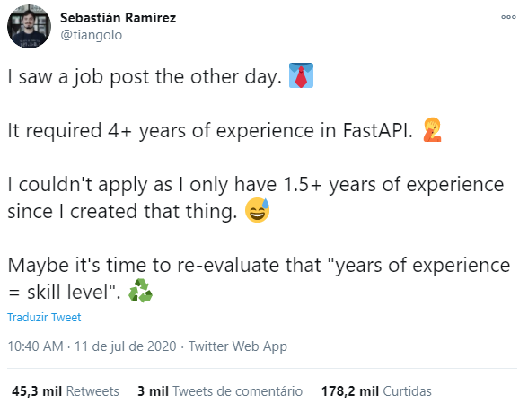

Evidentemente que existe muita intersecção entre os papéis de Cientista, Analista e Engenheiro de Dados:

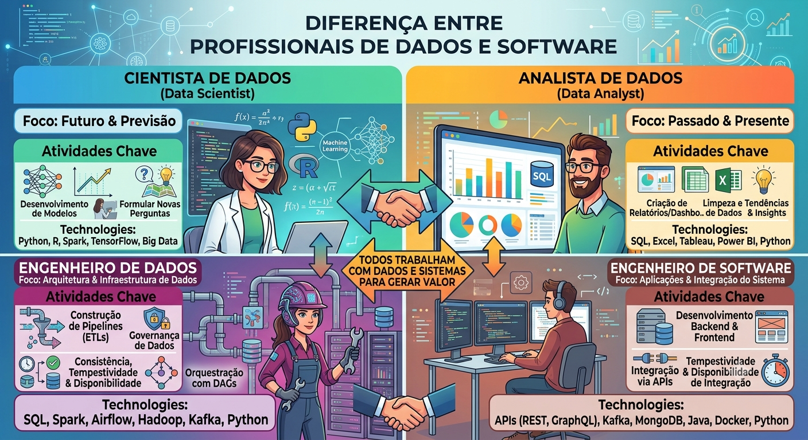

Eventualmente, por exemplo, um(a) Cientista de Dados pode desempenhar o papel (fala-se muito em "usar o chapéu") de um(a) Engenheiro(a) de Dados, ou vice-versa. No entanto, é importante ter estas distinções claras para saber qual a responsabilidade "principal" de cada profissional envolvido.

Outros termos também aparecem no mundo dos negócios, como Analistas de BI e Analistas de Negócios. O termo **Business Intelligence (BI)**, de acordo com a IBM, é:

> "Business intelligence (BI) is a set of technological processes for collecting, managing and analyzing organizational data to yield insights that inform business strategies and operations. Business intelligence analysts transform raw data into meaningful insights that drive strategic decision-making within an organization."
>
> Fonte: [ibm.com/think/topics/business-intelligence](https://www.ibm.com/think/topics/business-intelligence)

Note que BI tem mais relação com a pergunta *"O que aconteceu?"* do que com a pergunta *"O que vai acontecer?"*. Logo, tem mais relação com Analistas de Dados do que com Cientistas de Dados.

Mais recentemente, outros termos também apareceram no mercado, como *Data Steward*, Engenheiro de IA, Engenheiro de ML, Engenheiro de Prompt, Engenheiro de Analytics, MLOps, DevOps, FinOps, etc. Enfim, o mundo dos negócios é muito criativo em ficar dando nomes pras coisas, criando *hypes*, etc. — mas tente não surtar com tantos termos nesse início de disciplina.

# Conceitos Tecnológicos

Que tipo de tecnologia é utilizada no mundo dos negócios? Alguns dos principais conceitos abordados nesta seção:

Big Data · Data Lake · Computação em Nuvem · ETL · SQL · Spark · Dashboards · Machine Learning · Implantação/Deploy · LLM · GenAI

## Data vs. Big Data

**Big Data**: "estudo e aplicações de dados que são muito complexos para software de processamento de dados tradicionais" (Wikipedia). A pergunta que fica é: será que sempre precisamos de novas ferramentas para lidar com esse cenário? Um [famoso caso na Inglaterra](https://www.theverge.com/2020/10/5/21502141/uk-missing-coronavirus-cases-excel-spreadsheet-error) mostrou o problema de tentar lidar com uma quantidade de dados grande demais para uma ferramenta como o Excel durante a pandemia de COVID-19, resultando na perda de milhares de casos da contagem oficial.

Os **3 V's (ou 5) do Big Data**:

- Volume
- Velocidade
- Variedade
- Valor
- Veracidade

Qual a infraestrutura necessária para lidar com essa quantidade de dados? Isso nos leva a um novo paradoxo — e, lembre-se, "não existe heroísmo em Data Science": nem todo problema de negócio precisa, de fato, de ferramentas de Big Data.

## Data Lake

Segundo a Google: "Um data lake é um repositório centralizado, escalonável e seguro projetado para armazenar, processar e analisar grandes quantidades de dados estruturados, semiestruturados e não estruturados no formato nativo." (Fonte: [cloud.google.com/learn/what-is-a-data-lake](https://cloud.google.com/learn/what-is-a-data-lake))

Na prática, é um conjunto de tabelas mais genérico que abrange uma grande possibilidade/variedade de tipos de dados, sem uma estrutura de "conexão" entre as tabelas bem definida.

Quem mantém a "qualidade" de um Data Lake são, em geral, Engenheiros de Dados. Você interage com Data Lakes de maneira "remota": você não trabalha localmente com um Data Lake, mas sim através de uma interface, pois ele fica na nuvem. A interação com os dados é feita com frameworks que rodam em *clusters* de computadores, devido à quantidade massiva de dados.

## Computação em Nuvem

Computação em Nuvem (*Cloud Computing*), segundo a Amazon, é "...a entrega de recursos de TI sob demanda por meio da Internet com preço conforme o uso. Em vez de comprar, ter e manter data centers e servidores físicos, você pode acessar serviços de tecnologia, como capacidade computacional, armazenamento e bancos de dados, conforme a necessidade, usando um provedor de nuvem..." (Fonte: [aws.amazon.com/pt/what-is-cloud-computing](https://aws.amazon.com/pt/what-is-cloud-computing/))

Trabalhar "na Nuvem" é o oposto de trabalhar "localmente".

## ETL

**ETL** é a sigla para *Extract, Transform and Load* (Fonte: [wiki.databurst.tech](https://wiki.databurst.tech/docs/roadmap/data-integration/etl/)):

1. **Extract**: extrair os dados de diferentes fontes de maneira mais "bruta"
2. **Transform**: processar/transformar/organizar os dados extraídos para serem "utilizáveis"
3. **Load**: depositar os dados transformados em uma base para uso posterior

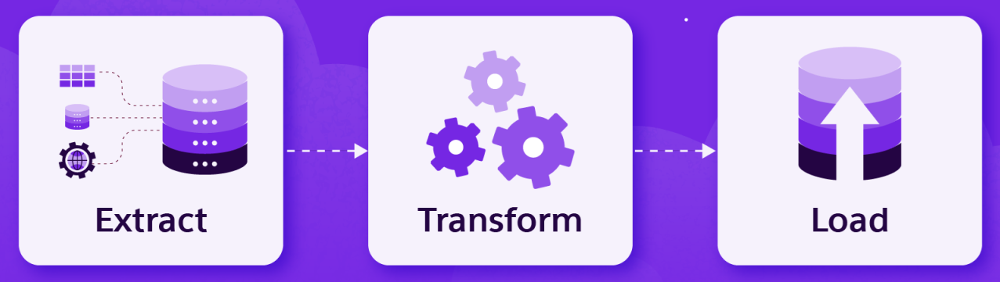

Por mais que esse conceito esteja mais presente em processos de pipelines de Engenharia de Dados, essa "lógica" de trabalhar com dados está no dia a dia de praticamente qualquer profissional de dados (Cientistas, Analistas, etc.). Lembre-se: você praticamente **nunca** vai receber uma base pronta para um modelo/análise trabalhar diretamente.

Esse conceito de "níveis de qualidade" de um dado está bastante presente nas tabelas disponibilizadas para os times de dados — é comum um Data Lake apresentar "camadas" (a chamada [arquitetura *medalhão*](https://piethein.medium.com/medallion-architecture-best-practices-for-managing-bronze-silver-and-gold-486de7c90055): *bronze*, *silver* e *gold*).

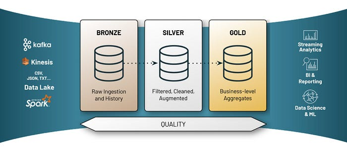

## SQL

**SQL** é a sigla para *Structured Query Language*. Pronuncia-se "éssiqueéle" ou até mesmo "siquou". É a linguagem mais "padrão" para se interagir com bases de dados, tanto em *data warehouses* (relacionais) quanto em bases não-relacionais (como Data Lakes).

SQL não é a única maneira de interagir com esses dados, mas é o framework mais utilizado. Existem diferentes programas para "executar" a linguagem SQL, como MySQL, PostgreSQL, Microsoft SQL Server, Oracle, etc. Algumas funções centrais: `SELECT`, `FROM`, `INNER JOIN`, `WHERE`.

## Spark

Framework usado para dados distribuídos e processados em *clusters* de computadores.

> "Apache Spark is an open-source unified analytics engine for large-scale data processing. Spark provides an interface for programming clusters with implicit data parallelism and fault tolerance. Originally developed at the University of California, Berkeley's AMPLab starting in 2009…"
>
> Fonte: [en.wikipedia.org/wiki/Apache_Spark](https://en.wikipedia.org/wiki/Apache_Spark)

Principais interfaces: PySpark, sparklyr, SparkSQL.

## Dashboards

> "Um dashboard é uma interface visual que reúne métricas principais [...] e visualizações de dados de uma ou mais fontes em uma única tela" (Databricks)
>
> Fonte: [databricks.com/br/blog/what-are-dashboards](https://www.databricks.com/br/blog/what-are-dashboards)

## Machine Learning

O aprendizado de máquina (*Machine Learning*, ML) é um subcampo da inteligência artificial no qual os computadores aprendem a partir de dados e identificam padrões. Em geral, pode ser um aprendizado **supervisionado** ou **não supervisionado**.

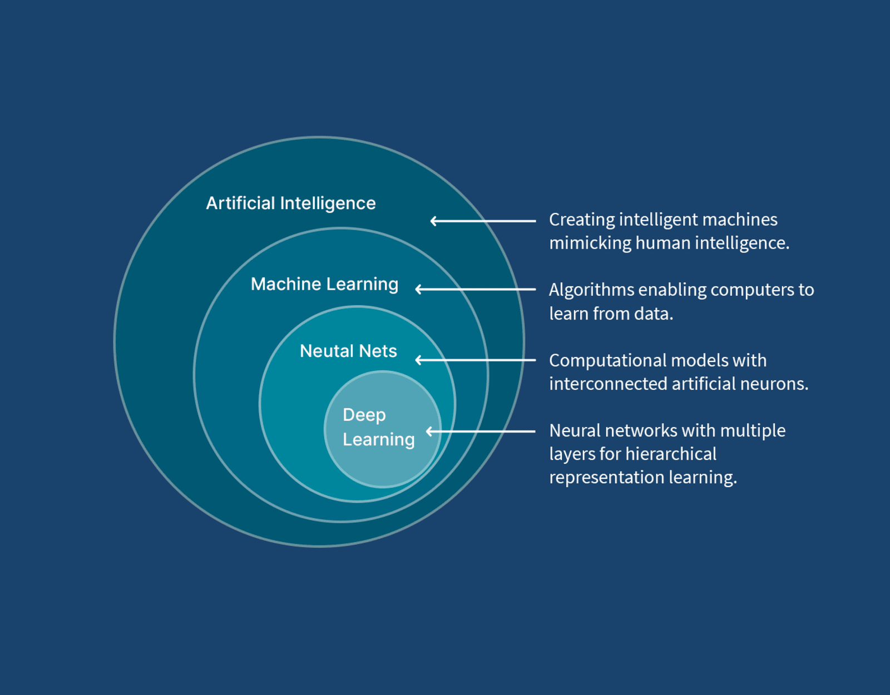

Alguns dos principais algoritmos:

**Supervisionado**

- Classificação
  - Regressão Logística
  - *Support Vector Machines*
- Regressão
  - Regressão Linear
  - Regressão Ridge/Lasso
- Modelos Baseados em Árvore
- K-Nearest Neighbors

**Não supervisionado**

- Análise de Componentes Principais
- Análise de Cluster
  - K-Means
  - Hierárquico
- Escalonamento Multidimensional

### Overfitting e Underfitting

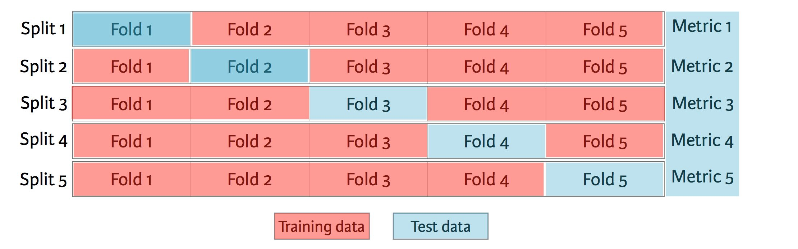

Principais estratégias de validação:

- *Holdout set* simples
- *K-Fold Cross-Validation*

Se estamos em um cenário com muitos dados, podemos "nos dar ao luxo" de criar também uma amostra de validação apartada da amostra de teste.

Fonte: Friedman, Jerome, Trevor Hastie, and Robert Tibshirani. *The elements of statistical learning*. Vol. 1. No. 10. New York: Springer series in statistics, 2001.

Leituras complementares: [How to Choose a Predictive Model After k-fold Cross-Validation](https://stats.stackexchange.com/questions/52274/how-to-choose-a-predictive-model-after-k-fold-cross-validation) e [How to Train a Final Machine Learning Model](https://machinelearningmastery.com/train-final-machine-learning-model/).

## Implantação/Deploy

O modelo de Machine Learning não tem muita utilidade pro negócio se ele não for colocado em produção! "Colocar em produção" significa "expor" o modelo para fazer predições/inferências/decisões em dados reais que irão impactar o negócio — é uma parte extremamente crítica do processo de Ciência de Dados.

Em geral, essa exposição pode ser feita de duas maneiras, a depender da natureza do problema e de como os *stakeholders* vão interagir com/analisar o modelo:

| Em batch/Assíncrona | Online/Real-Time/Síncrona |
|---|---|
| Dados preditos já calculados e só serão acessados em uma base | Dados preditos serão calculados pelo modelo (exposto em uma API) em tempo real |

Nessa etapa, em geral, profissionais de MLOps (cientistas de dados ou engenheiros de software) auxiliam no processo. Muitos detalhes devem ser levados em consideração, como a maneira que os dados estão estruturados para o processo de inferência ("fazer o *predict*"). Após um modelo estar em produção, é importante monitorar sua qualidade e fazer perguntas como:

- As predições estão estáveis?
- Os dados de entrada estão estáveis ou apresentam *data drift*?
- A estrutura que sustenta o modelo está disponível e tempestiva?

Um dos frameworks mais utilizados para gerenciar esse ciclo de vida é o **MLflow**.

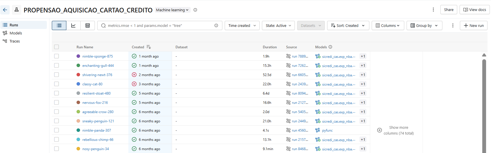

Vídeo complementar recomendado: assista à pergunta feita no segundo 37:55 [deste vídeo](https://www.youtube.com/watch?v=Lvt3hFQUhHY&t=6s).

## LLM

Do inglês *"Large Language Models"*:

> "A large language model (LLM) is a neural network trained on a vast amount of text for natural language processing tasks, especially language generation. LLMs can typically generate, summarize, translate, and analyze text in many contexts, and are a foundational technology behind modern chatbots." (Wikipedia)

## GenAI

De acordo com a Amazon: "A inteligência artificial generativa (GenAI) constitui uma modalidade de IA capaz de criar novos conteúdos e ideias, como diálogos, narrativas, imagens, vídeos e música. Ela pode aprender linguagem humana, linguagens de programação, arte, química, biologia ou qualquer assunto complexo."

A principal diferença da GenAI para a IA "tradicional" é que ela gera dados novos a partir de um modelo de machine learning **probabilístico**. A palavra "probabilística" advém do fato de que a geração do modelo assume uma "probabilidade" de estar correta (ex.: probabilidade da próxima palavra estar correta). Além disso, um modelo de GenAI pode gerar diferentes dados para o mesmo *input*/prompt.

Em IA Generativa, o parâmetro de **temperatura** (*temperature*) é uma configuração que controla o grau de aleatoriedade, criatividade e previsibilidade das respostas geradas por um modelo.

### GPTs

GPT é uma arquitetura de modelo de linguagem baseada em *transformers* que utiliza aprendizado de máquina para gerar texto coerente e contextualmente relevante. É utilizado em uma variedade de tarefas de processamento de linguagem natural e visão computacional, como tradução, resumo e geração de texto, criação de imagens e vídeos. Aplicações comuns: ChatGPT, Perplexity, Gemini.

Vídeo complementar recomendado sobre o processo de predição de um GPT: [assista aqui](https://www.youtube.com/watch?v=wjZofJX0v4M&t=1172s).

## Exemplos de ferramentas de um(a) Data Scientist

O ecossistema de ferramentas de um(a) profissional de dados costuma ser dividido em algumas frentes:

- **Extração de Dados e Manipulação de Dados** (ex.: SQL, R, Python, planilhas)
- **Visualização de Dados** (ex.: Power BI, Tableau, Looker Studio)
- **Modelagem** (ex.: bibliotecas de Machine Learning em R e Python)
- **Comunicação** (ex.: relatórios, apresentações, dashboards)
- **Ferramentas de IA Generativa** (ex.: assistentes de código, chatbots)

# Jargões de Negócio

Quais termos e jargões é possível encontrar no mundo dos negócios? Nesta seção: **KPIs**, **MVP** e **Metodologia Ágil**.

## KPIs

*Key Performance Indicators* (indicadores-chave de desempenho). Note que KPIs são métricas de **negócio**, e não métricas técnicas. Por exemplo, a medida de qualidade de um modelo de ML (como AUC) não é considerada um KPI.

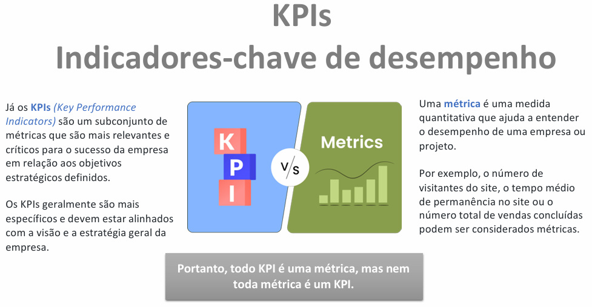

## MVP

Do inglês *"Minimum Viable Product"* (produto mínimo viável).

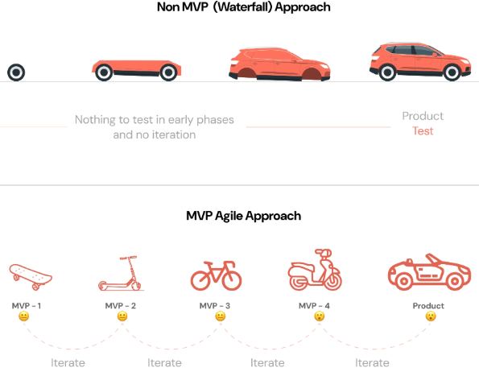

## Metodologia Ágil

É uma abordagem de gestão de projetos baseada em ciclos iterativos, entregas contínuas e flexibilidade. É um conceito concebido originalmente para desenvolvimento de software. Pode ser adaptado para ciência de dados, porém, devido à natureza mais imprevisível de se trabalhar com dados de negócio, é mais difícil adotar a metodologia ágil "ao pé da letra" nos fluxos de dados.

# Considerações Mercado vs. Academia

Palestra complementar recomendada: [Rodrigo Mello (UFSCar)](https://www.youtube.com/watch?v=Lvt3hFQUhHY).

E o futuro da nossa profissão? Opinião do professor: **aprenda bem os fundamentos e mantenha-se atualizado(a)!**

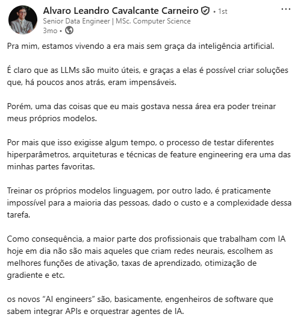
