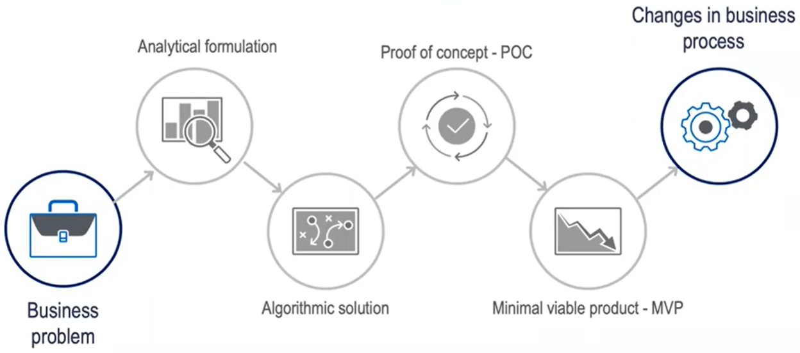
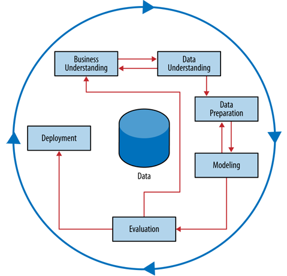
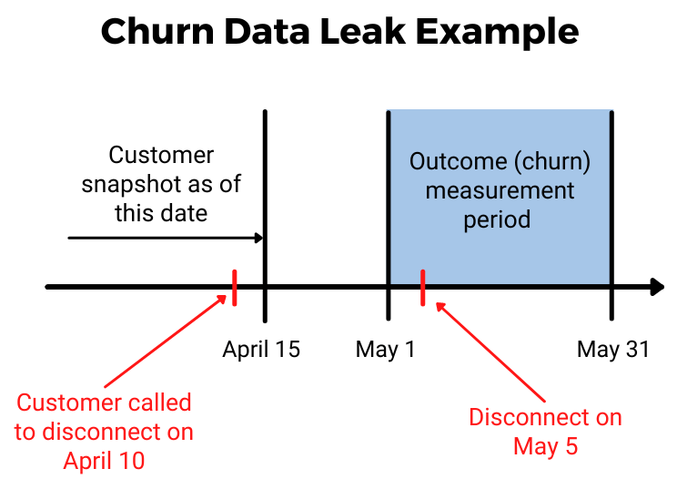
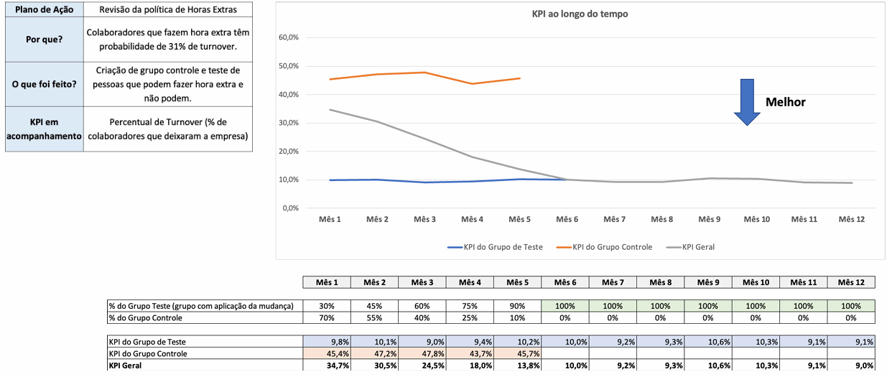

# Introdução

Todo problema de negócio que envolva dados percorre, implícita ou explicitamente, um fluxo de trabalho (*workflow*). Antes de entrar na metodologia formal, vale refletir: os dados disponíveis são confiáveis? Eles estão validados? Eles possuem as características necessárias para responder o que se quer saber? ([vídeo complementar](https://www.youtube.com/watch?v=oseHCwDBfSE&list=PLriUvS7IljvlcLnrvYUyNc9nXhiM9kWjq))



E o processo operacional? Um "produto de dados" não precisa ser necessariamente um modelo de Machine Learning — pode ser um relatório, um dashboard, uma análise pontual, etc. Como coloca Hadley Wickham:

> "Visualizations surprise you, but do not scale. Models scale, but do not surprise you." — Hadley Wickham
>
> Fonte: Wickham, Hadley, and Garrett Grolemund. *R for Data Science: import, tidy, transform, visualize, and model data*. O'Reilly Media, Inc., 2016.


Slides originais disponíveis [AQUI](https://github.com/renanxcortes/teaching/raw/refs/heads/main/Estatistica_Aplicada_Negocios/slides/2_workflow_crisp_dm.pdf).

# O que é o CRISP-DM

**CRISP-DM** (ou simplesmente CRISP) significa *Cross Industry Standard Process for Data Mining*.

> "Começar um projeto de dados, às vezes, é como tirar uma casquinha de um machucado... mas quando tu começa a tirar essa casquinha, vem uma sangueira..."

> "It is tempting — but usually a mistake — to view the data mining process as a software development cycle. [...] This can be a mistake because data mining is an exploratory undertaking closer to research and development than it is to engineering. The CRISP cycle is based around exploration; it iterates on approaches and strategy rather than on software designs."
>
> — Provost, F., & Fawcett, T. (2013)

> "Data scientists should review the literature to see what else has been done and how it has worked. On a larger scale, a team can invest substantially in building experimental testbeds to allow extensive agile experimentation. If you're a software manager, this will look more like research and exploration than you're used to [...]"
>
> — Provost, F., & Fawcett, T. (2013)

A principal lição é a de que o grau de incerteza e imprevisão de projetos de dados é maior do que o normal no mundo dos negócios.



*Figura do processo CRISP-DM. Fonte: Provost, F., & Fawcett, T. (2013). Data Science for Business: What You Need to Know about Data Mining and Data-Analytic Thinking. O'Reilly Media.*

A metodologia CRISP tem seis etapas — sendo que as três primeiras, em geral, acontecem de forma concomitante:

1. Compreensão do Negócio
2. Compreensão dos Dados
3. Preparação dos Dados
4. Modelagem
5. Avaliação
6. Implantação (Deploy em Produção + Monitoramento)

# Etapa 1 — Compreensão do Negócio

Compreender claramente o problema de negócio é a primeira etapa essencial. Problemas de negócio raramente chegam definidos de forma clara e objetiva: a definição do problema e o desenho da solução são processos iterativos (em geral, com muitas reuniões). O sucesso de um projeto muitas vezes está em transformar o problema de negócio em problemas de ciência de dados adequados.

Perguntas-chave desta etapa:

- O que exatamente queremos fazer?
- Como isso será realizado na prática?
- Que times isso impacta?
- Como isso será utilizado?

Nessa etapa, até mesmo questões aparentemente banais podem levar mais tempo do que se imagina.

**Exemplo:** a área X de um banco quer criar um modelo de *Churn* de clientes para aumentar a retenção.

- *Expectativa:* "Vamos criar a base, estimar os clientes mais propensos a sair da empresa, abordá-los e todo mundo será feliz."
- *Realidade:* O que significa "sair da empresa"? O cliente fechar a conta corrente? O cliente parar de transacionar durante 6 meses? Durante 12 meses? Que tipo de transação vamos considerar? Vamos contabilizar clientes que têm somente conta poupança?

# Etapa 2 — Compreensão dos Dados

Raramente os dados disponíveis correspondem exatamente ao problema que se deseja resolver. Dados históricos geralmente foram coletados para outros objetivos, e não para o problema atual. Diferentes bases de dados podem conter informações distintas — base de clientes, base de transações, base de respostas de campanhas de marketing — e essas bases podem diferir quanto à cobertura, qualidade e confiabilidade.

A área de negócio responsável por aquele dado é a mais indicada para responder dúvidas sobre ele, principalmente sobre quais tabelas são mais confiáveis (lembra da "camada de ouro" de um Data Lake?). Uma etapa importante é avaliar o custo-benefício de cada fonte de dados antes de investir em sua obtenção. À medida que os dados são analisados, a abordagem do projeto pode mudar.

**Exemplo — Fraude em Cartão de Crédito:** as transações fraudulentas normalmente são identificadas posteriormente, mas existe um histórico confiável indicando quais transações são fraude e quais são legítimas.

**Exemplo — Fraude no Sistema de Saúde (SUS):** os fraudadores também são usuários legítimos do sistema — não existe uma variável confiável indicando quais registros são fraudulentos. Nesse cenário, o aprendizado supervisionado não é adequado; a solução normalmente utiliza técnicas não supervisionadas, como perfilamento (*profiling*), clusterização e detecção de anomalias.

Problemas aparentemente semelhantes podem exigir abordagens completamente diferentes!

Uma pergunta de suma importância nesta etapa: **os dados necessários para responder a essa pergunta existem?** Alguns exemplos reais dessa dor:

- A área de CRM de um banco gostaria de encontrar clientes que "desmarcaram" a opção de receber notificações — mas o time de dados não encontra essa informação no Data Lake, pois ela não é rastreada no aplicativo (que, por sua vez, possui diferentes versões sem padrão entre elas).
- Uma mineradora está interessada na vazão da britagem de pedras nas esteiras, mas não possui a informação de qual caminhão fez o descarregamento entre duas opções de esteira.
- Uma empresa quer entender quais clientes estão retirando senha nas agências bancárias, mas o sistema não é integrado e esse dado não é registrado.

Nesta etapa, em geral, muitas análises descritivas são realizadas para compreender o fenômeno em estudo. Caso o projeto envolva um modelo de machine learning supervisionado, é comum realizar uma análise descritiva univariada de cada covariável em relação à variável resposta, a fim de identificar poder discriminatório individual. Estabilidade temporal das variáveis envolvidas também é importante de se garantir nesse processo.

O código abaixo (`funcoes_plot.R`) ilustra uma função usada para esse tipo de análise descritiva univariada — comparando a frequência de uma covariável (quebrada em quantis) com a taxa de uma classe de interesse da variável resposta:

```r
#' Descritivas por valores absolutos e relativos de uma covariável numérica
#' Plota os gráficos descritivos por valores absolutos e relativos (numéricos)
#'
#' @param df DataFrame a ser analisado
#' @param var_x String que representa o nome da variável de df a ser analisada.
#' @param var_y String que representa o nome da variável resposta de df.
#' @param flag_interesse String que representa a classe de interesse.
#' @param k Numérico inteiro (somente para covariáveis numéricas). Número de
#'   classes que a covariável numérica será "quebrada" em frequências
#'   aproximadamente homogêneas.
#' @param breaks Vetor de valores personalizados para serem quebrados.
#' @param ylim Vetor numérico com o limite da escala do eixo secundário.
#' @param keep_na Booleano se mantém os NAs como uma classe específica.
#'
#' @return plotly
plota_tx_interesse_quantis <- function(df, var_x, var_y,
                                        flag_interesse = 'categoria_de_interesse',
                                        k = 10, breaks = NA, ylim = c(0, 1),
                                        keep_na = FALSE) {

  color_1 <- '#ff0000'
  color_2 <- '#00997c'

  df %>%
    mutate(quantis = cut(get(var_x),
                          breaks = unique(quantile(get(var_x), probs = seq(0, 1, l = k + 1), na.rm = TRUE)),
                          include.lowest = TRUE)) %>%
    group_by(quantis) %>%
    summarize(n = n(),
              tx_de_interesse := sum(get(var_y) == flag_interesse, na.rm = TRUE) / n) %>%
    plot_ly(x = ~quantis, y = ~n, type = 'bar', text = ~n,
            marker = list(color = color_2), textposition = 'outside', name = "Fq.") %>%
    add_trace(x = ~quantis, y = ~tx_de_interesse, type = 'scatter', mode = 'lines',
              marker = list(color = 'black'), line = list(color = color_1),
              yaxis = "y2", name = paste0("Tx. ", flag_interesse)) %>%
    layout(title = paste0('Tx. de ', flag_interesse, ' e Fq. por ', var_x),
           yaxis2 = list(overlaying = "y", side = "right", range = ylim),
           xaxis = list(title = paste0('Quantis de ', var_x)))
}

# A função também possui uma ramificação para o caso de breaks customizados
# e para covariáveis categóricas — ver arquivo completo funcoes_plot.R.
```

# Etapa 3 — Preparação dos Dados

Integrar diferentes bases de dados pode ser um desafio, exigindo limpeza, padronização e associação correta dos registros. Problemas como duplicidade e inconsistência de registros de clientes são comuns e frequentemente exigem técnicas analíticas específicas. A preparação dos dados ocorre em paralelo ao entendimento dos dados ("*learn by doing*").

Principais atividades da preparação dos dados:

- Contemplar regras de negócio
- Integrar múltiplas fontes de dados
- Converter dados para formato tabular
- Tratar valores ausentes (remoção ou imputação)
- Converter tipos de dados (texto, categorias e números)
- Transformar variáveis categóricas quando necessário
- Normalizar ou padronizar variáveis numéricas para torná-las comparáveis
- Adequar os dados às exigências da técnica analítica que será utilizada
- Tratar datas

**Exemplo:** montar uma base para um modelo de *Churn* não é uma tarefa tão trivial assim — é preciso definir com cuidado três janelas temporais: (i) a janela do período de referência das variáveis preditoras, (ii) a janela temporal para a equipe de CRM ter tempo de atuar (abordando o cliente antes que ele saia), e (iii) a janela do período de referência para avaliar o critério de *churn* definido com a área de negócio — sob risco de um "buraco temporal" entre elas ([leitura complementar](https://zyabkina.com/how-to-predict-churn/)).



Muitas vezes as bases possuem problemas que só ficam evidentes nesta etapa:


# Etapa 4 — Modelagem

Na etapa anterior (Preparação dos Dados), algumas precauções já devem ser levadas em consideração para a modelagem:

- **Engenharia de Features**: criação de novas variáveis potenciais para a modelagem. Por exemplo, o "Tempo de Conta" de um cliente de banco precisa ser criado caso você tenha acesso somente à variável "Data de Criação de Conta".
- **Evitar Data Leakage**: quando uma variável contém informações que não estariam disponíveis no momento da tomada de decisão, mas aparecem nos dados históricos — o que superestima artificialmente a capacidade preditiva do modelo (mais detalhes na página de [Desafios de Bases do Ponto de Vista Operacional](5_desafios_base_operacional.qmd)).

A modelagem, em si, é o momento em que o(a) Cientista de Dados tem — e faz sentido ter — o maior grau de autonomia no processo. É ele(a) quem possui experiência e conhecimento para decidir algoritmos, pacotes, métricas de qualidade do modelo, técnicas estatísticas, etc., a fim de extrair um modelo que responda da melhor maneira ao problema de negócio.

# Etapa 5 — Avaliação

Checar se o modelo estimado atende ao problema de negócio:

- Caso explicabilidade seja um ponto importante: ele é explicável? Ele é estável?
- Tem muito falso positivo?
- Caso a predição tenha que ser dicotomizada, qual o *threshold* de probabilidade? (Ex.: um time de seguros quer enviar comunicação apenas para clientes com altíssima probabilidade de contratar — alta especificidade. Porém, se essa lista de clientes for muito pequena, esses clientes nunca receberão nenhuma comunicação, pois outras já são enviadas para eles.)
- Será feito um teste A/B com esse modelo, comparando-o com algum *benchmark*/modelo atual? (Kohavi, Ron & Tang, Diane & Xu, Ya. (2020). *Trustworthy Online Controlled Experiments: A Practical Guide to A/B Testing*.)
- A linguagem em que o modelo foi feito pode ser usada em produção, ou é preciso adaptá-la? (Ex.: regressão logística *hardcodeada* em Java, pois o motor de decisão está nessa linguagem.)
- Se for o caso, o modelo é "auditável"? (Ex.: modelos de concessão de crédito podem ser auditados pelo Banco Central.)
- Filosofia "feito é melhor que perfeito": em algum momento é preciso "bater o martelo", em vez de buscar um modelo perfeito que nunca chega.
- Buscar *feedback* de outros(as) colegas/*stakeholders* e estar aberto(a) a sugestões de melhorias.

# Etapa 6.1 — Implantação/Deploy em Produção

Um modelo pode ser exposto de maneira assíncrona (em batch/offline) ou síncrona (online). Nesta etapa, provavelmente haverá atuação de outras equipes — MLOps, DevOps, Engenheiros de Dados — para auxiliar na implantação ou no pipeline de geração dos dados. Ferramentas potenciais: MLflow, Amazon SageMaker, etc.

# Etapa 6.2 — Monitoramento

Estrutura-se uma forma de monitorar os resultados do modelo. Se o plano de ação visa melhorar um indicador/KPI, é interessante criar um acompanhamento automático em um dashboard, com indicação clara do momento em que o plano de ação foi implantado.

Métricas de monitoramento comuns:

- KS/AUC
- Distribuição dos *scores*/*clusters*
- Taxa do *target*

Deve-se também inserir gatilhos propostos para iniciar um processo de retreino ou calibragem do modelo, e monitorar o *data drift* das covariáveis — por exemplo, se a área responsável por uma variável mudou a metodologia de cálculo (ex.: passou a considerar TED além do PIX em um perfil transacional), isso afeta diretamente as predições do modelo!

Se o modelo estiver sendo implementado somente em parte dos dados via teste A/B (ex.: Grupo Controle vs. Grupo Tratamento), deve-se acompanhar a métrica de ambos os grupos.


