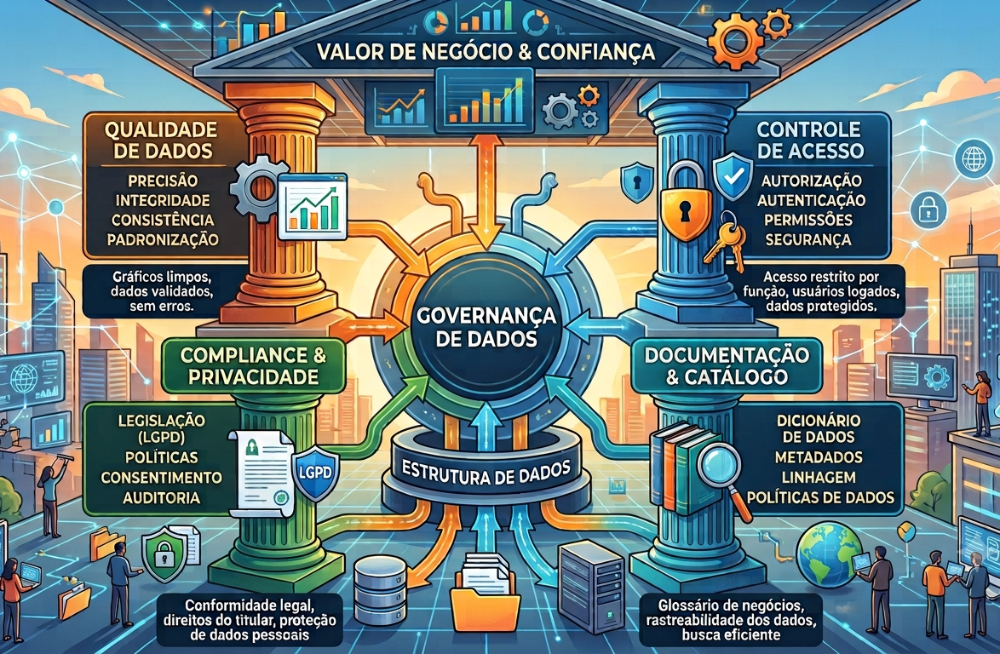
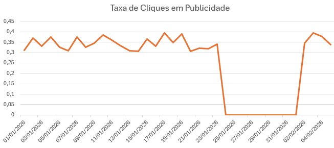

# Introdução

Nem todo desafio de uma base de dados é técnico: muitos deles nascem da própria organização do negócio. Esta parte da disciplina discute quatro grandes desafios: **Governança**, **Descentralização**, **Inconsistências/Quebras de Fonte** e **Regras de Negócio**.

Slides originais disponíveis [AQUI](https://github.com/renanxcortes/teaching/raw/refs/heads/main/Estatistica_Aplicada_Negocios/slides/3_desafios_base_negocio.pdf).

# Governança

> "É o conjunto de políticas, normas, padrões e práticas que orientam, monitoram e avaliam a gestão e o uso dos dados, para assegurar que sejam utilizados de maneira ética, segura e eficiente" — Fonte: Governo Federal

> "A governança de dados inclui os processos e as políticas que garantem que os dados estejam em condições adequadas para apoiar as iniciativas e operações de negócios." — Fonte: Amazon

Alguns pilares da governança de dados:

- **Qualidade**
- **Controle de Acesso**
- **Compliance e Privacidade**
- **Documentação**

Exemplos de cada pilar em ação:

- **Qualidade**: criação de um fluxo de dados que impede que linhas duplicadas sejam importadas em uma tabela, evitando inconsistências.
- **Controle de Acesso**: o setor de marketing não pode acessar as bases de RH, pois nelas estão presentes as remunerações dos colaboradores.
- **Compliance e Privacidade**: dados sensíveis dos clientes estão de acordo com a LGPD, dados de cartão de crédito estão anonimizados, dados sensíveis de saúde de cidadãos estão restritos, etc.
- **Documentação**: um exemplo clássico é a pergunta "o que significa a variável `PQ034HS` nesta tabela?", cuja resposta é "não sei, e a pessoa que sabia/criou saiu da empresa há 5 anos".

# Descentralização

É caracterizada pela presença de **"silos de dados"**: silos aprisionam informações em sistemas departamentais isolados, gerando duplicidade de esforços e problemas de acessibilidade/confiabilidade. Exemplos comuns:

- "Os dados estão dentro do sistema X (ex.: SAS, Oracle, DataCloud, etc.)"
- "Essa tabela vem de um `.xls` de uma pasta de rede"

Cada silo pode, ainda, ter uma regra de negócio não oficial/homologada, agravando o problema.

Isso é um problema generalizado em empresas e tem relação direta com a falta de governança. Para mitigar esse problema, os times podem criar um plano de integração de dados — um caso de uso comum em CRM é a criação de uma Central Unificada de Dados do Associado/Cliente.

# Inconsistências/Quebras de Fonte

Quando um sistema para de gerar dados que estão sendo monitorados, isso deve disparar algum tipo de alerta/investigação para entender a causa raiz: o que aconteceu nesse período? O dado está certo? Talvez o sistema que gerou o dado tenha parado de funcionar... talvez o pipeline de transformação desse dado tenha parado de funcionar nesses dias... ou talvez a publicidade simplesmente não tenha subido/aparecido para os usuários... ou talvez a publicidade tenha sido muito ruim mesmo.

Um exemplo (bem-humorado, mas revelador) frequentemente compartilhado entre profissionais de dados sobre esse tipo de problema:

> "O time de backend mudou o nome de uma coluna de `user_id` para `userId` sem me avisar. Então eu silenciosamente redirecionei todo o fluxo de eventos do aplicativo deles para o `/dev/null`. Já faz 4 dias. Eles estão em pânico porque o analytics está mostrando zero tráfego. Eu poderia consertar isso com uma linha de SQL, mas preciso que eles sintam o temor de Deus antes de tocarem no meu *schema* novamente. Respeitem o *pipeline*!!"

# Regras de Negócio

Regras de negócio garantem que analistas/cientistas de dados, gestores e equipes de tecnologia falem a mesma língua, compartilhem os mesmos conceitos e interpretem os dados de forma consistente. Quando as regras de negócio são bem definidas, toda a organização utiliza a mesma linguagem, os mesmos conceitos e os mesmos critérios para analisar e tomar decisões baseadas em dados.

Como são calculadas informações relevantes como receitas, despesas, clientes ativos, clientes totais, taxas de conversão, etc.? Alguns exemplos de regras de negócio:

- **Financeiro**: um sistema só permite a compra parcelada se o valor da parcela for superior a R$ 50.
- **E-commerce**: clientes que compram acima de R$ 200 ganham frete grátis.
- **Logística**: pedidos aprovados até as 15h são despachados no mesmo dia.
- **Fraude**: toda transação maior que R$ 50.000 será bloqueada e avaliada por um humano.

Áreas distintas podem estar calculando o mesmo dado/KPI, mas se baseando em regras de negócio diferentes — é o famoso "o meu dado não está batendo com o seu dado". Imagine uma empresa de e-commerce analisando a taxa de clientes ativos:

- **Sem regra de negócio**: qualquer cliente que realizou um cadastro é considerado ativo.
- **Com regra de negócio**: um cliente é considerado ativo apenas se realizou pelo menos uma compra nos últimos 12 meses.

O resultado dessas duas definições pode ser drasticamente diferente — daí a importância de deixar as regras de negócio explícitas e documentadas (ver também a seção de Documentação em [Governança](#governança)).
