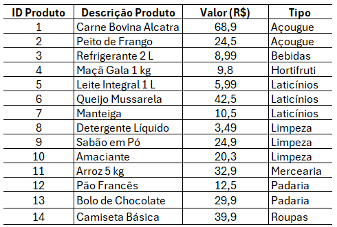
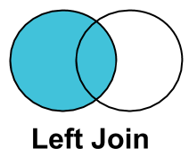

# Introdução

Além dos desafios organizacionais (vistos na página anterior, [Desafios de Bases Alinhadas ao Negócio](4_desafios_base_negocio.qmd)), existem desafios mais operacionais/técnicos na construção de uma base de dados para um problema de negócio: **Obtenção de Dados**, **Joins**, **Limpeza de Dados**, **Manipulação de Dados** e **Data Leakage**.

Slides originais disponíveis [AQUI](https://github.com/renanxcortes/teaching/raw/refs/heads/main/Estatistica_Aplicada_Negocios/slides/4_desafios_base_operacional.pdf).

# Obtenção de Dados

Como se conectar a múltiplas fontes de dados? No ambiente corporativo, é muito comum trabalharmos remotamente — isto é, trabalhar na nuvem, conectando-se remotamente a dados que estão hospedados fora da sua máquina.

*Exercício pra casa: puxar dados de alguma base de dados pública.*

Abaixo, dois exemplos ilustrativos de código de conexão a bancos de dados em R: o primeiro cria uma conexão local (em memória) para fins didáticos, e o segundo mostra uma conexão remota real a um banco de dados Postgres hospedado na nuvem (Neon).

```r
# Exemplo 1: conexão local (em memória), útil para testar/aprender SQL sem
# depender de um servidor remoto

install.packages(c("DBI", "RSQLite", "dplyr", "dbplyr"))

library(DBI)
library(RSQLite)
library(dplyr)
library(dbplyr)

# 1. Estabelecer a conexão (usando um banco SQL em memória para testes)
con <- dbConnect(RSQLite::SQLite(), ":memory:")

# 2. Subir um dataset de exemplo para o banco SQL
dbWriteTable(con, "cars_sql_table", mtcars)

# 3. Criar um ponteiro (lazy) para a tabela SQL -- nenhum dado é baixado ainda
lazy_cars_table <- tbl(con, "cars_sql_table")

# 4. Construir a query usando verbos do dplyr (também é "lazy")
lazy_query <- lazy_cars_table %>%
  filter(mpg > 20) %>%
  select(mpg, cyl, hp) %>%
  mutate(hp_per_cyl = hp / cyl)

# 5. OPCIONAL: ver o código SQL que o R gerou de forma lazy
show_query(lazy_query)

# 6. Executar e coletar (aqui sim a query roda no banco)
final_dataframe <- collect(lazy_query)

dbDisconnect(con)
```

```r
# Exemplo 2: conexão remota real a um banco de dados Postgres na nuvem (Neon)

install.packages(c("DBI", "RPostgres", "dplyr", "dbplyr"))

library(DBI)
library(RPostgres)
library(dplyr)

conn <- dbConnect(
  RPostgres::Postgres(),
  host = "ep-twilight-frost-athewr88-pooler.c-9.us-east-1.aws.neon.tech",
  port = 5432,
  dbname = "neondb",
  user = "neondb_owner",
  password = "my_password",
  sslmode = "require",
  channel_binding = "require"
)

# Criar um ponteiro (lazy) para uma tabela do banco remoto
lazy_persons <- tbl(conn, "persons")
head(lazy_persons)
#> # A tibble: 2 x 5
#>      id first_name last_name date_of_birth email
#>   <int> <chr>      <chr>     <date>        <chr>
#> 1     1 John       Doe       1995-01-05    john.doe@postgresqltutorial.com
#> 2     2 Jane       Doe       1995-02-05    jane.doe@postgresqltutorial.com

dbDisconnect(conn)
```

# Joins

Uma das tarefas **mais comuns e imprescindíveis** para quem trabalha com dados é efetivamente saber combinar informações de múltiplas tabelas.

**Exemplo motivador:** suponha que você é um(a) cientista de dados de um supermercado e precisa calcular os preços com desconto que são aplicados por tipo de produto, a partir de uma *tabela de produtos* e uma *tabela de descontos por tipo*.



- **Passo 1**: associar cada produto à sua respectiva alíquota de desconto.
- **Passo 2**: calcular o valor com desconto.

Nota: o Passo 1 também seria possível resolver usando a função `PROCV` do Excel, mas ela é bastante limitada em comparação a um `JOIN`.

O Passo 1 é um problema típico para ser resolvido via **JOIN**. Suponha que você tenha uma tabela A e uma tabela B; os principais tipos de *join* são:

- **INNER JOIN**: retorna apenas as linhas cujo valor da chave existe em **ambas** as tabelas.
- **LEFT JOIN**: mantém todas as linhas da tabela da esquerda (ou direita, dependendo da convenção), adicionando as colunas da outra tabela quando existir correspondência.
- **ANTI JOIN**: retorna apenas as linhas de uma tabela cuja chave **não** possui correspondência na outra tabela.
- **FULL JOIN**: retorna todos os registros de ambas as tabelas, com ou sem correspondência.

::: {layout-ncol=5}



:::

A **chave** de um *join* é a(s) variável(is) presente(s) em ambas as tabelas que permite conectá-las — no exemplo do supermercado, a variável `Tipo` é a chave que conecta a tabela de produtos à tabela de descontos.

Alguns exemplos práticos, usando a tabela de produtos (A) e a tabela de descontos por tipo (B):

- **LEFT JOIN**: mantém as linhas da tabela de produtos, adicionando a coluna de desconto quando existir correspondência.
- **INNER JOIN**: retorna apenas os produtos cujo tipo existe em ambas as tabelas, adicionando a coluna de desconto (produtos sem tipo correspondente somem do resultado).
- **ANTI JOIN**: retorna apenas os produtos cujo tipo **não** possui correspondência na tabela de descontos (o "espelho" do resultado do `INNER JOIN`).
- **FULL JOIN**: retorna todos os produtos e todos os tipos, com ou sem correspondência.

Por que não usar simplesmente um `PROCV` do Excel para tudo isso?

1. **Um `JOIN` mantém as colunas de todas as tabelas envolvidas** de uma vez, sem a necessidade de repetir a fórmula coluna a coluna.
2. **É possível conectar tabelas usando mais de uma chave.** Por exemplo, suponha que as alíquotas de desconto sejam diferentes por cidade — nesse caso, a chave passa a ser a combinação `Tipo + Cidade`, algo que o `PROCV` tradicional não resolve de forma direta.

# Limpeza de Dados

*Data cleaning* (limpeza de dados) é o processo de identificar e corrigir ou remover erros, inconsistências, duplicatas e dados irrelevantes de um conjunto de dados brutos.

Problemas típicos encontrados em uma base "suja":

- Problemas estruturais (nomes de colunas)
- Coluna "fantasma" e coluna constante
- Problemas de linhas e dados ausentes (`NA`s)
- Erros de digitação (ex.: "JOão", "João" e "Maria " — este último com um espaço extra invisível no final)
- Inconsistência de tipos de dados (datas em formatos diferentes, ou como número serial)
- Valores discrepantes (*outliers*) e erros numéricos (ex.: salário negativo?)
- Dados duplicados

Abaixo, o código completo (`cod_3_data_cleaning.R`) referenciado nos slides, que gera uma base "suja" propositalmente e aplica uma rotina de limpeza usando os pacotes `janitor`, `dplyr` e `stringr`:

```r
library(janitor)
library(dplyr)
library(stringr)

# Criar um conjunto de dados ainda mais caótico com erros e outliers
dados_sujos_avancados <- data.frame(
  `Primeiro Nome!!!` = c("João", "Maria ", "J0ão", NA, "Roberto", NA, "Alice", "Carlos"),
  `Último   Nome`    = c("Silva", "Santos", "silva ", NA, "Souza", NA, "Oliveira", "Pereira"),
  `ID..Funcionario`  = c(101, 102, 101, NA, 103, NA, 104, 105),
  `DATA ADMISSAO`    = c("2021-01-15", "44211", "2021-01-15", NA, "2023-05-11", NA, "45123", "2025-08-20"),
  `ColunaAtivo`      = c("SIM", "SIM", "SIM", NA, "SIM", NA, "SIM", "SIM"),
  `SALARIO`          = c(5000, 6000, 5000, NA, 7500, NA, 800000, -4500), # Outliers aqui
  ` `                = c(NA, NA, NA, NA, NA, NA, NA, NA),
  check.names = FALSE
)

dados_limpos_avancados <- dados_sujos_avancados %>%
  # 1. Limpeza estrutural clássica do janitor
  clean_names() %>%
  remove_empty(which = c("rows", "cols")) %>%
  remove_constant() %>%
  mutate(data_admissao = convert_to_date(data_admissao)) %>%

  # 2. Corrigindo erros de digitação nos textos
  mutate(
    primeiro_nome = str_trim(primeiro_nome),   # remove espaços extras (ex: "Maria ")
    ultimo_nome = str_trim(ultimo_nome),
    primeiro_nome = str_replace_all(primeiro_nome, "0", "o"),  # "J0ão" vira "João"
    ultimo_nome = str_to_title(ultimo_nome)    # "silva " vira "Silva"
  ) %>%

  # 3. Tratando os valores discrepantes (outliers) no salário
  mutate(
    salario = case_when(
      salario < 0 ~ NA_real_,           # salários negativos viram NA
      salario > 500000 ~ salario / 100, # corrige erro de digitação (800000 vira 8000)
      TRUE ~ salario
    )
  )

# ---- Encontrar duplicatas ----

# Todas as linhas 100% idênticas no banco inteiro
duplicadas_totais <- dados_limpos_avancados %>% get_dupes()

# Duplicatas pelo ID do funcionário
duplicatas_por_id <- dados_limpos_avancados %>% get_dupes(id_funcionario)

# Limpeza final: remove a segunda ocorrência de cada ID duplicado
dados_perfeitos <- dados_limpos_avancados %>%
  distinct(id_funcionario, .keep_all = TRUE)

dados_perfeitos
```

O antes e depois da limpeza (dados de exemplo usados no código acima):

**Base "suja"**

| Primeiro Nome!!! | Último Nome | ID..Funcionario | DATA ADMISSAO | ColunaAtivo | SALARIO |
|---|---|---|---|---|---:|
| João | Silva | 101 | 2021-01-15 | SIM | 5000 |
| Maria&nbsp; | Santos | 102 | 44211 | SIM | 6000 |
| J0ão | silva&nbsp; | 101 | 2021-01-15 | SIM | 5000 |
| *NA* | *NA* | *NA* | *NA* | *NA* | *NA* |
| Roberto | Souza | 103 | 2023-05-11 | SIM | 7500 |
| *NA* | *NA* | *NA* | *NA* | *NA* | *NA* |
| Alice | Oliveira | 104 | 45123 | SIM | 800000 |
| Carlos | Pereira | 105 | 2025-08-20 | SIM | -4500 |

**Base limpa** (colunas renomeadas, linhas/colunas vazias removidas, duplicata do ID 101 eliminada, textos padronizados, outliers de salário tratados)

| primeiro_nome | ultimo_nome | id_funcionario | data_admissao | salario |
|---|---|---:|---|---:|
| João | Silva | 101 | 2021-01-15 | 5000 |
| Maria | Santos | 102 | 2021-01-15 | 6000 |
| Roberto | Souza | 103 | 2023-05-11 | 7500 |
| Alice | Oliveira | 104 | 2023-07-16 | 8000 |
| Carlos | Pereira | 105 | 2025-08-20 | *NA* |

# Manipulação de Dados

Neste contexto, "manipulação" de dados é no sentido de lidar/manejar/preparar os dados — também conhecido como ***Data Wrangling***. A família de `JOIN`s vista anteriormente também pode ser vista como uma etapa de um processo de manipulação de dados, mas manipulação é mais do que isso:

> "Data wrangling is the process of cleaning, structuring and enriching raw data to be used in data science, machine learning (ML) and other data-driven applications" — IBM

**Exercício motivador:** suponha que você tenha três bases — `vendas`, `produtos` e `clientes`:

- **Tarefa 1**: criar uma tabela com os nomes dos clientes de Porto Alegre, para os meses de março a junho, com quantidade de vendas e faturamento (R$) por categoria.
- **Tarefa 2**: reorganizar a tabela resultante da Tarefa 1 para apresentar os valores de faturamento das categorias em colunas (preenchendo combinações ausentes com zero).
- **Tarefa 3**: com os dados originais, fazer um gráfico de gastos totais por cliente e período do dia, respondendo "qual cliente mais gastou, em valores absolutos, no período da noite?" (resposta: foi o Carlos).

Abaixo, o código completo (`cod_4_data_wrangling.R`) referenciado nos slides, com a criação das três tabelas de exemplo e o pipeline de limpeza/wrangling/joins que resolve as três tarefas:

```r
library(dplyr)
library(tidyr)
library(lubridate)
library(ggplot2)

# ---- Tabela de vendas (com 1 duplicata proposital: id_venda 30) ----
vendas <- tibble(
  id_venda   = c(1,2,3,4,5,6,7,8,9,10,11,12,13,14,15,
                 16,17,18,19,20,21,22,23,24,25,26,27,28,29,30,30),
  id_cliente = c(101,102,103,104,105,101,102,106,107,103,
                 108,109,101,110,104,102,103,105,106,101,
                 107,108,109,110,104,105,102,101,106,103,103),
  id_produto = c(1,2,3,4,5,2,1,6,3,5,4,2,1,6,3,
                 5,4,2,1,6,3,5,2,4,1,6,3,5,2,4,4),
  data_hora  = c("2025-01-05 09:15:23", "2025-01-09 14:32:10", "...",
                 NA, "2025-06-30 20:05:54", "2025-06-30 20:05:54") # (ver script completo p/ vetor inteiro)
)

# ---- Tabela de clientes ----
clientes <- tibble(
  id_cliente = 101:110,
  nome = c("Ana","Bruno","Carlos","Diana","Eduardo",
           "Fernanda","Gabriel","Helena","Igor","Juliana"),
  cidade = c("Porto Alegre — RS","Curitiba — PR","Campinas — SP","Porto Alegre — RS",
             "Curitiba — PR","Londrina — PR","Campinas — SP","Porto Alegre — RS",
             "Curitiba — PR","Porto Alegre — RS")
)

# ---- Tabela de produtos ----
produtos <- tibble(
  id_produto = 1:6,
  produto = c("Arroz 5 kg","Refrigerante 2 L","Detergente","Shampoo","Café 500 g","Sabão em Po"),
  categoria = c("Alimentos","Bebidas","Limpeza","Higiene","Alimentos","Limpeza"),
  preco = c(28.90, 9.50, 4.90, 18.90, 21.50, 16.90)
)

# Separar cidade e estado
clientes2 <- clientes %>%
  separate(cidade, into = c("cidade", "estado"), sep = " — ")

dados_pre_processados <- vendas %>%
  distinct() %>%                                    # 1. remover duplicatas
  filter(!is.na(data_hora)) %>%                      # 2. tratar valores faltantes
  mutate(data_hora = ymd_hms(data_hora)) %>%          # 3. converter data e hora
  left_join(clientes2, by = "id_cliente") %>%         # 4. joins
  left_join(produtos, by = "id_produto") %>%
  mutate(                                             # 5. criar novas colunas
    ano = year(data_hora),
    mes = month(data_hora),
    hora = hour(data_hora),
    periodo = case_when(
      hora < 12 ~ "Manhã",
      hora < 18 ~ "Tarde",
      TRUE      ~ "Noite"
    )
  )

# ---- Tarefa 1 ----
tarefa_1 <- dados_pre_processados %>%
  filter(cidade == "Porto Alegre", mes %in% c(3, 4, 5, 6)) %>%
  rename(cliente = nome, valor_venda = preco) %>%
  group_by(cliente, mes, categoria) %>%
  summarise(vendas = n(), faturamento = sum(valor_venda), .groups = "drop")

# ---- Tarefa 2 ----
tarefa_2 <- tarefa_1 %>%
  select(-vendas) %>%
  pivot_wider(names_from = categoria, values_from = faturamento, values_fill = 0)

# ---- Tarefa 3 ----
dados_grafico <- dados_pre_processados %>%
  group_by(nome, periodo) %>%
  summarize(gastos_totais = sum(preco)) %>%
  ungroup() %>%
  complete(nome, periodo = c("Manhã", "Tarde", "Noite"), fill = list(gastos_totais = 0))

dados_grafico %>%
  ggplot(aes(x = nome, y = gastos_totais, fill = periodo)) +
  geom_col(position = "dodge") +
  labs(x = "Nome", y = "Gastos Totais", fill = "Período") +
  theme_minimal(base_size = 12)
```

As tabelas originais de exemplo usadas nesse *pipeline*:

**Tabela `clientes`**

| id_cliente | nome | cidade |
|---:|---|---|
| 101 | Ana | Porto Alegre — RS |
| 102 | Bruno | Curitiba — PR |
| 103 | Carlos | Campinas — SP |
| 104 | Diana | Porto Alegre — RS |
| 105 | Eduardo | Curitiba — PR |
| 106 | Fernanda | Londrina — PR |
| 107 | Gabriel | Campinas — SP |
| 108 | Helena | Porto Alegre — RS |
| 109 | Igor | Curitiba — PR |
| 110 | Juliana | Porto Alegre — RS |

**Tabela `produtos`**

| id_produto | produto | categoria | preco |
|---:|---|---|---:|
| 1 | Arroz 5 kg | Alimentos | 28.90 |
| 2 | Refrigerante 2 L | Bebidas | 9.50 |
| 3 | Detergente | Limpeza | 4.90 |
| 4 | Shampoo | Higiene | 18.90 |
| 5 | Café 500 g | Alimentos | 21.50 |
| 6 | Sabão em Pó | Limpeza | 16.90 |

*(A tabela `vendas`, com 31 linhas — incluindo a duplicata proposital do `id_venda` 30 — está disponível no script completo `cod_4_data_wrangling.R`.)*

# Data Leakage

**Data Leakage**: quando uma variável contém informações que não estariam disponíveis no momento da tomada de decisão, mas aparecem nos dados históricos. Isso faz com que se superestime artificialmente a capacidade preditiva do modelo — em outras palavras, "vazam" dados do futuro para o passado.


*Data leakage* também pode estar presente nas etapas de pré-processamento de dados, nas divisões entre treino e teste para validação de modelos de ML. Exemplo clássico — imputação de média: você não pode usar os dados de teste para descobrir qual média imputar nos valores faltantes; tudo o que o modelo "aprende" no treino deve ser aplicado ao teste, nunca o contrário.

Alguns exemplos práticos de *data leakage*:

- **Prever a aprovação em uma disciplina.** O erro: usar a *nota final* como variável preditora. O modelo rapidamente aprende uma regra praticamente perfeita — "se nota final ≥ 6,0, então aprovado = sim" — só que essa "predição" não tem nenhuma utilidade prática, pois a nota final só existe depois do resultado já estar definido.
- **Concessão de empréstimo.** Objetivo: prever se um cliente será inadimplente, usando variáveis como renda, idade, valor solicitado, score de crédito, número de dependentes e... quantidade de parcelas atrasadas. O modelo acaba aprendendo uma coisa óbvia (quem atrasou parcelas vira inadimplente), mas isso é uma **consequência** da inadimplência, não uma causa.
- **Fraude.** Objetivo: prever se uma transação é fraudulenta, usando valor, país, horário e a variável "transação estornada". O problema: uma transação normalmente é estornada justamente *porque* foi identificada como fraude — o modelo aprende que "transação estornada = fraude", mas em produção, no momento da decisão, essa informação ainda não existe.
- **Séries temporais.** Em problemas temporais, a ordem cronológica deve ser respeitada para evitar que o modelo aprenda com informações futuras — ou seja, os dados usados para prever um determinado período nunca podem incluir informações que só existiriam depois desse período.
