# Introdução

Esta parte da disciplina (semanas 8 a 18) aplica técnicas estatísticas — estatística descritiva, dashboards, modelagem/machine learning, RFV — em diferentes contextos de negócio, como Seguro, Crédito e Cobrança, RH, Marketing, Vendas, CRM, Fraudes, Jurídico e Setor Público.

Este estudo de caso utiliza o [Brazilian E-Commerce Public Dataset by Olist](https://www.kaggle.com/datasets/olistbr/brazilian-ecommerce), uma base pública com cerca de 100 mil pedidos realizados entre 2016 e 2018 em múltiplos marketplaces no Brasil. A base é composta por diversas tabelas relacionais (pedidos, itens, pagamentos, avaliações, produtos, vendedores, clientes e geolocalização), o que a torna um bom exemplo prático de:

- **Joins** entre múltiplas fontes/tabelas de um mesmo negócio
- **Estatística descritiva** sobre vendas, frete e prazos de entrega
- **Dashboards** de acompanhamento comercial e logístico
- Potencial de **modelagem** (ex.: previsão de atraso de entrega, satisfação do cliente)

Contextos de negócio relacionados: Vendas, Marketing, CRM.

# Preparação da Base (Upload para um Banco Postgres na Nuvem)

Antes das análises, as tabelas `.csv` originais da Olist são carregadas em um banco de dados Postgres hospedado na nuvem (Neon — a mesma tecnologia vista na seção de [Obtenção de Dados](5_desafios_base_operacional.qmd#obtenção-de-dados)), permitindo que o restante do estudo de caso seja resolvido via `JOIN`s de SQL/`dplyr`, em vez de arquivos soltos em disco.

Abaixo, o código completo (`0 - Postgres_Create_Tables.R`) que cria as tabelas no banco e faz a carga inicial dos dados:

```r
# Neon
library(magrittr)
library(dplyr)
library(DBI)
library(RPostgres)

my_password <- Sys.getenv("my_password")

conn <- dbConnect(
  RPostgres::Postgres(),
  host = "ep-twilight-frost-athewr88-pooler.c-9.us-east-1.aws.neon.tech",
  port = 5432,
  dbname = "neondb",
  user = "neondb_owner",
  password = my_password,
  sslmode = "require",
  channel_binding = "require"
)

cria_tabela_postgres <- function(conn, tabela, nome_tabela, sample_frac = 1) {

  sql_statement <- DBI::sqlCreateTable(
    con = conn,
    table = nome_tabela,
    fields = tabela
  )

  dbExecute(conn, paste0("DROP TABLE IF EXISTS ", nome_tabela, ";"))

  dbExecute(
    conn,
    sql_statement@.Data
  )

  dbWriteTable(
    conn,
    nome_tabela,
    tabela %>% sample_frac(sample_frac),
    overwrite = TRUE,
    row.names = FALSE
  )

}

clientes <- read_csv('data/customers_dataset.csv')
orders <- read_csv('data/orders_dataset.csv')
reviews <- read_csv('data/order_reviews_dataset.csv')
pagamentos <- read_csv('data/order_payments_dataset.csv')
produtos <- read_csv('data/products_dataset.csv')
vendedores <- read_csv('data/sellers_dataset.csv')
categorias <- read_csv('data/product_category_name_translation.csv')
geolocalizacao <- read_csv('data/geolocation_dataset.csv')
order_items <- read_csv('data/order_items_dataset.csv')

set.seed(1234)
cria_tabela_postgres(conn = conn, clientes, "clientes")
cria_tabela_postgres(conn, orders, "orders")
cria_tabela_postgres(conn, reviews, "reviews")
cria_tabela_postgres(conn, pagamentos, "pagamentos")
cria_tabela_postgres(conn, produtos, "produtos")
cria_tabela_postgres(conn, vendedores, "vendedores")
cria_tabela_postgres(conn, categorias, "categorias")
cria_tabela_postgres(conn, geolocalizacao, "geolocalizacao")
cria_tabela_postgres(conn, order_items, "order_items")
```

Note que a base é dividida em 9 tabelas relacionais (clientes, pedidos, avaliações, pagamentos, produtos, vendedores, categorias, geolocalização e itens do pedido) — reforçando a necessidade de dominar `JOIN`s para reconstruir a visão completa de um pedido.

# Importação, Tratamento e Análise Exploratória

Com as tabelas já disponíveis, o próximo script (`1 - Import_Transform_Wrangling_Visualization.R`) percorre o restante do pipeline de dados até a base pronta para modelagem: importação (local ou direto do banco na nuvem), `JOIN`s entre as 9 tabelas, criação de variáveis (ex.: atraso na entrega, frete sobre preço, nota alta de review) e uma extensa análise exploratória univariada e bivariada — incluindo o cuidado de usar transformação logarítmica em variáveis assimétricas (preço, frete) e a discussão sobre as limitações do boxplot frente a gráficos de densidade:

```r
# Carregando pacotes necessários ----
source('util/pacotes_necessarios.R')

# Carrega algumas funções úteis para plotagem exploratória ----
source('util/funcoes_plot.R')


# No sistema da Olist cada pedido é designado a um unique customerid.
# Isso significa que cada consumidor terá diferentes ids para diferentes pedidos.
# O propósito de ter um customerunique_id na base é permitir identificar consumidores que fizeram recompras na loja.
# Caso contrário, você encontraria que cada ordem sempre tivesse diferentes consumidores associados.

# customer_unique_id é único por pessoa (como se fosse um "CPF")
# n_distinct(clientes$customer_id) == n_distinct(orders$order_id)
# Tanto o "customer_id" quanto o "order_id" são únicos por compra

# Import (Método 1: local) ----
clientes <- read_csv('data/customers_dataset.csv')
orders <- read_csv('data/orders_dataset.csv')
reviews <- read_csv('data/order_reviews_dataset.csv')
pagamentos <- read_csv('data/order_payments_dataset.csv')
produtos <- read_csv('data/products_dataset.csv')
vendedores <- read_csv('data/sellers_dataset.csv')
categorias <- read_csv('data/product_category_name_translation.csv')
geolocalizacao <- read_csv('data/geolocation_dataset.csv')
order_items <- read_csv('data/order_items_dataset.csv')

# # Import (Método 2: remoto/na nuvem) ----
# library(DBI)
# library(RPostgres)
#
# my_password <- Sys.getenv("my_password")
#
# conn <- dbConnect(
#   RPostgres::Postgres(),
#   host = "ep-twilight-frost-athewr88-pooler.c-9.us-east-1.aws.neon.tech",
#   port = 5432,
#   dbname = "neondb",
#   user = "neondb_owner",
#   password = my_password,
#   sslmode = "require",
#   channel_binding = "require"
# )
#
# clientes <- tbl(conn, "clientes") %>% collect()
# orders <- tbl(conn, "orders") %>% collect()
# reviews <- tbl(conn, "reviews") %>% collect()
# pagamentos <- tbl(conn, "pagamentos") %>% collect()
# produtos <- tbl(conn, "produtos") %>% collect()
# vendedores <- tbl(conn, "vendedores") %>% collect()
# categorias <- tbl(conn, "categorias") %>% collect()
# geolocalizacao <- tbl(conn, "geolocalizacao") %>% collect()
# order_items <- tbl(conn, "order_items") %>% collect()


# Explicação do pipe (%>%):

# pegue isso então faça isso, então faça essa outra coisa
# pegue isso %>% faça isso %>% faça essa outra coisa

# Juntando Dados ("Tidying") ----
base_completa <- clientes %>%
  left_join(orders) %>%
  left_join(order_items) %>% # Uma ordem pode ter muito itens (por isso a base expande aqui)
  left_join(reviews) %>%
  left_join(pagamentos) %>%
  left_join(produtos) %>%
  left_join(vendedores) %>%
  left_join(categorias) %>%
  left_join(geolocalizacao %>% distinct(geolocation_zip_code_prefix), by = c('customer_zip_code_prefix' = 'geolocation_zip_code_prefix'))

# Olhadela inicial na base:
skim(base_completa)

# Lembrando que a análise por item expande a base, mas a maioria dos pedidos é de um item somente.

order_items %>%
  count(order_item_id) %>% # Número de itens do mesmo pedido
  mutate(prop = n / sum(n)) # 87% dos pedidos tem só um item

# IMPORTANTE: existem duplicidades:
# reviews %>% janitor::get_dupes(order_id)
# reviews %>% janitor::get_dupes(review_id)
# order_items %>% janitor::get_dupes(order_id)

# Além disso, geolocalizacao %>% distinct() instabilidade com relação aos distintos. Por exemplo, zip_code_prefix 01046, possui dois valores de latitude

# Para simplificar, vamos limitar nossa análise somente para pedidos com um item
base_completa <- base_completa %>%
  filter(order_item_id == 1)

# Verifica qtd. de linhas e colunas e estrutura das colunas
glimpse(base_completa)

View(base_completa) # Visualiza base similarmente a uma planilha excel


# Transform ----

# Nesta etapa, após a análise inicial da estrutura dos dados, criamos variáveis que serão úteis na análise.
# Criação de uma variável de review_alto: "1" se score do review for 5, e "0" caso contrário. Não existem valores faltantes nessa variável sum(is.na(base_completa$review_score))
# Criação de uma variável de diferença entrega prazo de entrega dado para o cliente e data de entrega propriamente dita.
# Criação de uma variável que relaciona valores de Frete e Preço.
# Criação de uma variável de frete gratuito
# Reduzimos o escopo da análise somente para entregas concluídas (order_status == 'delivered').

base_analise <- base_completa %>%
  mutate(review_alto = ifelse(review_score == 5, 'Nota Máxima', 'Menor que 5'),
         review_alto_numerico = ifelse(review_score == 5, 1, 0), # É útil termos a variável dependente como numérica para algumas análises exploratórias
         order_delivered_customer_date = as.Date(order_delivered_customer_date),
         order_estimated_delivery_date = as.Date(order_estimated_delivery_date),
         dias_antecipacao_na_entrega = order_estimated_delivery_date - order_delivered_customer_date,
         atrasou = ifelse(dias_antecipacao_na_entrega < 0, 1, 0),
         frete_sobre_preco = freight_value / price,
         frete_gratuito = ifelse(freight_value == 0, 1, 0)) %>%
  select(customer_state,
         order_status,
         price,
         freight_value,
         payment_type,
         payment_value,
         product_category_name,
         product_photos_qty,
         review_score,
         review_alto,
         review_alto_numerico,
         dias_antecipacao_na_entrega,
         atrasou,
         order_estimated_delivery_date,
         order_delivered_customer_date,
         review_comment_title,
         review_comment_message,
         frete_sobre_preco,
         frete_gratuito,
         customer_city,
         seller_city) %>%
  filter(order_status == 'delivered')

# Como é a distribuição de Missings dos nossos Dados?

# Visualização PARCIAL (20% da base) de Tipos e missings
# Restartar o componente gráfico: dev.off()
set.seed(1234)
vis_dat(base_analise %>%
          sample_frac(0.2))

# Verificando quantidade de missing por coluna e ordenando
map_df(base_analise, ~sum(is.na(.))) %>%
  gather() %>%
  arrange(desc(value))

sum(is.na(base_analise$atrasou)) # Opa, temos alguns Missings na variável 'atrasou'! Porque temos algumas linhas que não tem data de entrega.

# Retirando esses casos da Base
base_analise <- base_analise %>%
  drop_na(atrasou)


# Exploração e Visualização ----

# Antes, vale a pena olhar no Grammar of Graphics:
# https://vita.had.co.nz/papers/layered-grammar.html
# grammar_of_graphics.png
# Importância da Visualização de Dados: anscombe_quartet.png e people_land_vote.gif


# Algumas Análises Univariadas ----

# Variável Dependente: Review Score e Review Alto
base_analise %>%
  count(review_score) %>%
  mutate(prop = n / sum(n))

base_analise %>%
  count(review_score) %>%
  ggplot(aes(x = review_score, y = n)) +
  geom_bar(stat ='identity')

base_analise %>%
  count(review_alto) %>%
  mutate(prop = n / sum(n))

base_analise %>%
  count(review_alto) %>%
  ggplot(aes(x = review_alto, y = n)) +
  geom_bar(stat ='identity')
```

::: {layout-ncol=2}
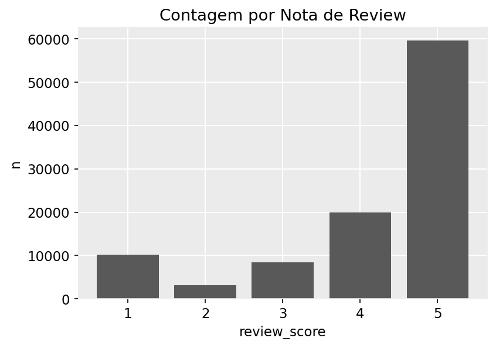

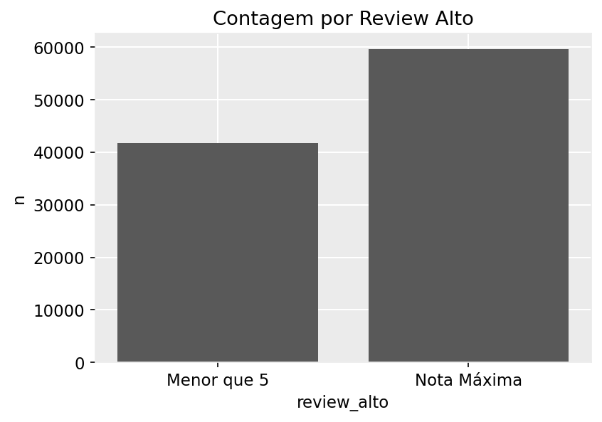
:::

```r
# Algumas Variáveis Categóricas ----

# Estado

base_analise %>%
  count(customer_state, sort = T) %>%
  mutate(prop = n / sum(n))

base_analise %>%
  count(customer_state) %>%
  ggplot(aes(x = customer_state, y = n)) +
  geom_bar(stat ='identity')

# payment_type

base_analise %>%
  count(payment_type, sort = T) %>%
  mutate(prop = n / sum(n))

base_analise %>%
  count(payment_type) %>%
  ggplot(aes(x = payment_type, y = n)) +
  geom_bar(stat ='identity')

# product_category_name

base_analise %>%
  count(product_category_name, sort = T) %>%
  mutate(prop = n / sum(n))
```

::: {layout-ncol=2}
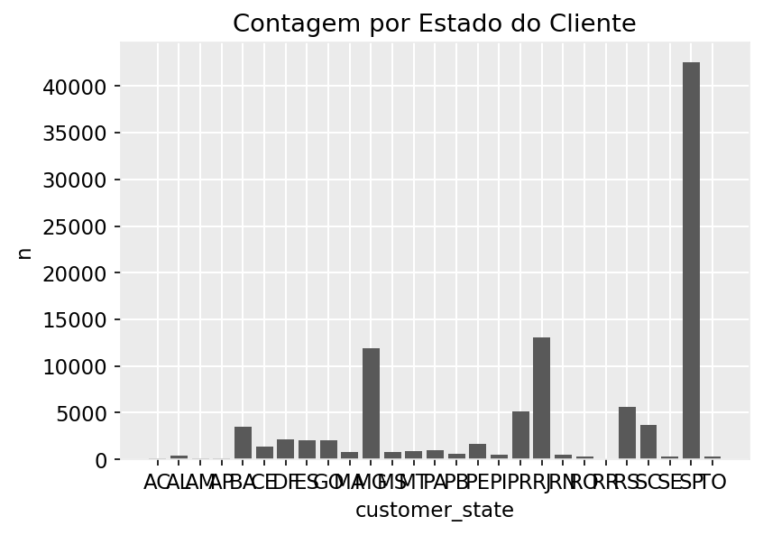

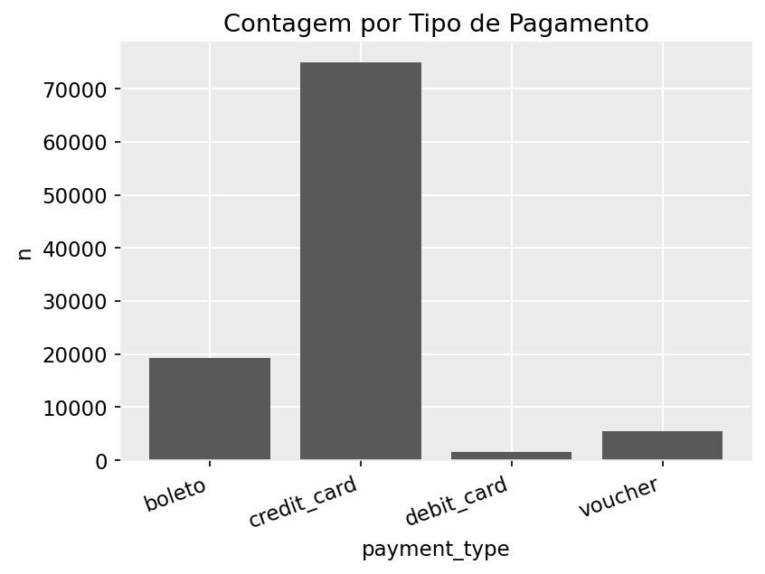
:::

```r
# Algumas Variáveis Numéricas ----

# Preço

summary(base_analise$price)

p1 <- base_analise %>%
  ggplot(aes(y = price)) +
  geom_boxplot() # Boxplot com diversos outliers

p2 <- base_analise %>%
  ggplot(aes(x = price)) +
  geom_density()

grid.arrange(p1, p2, nrow = 1)
# Preço é extremamente assimétrico! Temos outliers com preços acima de R$6000
# O mais comum é transformar essa variável para estabilizá-la se é desejável incluí-la na modelagem
# Obs.: apenas "padronizar" a variável (isto é, sutrair a média e dividir pelo desvio padrão) não é suficiente para retirar a assimetria dela.

pp1 <- base_analise %>%
  ggplot(aes(y = log(price))) +
  geom_boxplot() +
  ggtitle('Boxplot de preço mais estável com a Transformação Logarítmica')

pp2 <- base_analise %>%
  ggplot(aes(x = log(price))) +
  geom_density() +
  ggtitle('Variável de Preço com Transformação Logarítmica')

grid.arrange(pp1, pp2, nrow = 1)
# Nota: Boxplot pode ser problemático por não refletir a distribuição dos dados. Veremos adiante um exemplo melhor.

# Frete

summary(base_analise$freight_value)

base_analise %>%
  ggplot(aes(x = freight_value)) +
  geom_density()

base_analise %>%
  ggplot(aes(x = log(freight_value))) +
  geom_density() +
  ggtitle('Variável de Frete com Transformação Logarítmica')

# A variável de Frete parece ser mais problemática, pois tem valores 0 e alguns saltos
# Como eu poderia identificar rapidamente aonde estão esses pontos de corte???
# Com interatividade gráfica!

(base_analise %>%
  filter(freight_value > 0) %>% # Tira os fretes gratuitos
  ggplot(aes(x = freight_value)) +
  geom_density()) %>% ggplotly()

# O ponto no entorno do 10 parece um ponto de atenção
# Temos muitos valores de frete repetidos.
# Talvez seria interessante transformar essa variável em categórica (ou somar uma constante).

# IMPORTANTE:
# Além disso, o frete deve ter relação com a distância entre customer e seller,
# isso poderia ser levado em consideração fazendo algum tipo de manipulação de
# localização (que está por zipcode).
# Os dados permitiriam fazer essa análise de maneira fácil?

# Frete sobre preço

summary(base_analise$frete_sobre_preco)

base_analise %>%
  ggplot(aes(x = frete_sobre_preco)) +
  geom_density()

base_analise %>%
  ggplot(aes(x = log(frete_sobre_preco))) +
  geom_density()

# Importante: o logaritmo do Frete, quando ele é zero, resulta em -Infinito!

# Frete vs. Preço (neste caso, é uma análise bivariada)

base_analise %>%
  sample_frac(0.2) %>% # Para reduzir o custo computacional
  ggplot(aes(x = log(price),
             y = log(freight_value))) +
  geom_point() +
  geom_smooth() # Mostrar tendência crescente

# Frete Gratuito

base_analise %>%
  count(frete_gratuito, sort = T) %>%
  mutate(prop = n / sum(n))
# Quantidade Irrisória, não vale a pena modelar

# Dias de Antecipação na entrega e Atrasou

summary(as.numeric(base_analise$dias_antecipacao_na_entrega))

base_analise %>%
  ggplot(aes(x = dias_antecipacao_na_entrega)) +
  geom_density()

base_analise %>%
  count(atrasou) %>%
  mutate(prop = n / sum(n))


# product_photos_qty

base_analise %>%
  count(product_photos_qty) %>%
  mutate(prop = n / sum(n))
# Seria interessante imputar 0 nos NA e reclassificar essa variável
```

Os gráficos abaixo são as saídas reais desse trecho, geradas a partir da base de dados verdadeira da Olist (o preço apresenta outliers extremos — pedidos acima de R\$ 6.000 — o que motiva a transformação logarítmica; o mesmo vale para o frete):

::: {layout="[[1,1], [1,1], [1,1], [1,1]]"}
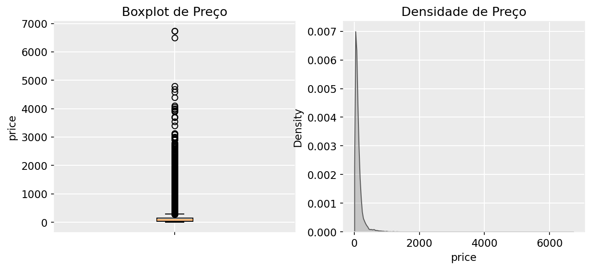

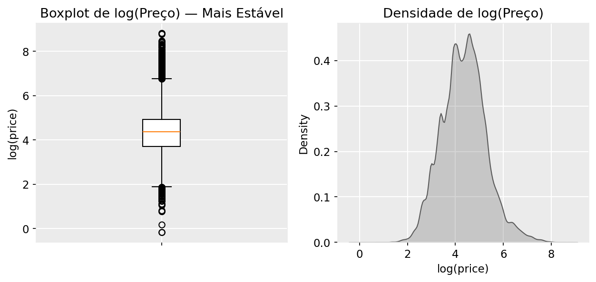

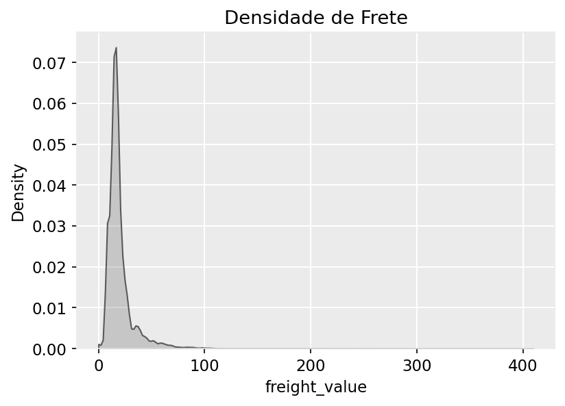

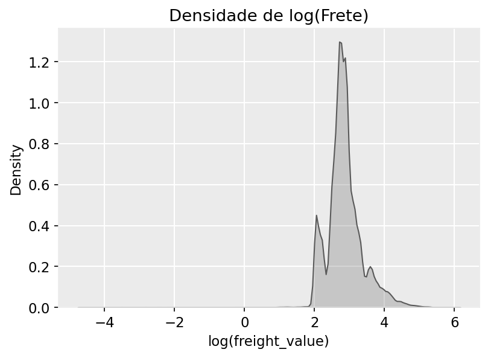

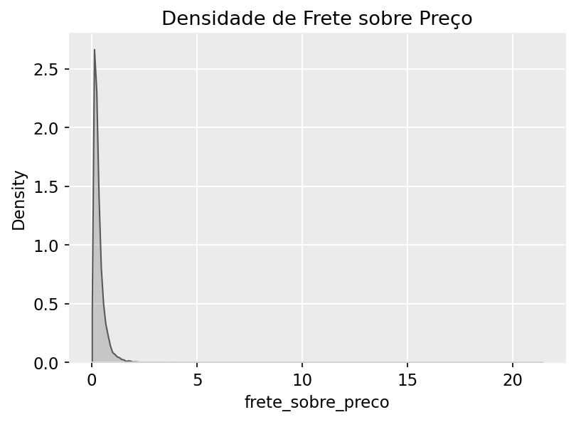

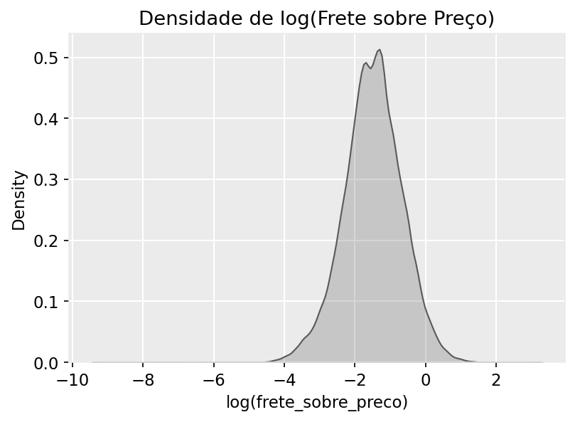

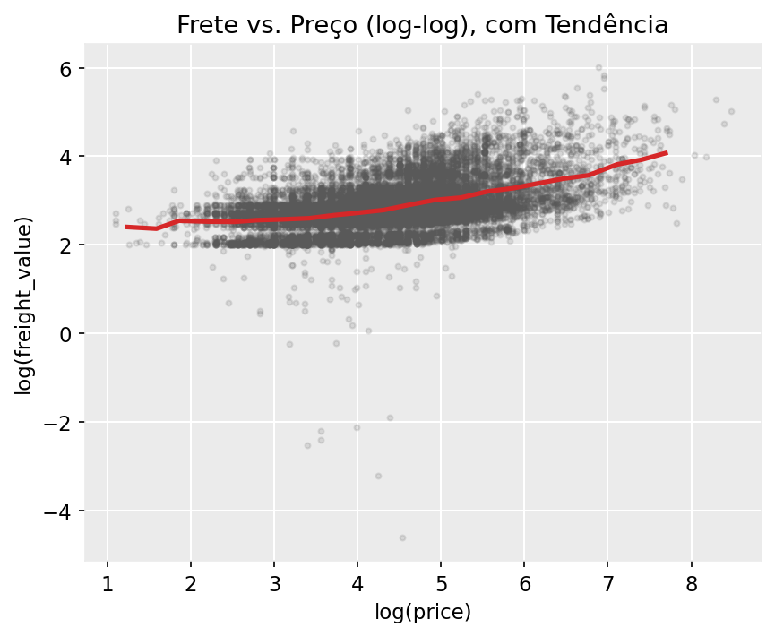

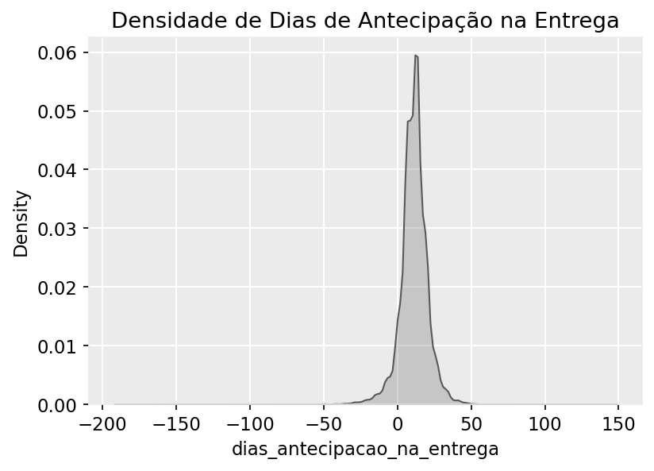
:::

```r
# Análises Bivariadas relacionando com a var. dependente/resposta (review_alto) ----

# Estado vs. Review

base_analise %>%
  group_by(customer_state) %>%
  summarize(n = n(),
            n_review_alto = sum(review_alto_numerico),
            tx_review_alto = mean(review_alto_numerico)) %>%
  View()

# Visualização Interativa usando plotly
base_analise %>%
  plota_tx_interesse(var_x = 'customer_state',
                     var_y = 'review_alto',
                     flag_interesse = 'Nota Máxima')

# Aparentemente o Estado não influencia tanto o Review
```

`plota_tx_interesse()` (definida em `funcoes_plot.R`) gera um gráfico combinado em `plotly`: barras verdes com a frequência (`Fq.`) por categoria no eixo primário, e uma linha vermelha com a taxa de interesse (`Tx.`) no eixo secundário. Como a página não executa `plotly` interativo, as versões abaixo foram recriadas de forma estática (mesmo dado real, mesmo desenho de gráfico: barras + linha em eixo secundário), preservando a mesma escala fixa (0 a 1) usada por padrão na função:

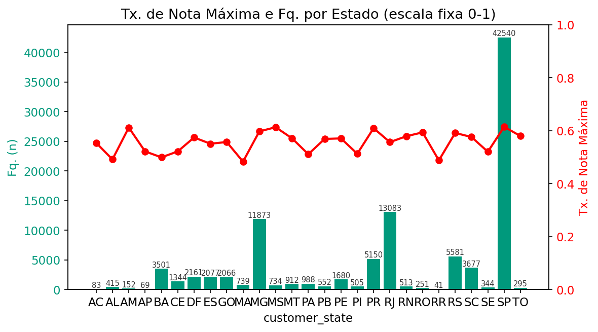

Com a escala fixa em 0–1, o estado aparenta não influenciar muito a taxa de review alto — é a leitura que o próprio comentário do script faz.

```r
# Interlúdio: O poder da Escala!
base_analise %>%
  plota_tx_interesse(var_x = 'customer_state',
                     var_y = 'review_alto',
                     flag_interesse = 'Nota Máxima',
                     ylim = NA)
```

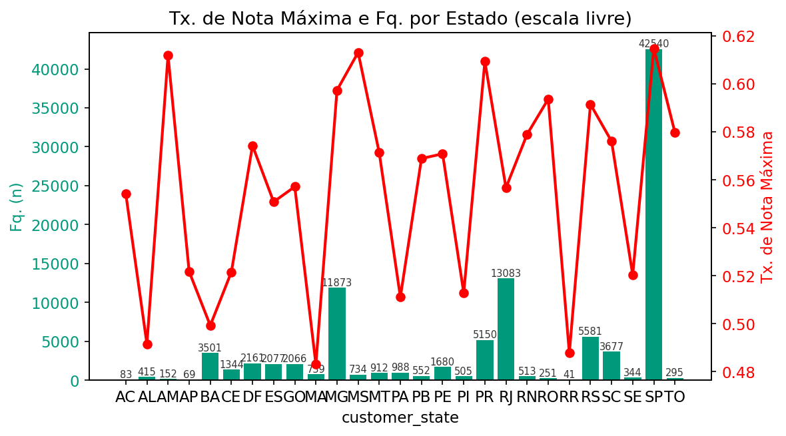

Este é o "Interlúdio: O poder da Escala" do próprio script: a mesma informação, com a escala do eixo secundário liberada (em vez de fixa em 0–1), parece mostrar uma variação muito mais dramática entre estados — mesmo a diferença real sendo pequena (todas as taxas ficam entre ~0,48 e ~0,62). Um lembrete de como a escolha da escala pode enganar (ou exagerar) uma leitura visual.

```r
# payment_type vs. Review
base_analise %>%
  plota_tx_interesse(var_x = 'payment_type',
                     var_y = 'review_alto',
                     flag_interesse = 'Nota Máxima',
                     ylim = NA)
```

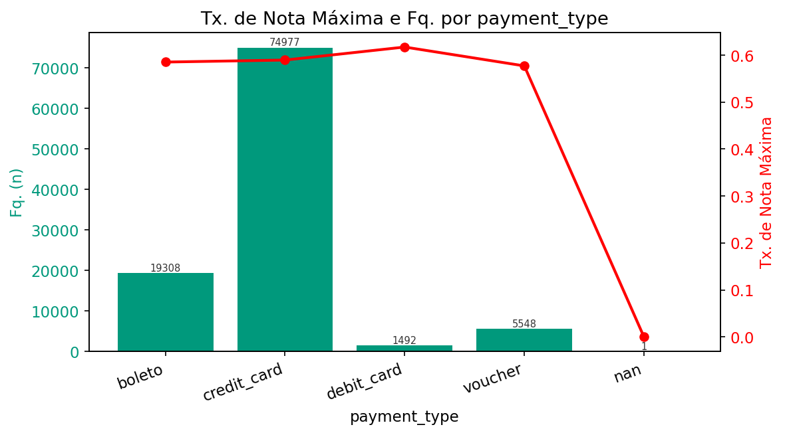

```r
# product_category_name vs. Review
base_analise %>%
  plota_tx_interesse(var_x = 'product_category_name',
                     var_y = 'review_alto',
                     flag_interesse = 'Nota Máxima',
                     ylim = NA)

# Muitas classes, vamos agrupar em algumas
base_analise %>%
  mutate(product_category_name_cat = fct_lump(product_category_name, 7)) %>%
  plota_tx_interesse(var_x = 'product_category_name_cat',
                     var_y = 'review_alto',
                     flag_interesse = 'Nota Máxima',
                     ylim = NA)
```

A versão com `product_category_name` bruto tem dezenas de categorias e fica ilegível num gráfico de barras; por isso, abaixo está a versão já agrupada (top 7 categorias + "Other"), que é o objetivo do `fct_lump`:

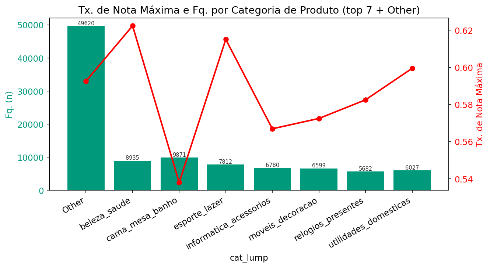

```r
# Preço/Frete/Frete sobre Preço vs. Review

# Preço
base_analise %>%
  group_by(review_alto) %>%
  summarize(n = n(),
            media = mean(price, na.rm = T),
            desvio_padrao = sd(price, na.rm = T),
            min = min(price, na.rm = T),
            max = max(price, na.rm = T))

# Frete
base_analise %>%
  group_by(review_alto) %>%
  summarize(n = n(),
            media = mean(freight_value, na.rm = T),
            desvio_padrao = sd(freight_value, na.rm = T),
            min = min(freight_value, na.rm = T),
            max = max(freight_value, na.rm = T))

# Frete sobre Preço
base_analise %>%
  group_by(review_alto) %>%
  summarize(n = n(),
            media = mean(frete_sobre_preco, na.rm = T),
            desvio_padrao = sd(frete_sobre_preco, na.rm = T),
            min = min(frete_sobre_preco, na.rm = T),
            max = max(frete_sobre_preco, na.rm = T))

# # Possível gráfico interessante comparativo entre dois grupos:
# base_analise %>%
#   sample_frac(0.01) %>%
#   mutate(log_price = log(price)) %>%
#   ggstatsplot::ggbetweenstats(
#   x = review_alto,
#   y = log_price,
#   title = "Comparação do Log do Preço com Nota do Cliente"
# )


# ---- Interlúdio: Múltiplas Densidades e a limitação de Boxplots ---- #

# Relação de preço com product_category_name

base_analise %>%
  mutate(cat_product_category_name = fct_lump(product_category_name, n = 7)) %>%
  ggplot(aes(x = log(price), fill = cat_product_category_name)) +
  geom_density(alpha = 0.35)
# Difícil de Visualizar

base_analise %>%
  mutate(cat_product_category_name = fct_lump(product_category_name, n = 7),
         log_price = log(price)) %>%
  ggplot(aes(x = log_price,
             y = cat_product_category_name,
             fill = stat(x))) +
  geom_density_ridges_gradient(scale = 3, rel_min_height = 0.001) +
  scale_fill_viridis_c(name = "Preço (em log)")
# Melhor de Visualizar

base_analise %>%
  mutate(cat_product_category_name = fct_lump(product_category_name, n = 7),
         log_price = log(price)) %>%
  ggplot(aes(fill = cat_product_category_name,
             y = log_price,
             x = cat_product_category_name)) +
  geom_boxplot() +
  theme(legend.title = element_blank(),
        axis.text.x = element_text(angle = 45))
# Boxplot pode não refletir a distribuição dos dados


# ---- Fim do Interlúdio ---- #
```

::: {layout-ncol=3}
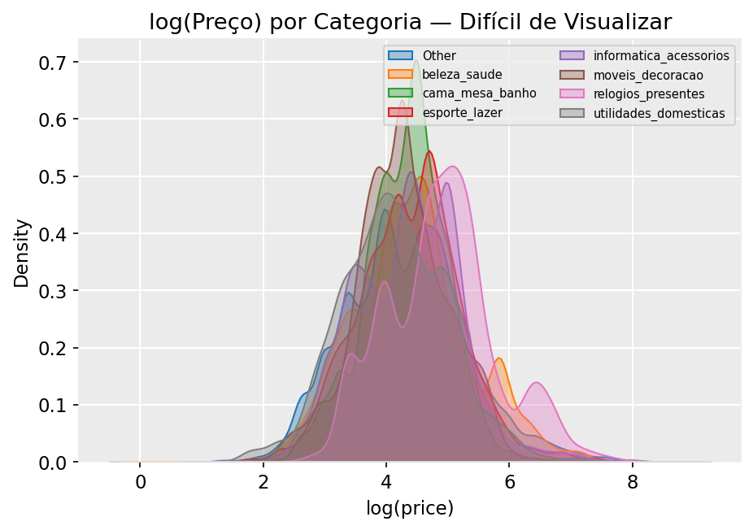

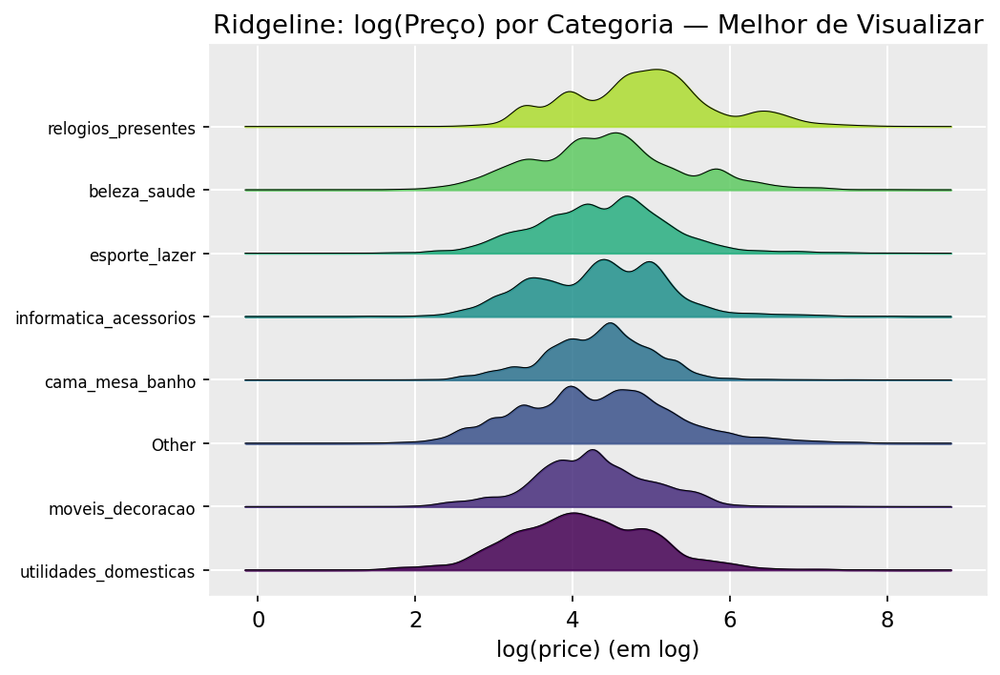

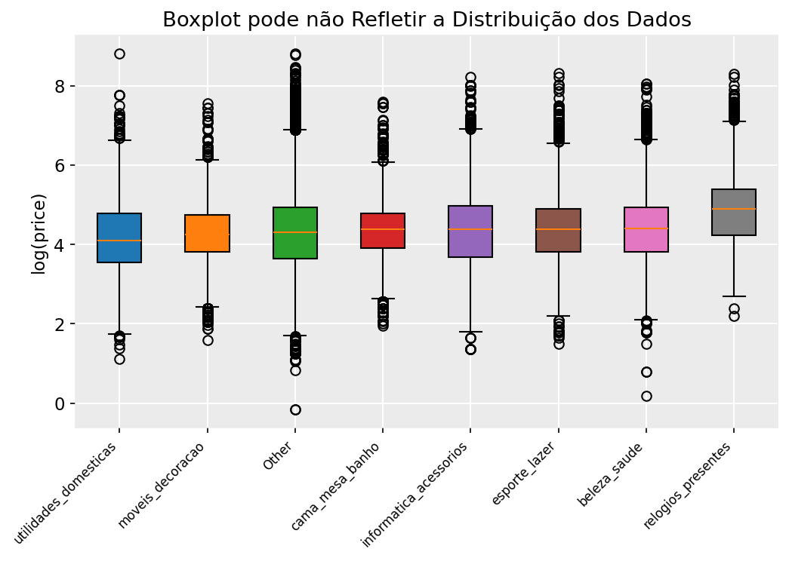
:::

O "interlúdio" do próprio script ilustra bem a limitação do boxplot: ao comparar as três visualizações acima da mesma variável (log do preço) por categoria de produto, a densidade sobreposta é difícil de interpretar, o ridgeline (gráfico de cristas) mostra claramente a forma e a posição de cada distribuição, e o boxplot — apesar de compacto — esconde nuances como multimodalidade.

```r
# Dias de Antecipação na entrega/Atrasou vs. Review

base_analise %>%
  group_by(review_alto) %>%
  summarize(n = n(),
            media = mean(dias_antecipacao_na_entrega, na.rm = T),
            desvio_padrao = sd(dias_antecipacao_na_entrega, na.rm = T),
            min = min(dias_antecipacao_na_entrega, na.rm = T),
            max = max(dias_antecipacao_na_entrega, na.rm = T))

base_analise %>%
  ggplot(aes(x = dias_antecipacao_na_entrega, fill = as.factor(review_alto))) +
  geom_density(alpha = 0.5)
```

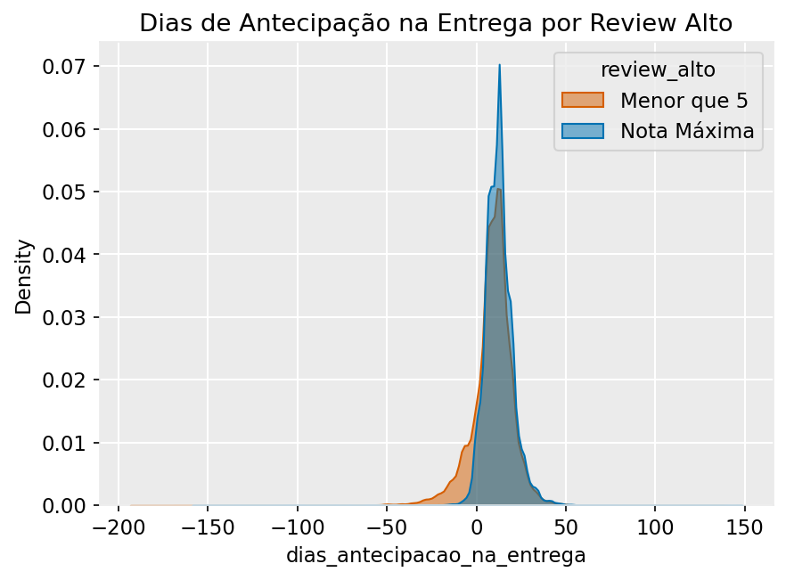

Analisando pela quantidade de dias não é tão clara a diferença entre os dois grupos — mas, como o script comenta, analisando pela variável dicotômica "Atrasou" a relevância fica mais clara:

```r
base_analise %>%
  mutate(atrasou = ifelse(atrasou == 1, 'Sim', 'Não')) %>%
  plota_tx_interesse(var_x = 'atrasou',
                     var_y = 'review_alto',
                     flag_interesse = 'Nota Máxima',
                     ylim = NA)
```

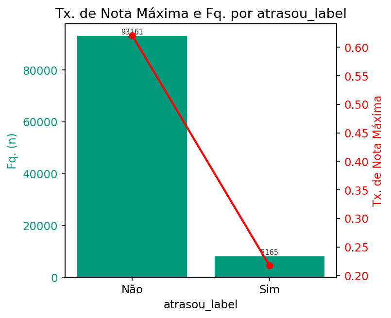

A diferença fica bem mais evidente aqui: quem teve o pedido atrasado deu nota máxima com frequência bem menor do que quem recebeu no prazo.

```r
# product_photos_qty vs. Review
# Imputando NA's e Categorizando uma variável numérica!
base_analise %>%
  replace_na(list(product_photos_qty = 0)) %>%
  plota_tx_interesse(var_x = 'product_photos_qty',
                     var_y = 'review_alto',
                     flag_interesse = 'Nota Máxima',
                     ylim = NA)
# Diferença pontual entre taxas ainda pequena
```

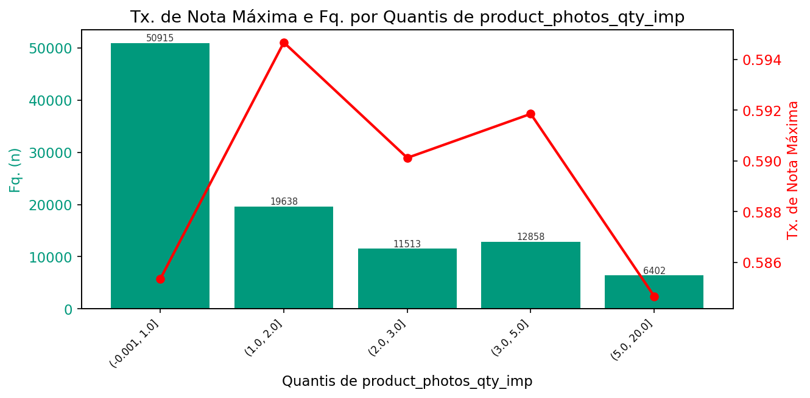

Como `product_photos_qty` é numérica, `plota_tx_interesse()` primeiro a quebra em quantis (`k = 10` por padrão, aqui colapsados para 5 faixas por haver poucos valores distintos) antes de calcular a taxa por faixa — confirmando o comentário do script: a diferença entre faixas é pequena.

```r
# Visualização múltipla: o poder do Grammar of Graphics

# Gráfico de dispersão: Preço vs. Frete vs. Review vs. Estado vs. Atrasou vs. Qtd. de Photos
base_analise %>%
  sample_frac(0.1) %>%
  replace_na(list(product_photos_qty = 0)) %>%
  mutate(customer_state = fct_lump(customer_state, 5)) %>%
  ggplot(aes(x = log(price),
             y = log(freight_value),
             col = review_alto,
             size = product_photos_qty)) +
  geom_point(alpha = 0.5) +
  facet_wrap(customer_state ~ atrasou,
             labeller = "label_both"
             #, scales = "free"
             ) +
  ggtitle('Preço vs. Frete vs. Review vs. Estado vs. Atrasou vs. Qtd. de Photos') +
  theme_light()
```

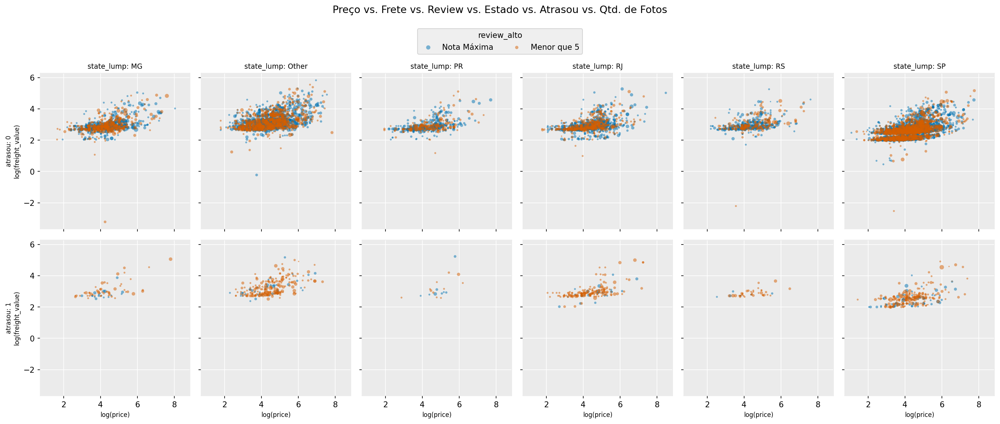

O gráfico acima ilustra bem o poder do *Grammar of Graphics*: 6 variáveis (preço, frete, review, estado, atraso e quantidade de fotos) combinadas em um único gráfico usando eixos, cor, tamanho e facetas — e fica visualmente claro que atrasos (`atrasou == 1`, linha de baixo) são bem mais raros que entregas dentro do prazo.

```r
# Observação: é possível incluir interatividade no gráfico acima facilmente
# Com a função "ggplotly" (alguns ajustes podem ser requeridos como o scales = "free")

# Visualização conjunta de variáveis numéricas, misturando data wrangling e data visualization

# Lembre da Distribuição assimétrica de frete_sobre_preco e price
# Aplicando a transformação logarítmica
base_analise %>%
  mutate(dias_antecipacao_na_entrega = as.numeric(dias_antecipacao_na_entrega),
         log_price = log(price),
         frete_sobre_preco_desloc = (freight_value + 1) / (price + 1), # Desloca-se para evitar -Infinito
         log_frete_sobre_preco_desloc = log(frete_sobre_preco_desloc)) %>% # Mantém mesmo tipo de dado para gather
  select(log_price,
         log_frete_sobre_preco_desloc,
         dias_antecipacao_na_entrega,
         review_alto) %>%
  gather(variavel, valor, -review_alto) %>%
  ggplot(aes(x = valor,
             fill = as.factor(review_alto))) +
  geom_density(alpha = 0.5) +
  facet_wrap(~variavel, scales = "free") +
  labs(fill = "Review Alto")
```

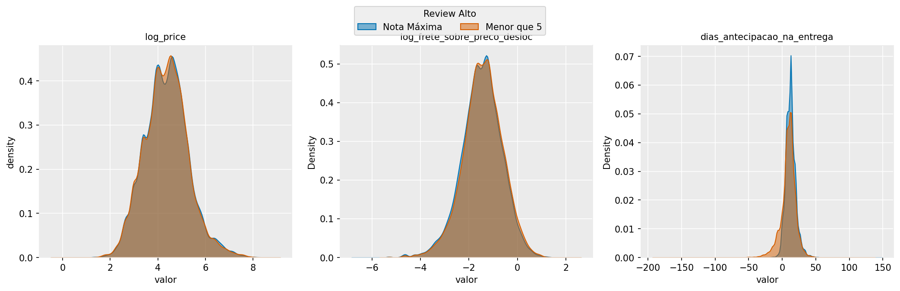

```r
# salva a base de Dados para modelagem posterior

base_model <- base_analise %>%
  mutate(dias_antecipacao_na_entrega = as.numeric(dias_antecipacao_na_entrega),
         log_price = log(price),
         frete_sobre_preco_desloc = (freight_value + 1) / (price + 1), # Desloca-se para evitar -Infinito
         log_frete_sobre_preco_desloc = log(frete_sobre_preco_desloc),
         product_category_name_cat = fct_lump(product_category_name, 7)
         ) %>%
  replace_na(list(product_photos_qty = 0)) %>%
  select(customer_state,
         log_price,
         log_frete_sobre_preco_desloc,
         payment_type,
         product_category_name_cat,
         product_photos_qty,
         dias_antecipacao_na_entrega,
         atrasou,
         review_alto_numerico)

# Ainda temos NA's na base?
map_df(base_model, ~sum(is.na(.))) %>%
  gather() %>%
  arrange(desc(value))

# Criamos uma classe explícita de NA para produto e imputamos NA no tipo de pagamento pela categoria mais provável

base_model <- base_model %>%
  mutate(product_category_name_cat = fct_explicit_na(product_category_name_cat)) %>%
  replace_na(list(payment_type = 'credit_card'))


saveRDS(base_model, 'data/base_model.rds')
```

Alguns destaques do script:

- **Assimetria e transformação logarítmica**: as variáveis `price` e `freight_value` são extremamente assimétricas (outliers de até R\$ 6.000), então o script aplica `log()` para estabilizá-las antes de qualquer modelagem — lembrando que padronizar (subtrair média, dividir por desvio padrão) sozinho **não** remove a assimetria.
- **Boxplot vs. densidade**: o script mostra, lado a lado, como o boxplot pode ocultar a real distribuição dos dados em comparação a gráficos de densidade (inclusive densidade em "cristas", via `ggridges`).
- **Grammar of Graphics**: o gráfico final de dispersão combina 6 variáveis simultaneamente (preço, frete, review, estado, atraso e quantidade de fotos), usando `facet_wrap`, cor e tamanho — ilustrando o poder de camadas do `ggplot2`.
- A base final (`base_model.rds`) é o ponto de partida da etapa de modelagem, a seguir.

# Modelagem

Com a base pronta (`base_model.rds`), o script `2 - Modelling_ML_H2O.R` compara duas estratégias de modelagem para prever `review_alto_numerico` (se o cliente deu nota máxima ao pedido): uma **Regressão Logística** simples (com holdout set) e um **AutoML do H2O** (com k-fold cross-validation), avaliando ambas por AUC/curva ROC:

```r
# Carregando pacotes necessários ----
source('util/pacotes_necessarios.R')

base_model <- readRDS('data/base_model.rds')

# Algoritmo: Regressão Logística
# Estratégia de Checagem de Qualidade: Simples Holdout Set (amostra de teste)

set.seed(1234)

n_treino = floor(0.7 * nrow(base_model))
train_ind = sample(seq_len(nrow(base_model)), size = n_treino)

base_treino <- base_model[train_ind,]
base_teste <- base_model[-train_ind,]

cat('n Base Treino: ', nrow(base_treino), '\n',
    'n Base Teste: ', nrow(base_teste), '\n',
    'n Base Total: ', nrow(base_model))

# Originalmente, o modelo daria problema se tivesse o -Infinito no logaritmo do Frete sobre Preço
# Lembre-se do Fluxo de iteração entre modelagem e transformação
reg_logistica <- glm(review_alto_numerico ~ .,
                     data = base_treino,
                     family = binomial(link = 'logit'))

# saveRDS(reg_logistica, 'data/models/reg_logistica.rds')

summary(reg_logistica)

p <- predict(reg_logistica, base_teste, type = "response")

# Probabilidades Individuais
base_teste %>%
  mutate(probabilidade_predita = p) %>%
  View()

# Checando AUC e plotando a curva ROC
PRROC_obj <- roc.curve(scores.class0 = p,
                       weights.class0 = base_teste$review_alto_numerico,
                       curve = TRUE)
plot(PRROC_obj)
auc_calculada <- PRROC_obj$auc

# Gráfico de Distribuição Acumulada entre os grupos
aux <- tibble(prob_predita = p, group = as.factor(base_teste$review_alto_numerico))
ggplot(aux, aes(x = prob_predita, col = as.factor(group))) +
  stat_ecdf(geom = "step") +
  ggtitle(paste0('AUC = ', round(auc_calculada, 4)))

# Modelo com baixo poder discriminativo


# Vamos ver se a gente consegue melhorar ele com alguma outra estratégia.

# Algoritmo: Diversos com AutoML do H2O
# Estratégia de Validação: K-Fold Cross_validation
# Estratégia de Checagem de Qualidade: o mesmo Holdout Set de antes
# Fonte: https://towardsdatascience.com/a-minimal-example-combining-h2os-automl-and-shapley-s-decomposition-in-r-ba4481282c3c

h2o.init() # Necessário Java 64-bit

df_treino <- base_treino %>%
  rename(y = review_alto_numerico) %>%
  mutate(y = as.factor(y)) %>%
  mutate_if(is.character, factor)

df_teste <- base_teste %>%
  rename(y = review_alto_numerico) %>%
  mutate(y = as.factor(y)) %>%
  mutate_if(is.character, factor)

df_frame_treino <- as.h2o(df_treino)
df_frame_teste <- as.h2o(df_teste)

automl_model <- h2o.automl(
  y = 'y',
  balance_classes = TRUE,
  training_frame = df_frame_treino,
  nfolds = 4,
  max_runtime_secs = 60 * 1, # Tempo Máximo de k minutos: 60 * k
  #include_algos = c('DRF', 'GBM', 'XGBoost'),
  exclude_algos = "StackedEnsemble", # Importância Global de Modelos Stacked não são triviais
  sort_metric = "AUC",
  seed = 1234)

lb <- as.data.frame(automl_model@leaderboard)
View(lb)
aml_leader <- automl_model@leader

#h2o.saveModel(object = aml_leader,
#              path = 'data/models',
#              force = TRUE)

# Melhorou a métrica AUC no Holdout set?
pred <- h2o.predict(object = aml_leader, newdata = df_frame_teste) %>%
  as.data.frame() %>%
  pull(p1)

# Checando AUC e plotando a curva ROC
PRROC_obj <- roc.curve(scores.class0 = pred,
                       weights.class0 = base_teste$review_alto_numerico,
                       curve = TRUE)
plot(PRROC_obj)

# Gráfico de Importância de Variância
h2o.varimp_plot(aml_leader)

# Dependência Parcial com relação a algumas variáveis
h2o.partialPlot(object = aml_leader,
                data = df_frame_treino,
                cols = "dias_antecipacao_na_entrega")

h2o.partialPlot(object = aml_leader,
                data = df_frame_treino,
                cols = "log_frete_sobre_preco_desloc")

h2o.partialPlot(object = aml_leader,
                data = df_frame_treino,
                cols = "payment_type")
```

O script compara as duas abordagens na prática: a regressão logística simples tem baixo poder discriminativo (AUC baixa), o que motiva testar o AutoML do H2O — que treina e compara automaticamente diversos algoritmos (GBM, Random Forest, XGBoost, etc.) via k-fold cross-validation, selecionando o "líder" pela métrica de AUC. Ao final, o script ainda produz gráficos de importância de variáveis e de dependência parcial (relação entre uma covariável específica e a predição do modelo, mantendo as demais fixas) — uma forma prática de abordar a explicabilidade do modelo discutida na etapa de Avaliação da metodologia [CRISP-DM](3_workflow_produto_dados_crisp_dm.qmd#etapa-5-avaliação).
