# Introdução

Este material cobre as **Semanas 1 e 2** do plano de ensino: noções gerais sobre Estatística, alfabetização científica, população e amostra, classificação de variáveis, níveis de mensuração, coleta e representação de dados, e distribuição de frequências (histograma e boxplot).

Slides originais disponíveis [AQUI](https://github.com/renanxcortes/teaching/raw/refs/heads/main/Metodos_Estatisticos/slides/semana_1_a_2.pptx).

# Noções Gerais sobre Estatística

**Estatística** é a ciência que tem por objetivo orientar a coleta, o resumo, a apresentação, a análise e a interpretação dos dados. Em outras palavras, é a ciência que coleta, organiza, analisa e interpreta dados, apoiando a tomada de decisões em situações de incerteza. É muito utilizada em experimentos agrícolas e zootécnicos — por exemplo, na avaliação da produtividade de culturas ou do ganho de peso animal.

A Estatística se divide em duas grandes frentes:

- **Estatística descritiva**: envolvida com o resumo e a apresentação dos dados; e
- **Estatística inferencial**: ajuda a concluir sobre o conjunto maior de dados (população) quando apenas uma parte deste conjunto for estudada (amostra).

## Alfabetização científica

**Alfabetização científica** é a capacidade de interpretar dados e resultados científicos: compreender gráficos, tabelas e conclusões estatísticas. Ela é fundamental para a leitura de artigos científicos em Agronomia e Zootecnia, e evita interpretações equivocadas de resultados experimentais — um problema mais comum do que se imagina, inclusive na cobertura jornalística de dados (veja, por exemplo, o vídeo disponível no Moodle sobre interpretações equivocadas de dados durante a pandemia de Covid-19, que motivou inclusive um workshop de letramento estatístico para jornalistas).

Um bom ponto de partida para pensar em alfabetização científica é entender as etapas de uma pesquisa científica e onde a Estatística entra nesse processo — tanto na metodologia da área de estudo quanto na metodologia estatística propriamente dita:

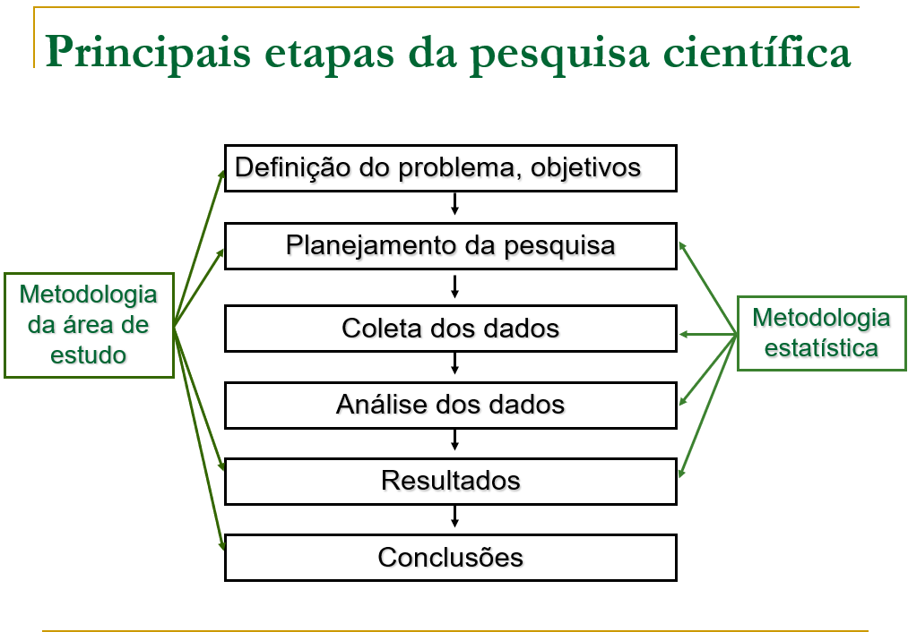

# População e Amostra

- **População**: conjunto total de indivíduos ou observações de interesse que apresentam, pelo menos, uma característica em comum.
- **Amostra**: subconjunto representativo (ou não) da população.

Uma boa intuição para essa distinção: *"um chef de cozinha prova seu prato com uma colherada antes de servir toda a panela"*. Não é preciso comer o prato inteiro para saber se o tempero está bom.

**Exemplo de população**: todo o rebanho bovino de uma fazenda. **Exemplo de amostra**: 30 animais selecionados para avaliação.

## Variáveis: exemplo motivacional

Considere uma população — o rebanho total de vacas de uma fazenda — e uma característica observável $X$ nesse rebanho (por exemplo, $X_1$, $X_2$, $X_3$, ...). Um exemplo concreto: estimar a **proporção de vacas com a doença da vaca louca**.

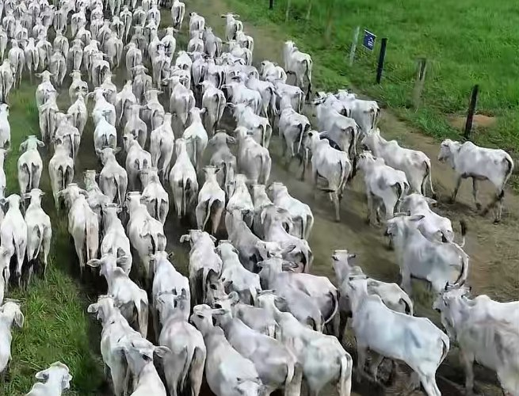

- **População**: rebanho total de vacas de uma fazenda.
- **Característica $X$ observável**: "Tem a doença da vaca louca? Sim ou não?"
- **Amostra**: um subconjunto do rebanho, sobre o qual observamos $X$.

O esquema geral é: partimos do **universo do estudo** (população), observamos uma parte dele através da **amostragem**, e usamos os dados observados (amostra) para fazer **inferência** sobre a população como um todo. Esse ciclo — população → amostragem → amostra → inferência → conclusão sobre a população — é a espinha dorsal de toda a Estatística Inferencial, e retornaremos a ele repetidamente ao longo da disciplina (por exemplo, nas semanas de Amostragem/Estimação e de Testes de Hipótese).

# Variáveis

**Variável** é toda a característica que, observada em uma unidade de pesquisa/experimento, pode variar de unidade para unidade. Exemplos: peso de um animal, raça de um animal, altura de uma planta, número de ovos de uma galinha, etc.

> "A existência da variabilidade justifica o estudo da ciência estatística."

## Classificação de variáveis

As variáveis podem ser classificadas em dois grandes grupos, cada um com dois subtipos:

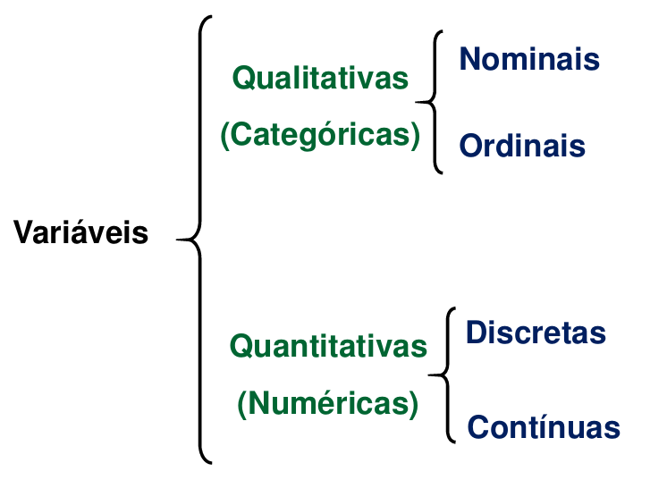

### Qualitativas (categóricas)

- **Nominal**: não possui ordem/hierarquia. Exemplo: raça animal (Raça A, Raça B, Raça C, ...).
- **Ordinal**: possui ordem/ranking/escala lógica. Exemplo: estágios de crescimento (Pequeno, Médio, Grande).

Outros exemplos aplicados à Agronomia e Zootecnia:

**Nominais**: tipo de cultura (Soja, Milho, Cana-de-açúcar, Café, Algodão); raça de gado (Nelore, Angus, Holandesa, Jersey, Brangus); tipo de solo (Argiloso, Arenoso, Franco); sistema de produção (Intensivo, Extensivo, Orgânico, Convencional); marca de fertilizante ou defensivo agrícola.

**Ordinais**: intensidade de infestação de pragas (Baixa, Média, Alta); classificação da qualidade do fruto (Primeira, Segunda, Descarte); nível de maturação do fruto (Verde, Maduro, Passado); escore de condição corporal em bovinos (Magro, Ideal, Obeso); nível de severidade de uma doença como a ferrugem (Leve, Moderada, Severa).

### Quantitativas (numéricas)

- **Discretas**: valores inteiros contáveis. Exemplo: número de leitões por parto (1, 2, 3, ..., 14, ...).
- **Contínuas**: valores em escala real. Exemplo: peso de animais, altura de plantas (12,4 kg, 14,85 kg, etc.).

Outros exemplos:

**Discretas**: número de frutos por planta; quantidade de animais por piquete; número de perfilhos por planta de trigo; quantidade de tratores na fazenda; número de ovos produzidos por galinha por dia.

**Contínuas**: produtividade da cultura (t/ha ou sc/ha); peso do animal (kg); índice pluviométrico (mm); teor de umidade do grão (%); temperatura ambiente no aviário (°C).

## Escalas (níveis) de mensuração

Escalas de medida — também chamadas de **níveis de mensuração** — são importantes porque determinam quais análises estatísticas podem ser realizadas com segurança e como os dados devem ser interpretados. Existem quatro escalas distintas, organizadas hierarquicamente: à medida que se sobe de nível, aumentam tanto a complexidade quanto a informação disponível para a metodologia estatística.

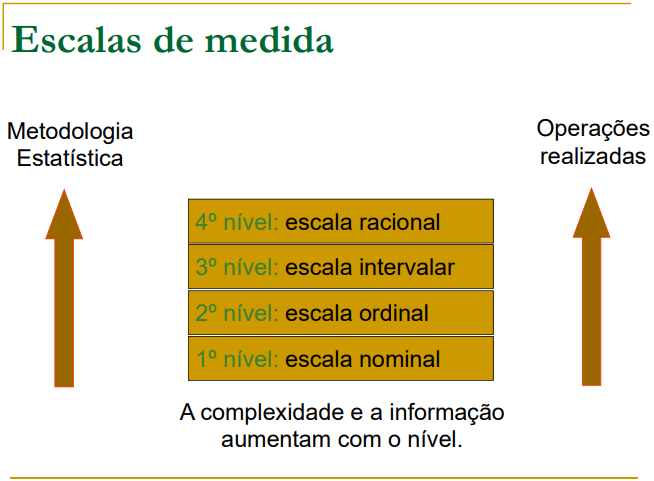

Uma pergunta importante para fixar o conceito: *faz sentido calcular uma média em uma base de dados em que estão codificados os números "1 – Angus" e "2 – Hereford"? E se fosse "1 – Pequeno" e "2 – Médio"? E se fosse "0 – Não" e "1 – Sim"?* Em nenhum desses casos a média tem uma interpretação sensata, porque os números ali são apenas rótulos (nominal) ou indicam ordem sem distância fixa entre categorias (ordinal) — não são medidas na escala intervalar ou de razão.

### Intervalar vs. razão: o que muda na prática?

A distinção entre escala **intervalar** e de **razão** costuma ser a mais sutil das quatro. A ideia central: nas duas escalas, o intervalo entre dois pontos quaisquer tem sempre o mesmo "tamanho" (16 graus de diferença entre 32°C e 16°C é a mesma coisa que entre 66°C e 50°C; 10 kg a 20 kg é a mesma diferença que 75 kg a 85 kg). A diferença é que a escala de razão tem um **zero absoluto** (zero significa "ausência" da grandeza), e a intervalar não.

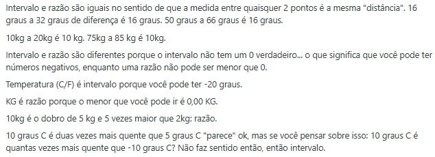

Por exemplo: temperatura em °C/°F é intervalar, porque você pode ter valores negativos (-20°C é um valor válido) — não existe "zero absoluto" de temperatura nessas escalas. Já o peso em kg é de razão, porque o menor valor possível é 0,00 kg, que representa de fato ausência de peso. Isso implica que "10 kg é o dobro de 5 kg" faz sentido (razão), mas "10°C é duas vezes mais quente que 5°C" não faz sentido — a comparação correta precisaria ser feita em Kelvin, que tem zero absoluto.

Na prática, quase todas as variáveis contínuas medidas em Agronomia e Zootecnia (peso, produtividade, altura, precipitação) são de **razão**. A escala intervalar aparece com menos frequência (temperatura em °C sendo o exemplo clássico).

# Coleta e representação de dados (organização)

## Tabelas

A forma mais básica de organizar dados coletados é uma tabela. É importante lembrar que a Associação Brasileira de Normas Técnicas (ABNT) estabelece alguns padrões mínimos para tabelas, como a presença de fonte e título.

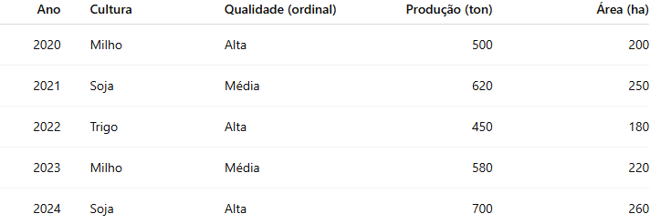

## Gráficos

Os principais tipos de gráfico para representar dados são: **linha**, **série temporal**, **coluna**, **barra** e **setor/pizza**. A escolha do tipo de gráfico depende da natureza da variável e do que se quer comunicar — evolução ao longo do tempo, comparação entre categorias, ou composição/proporção de um total.

::: {layout-ncol=2}
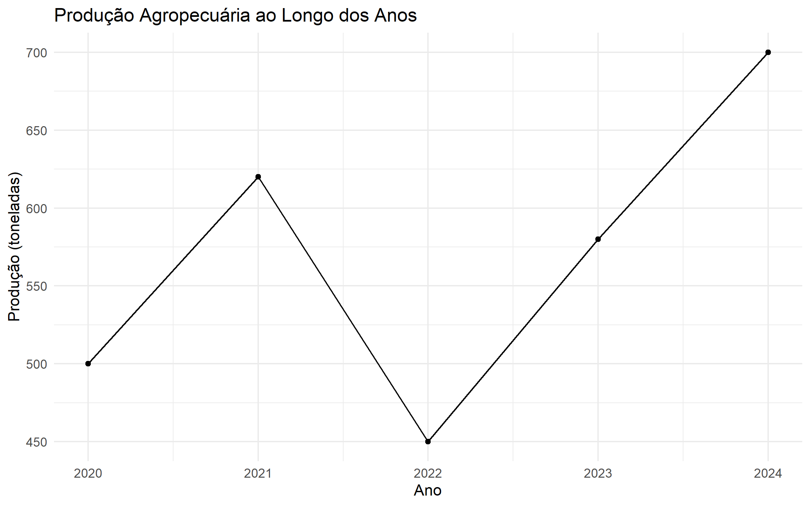

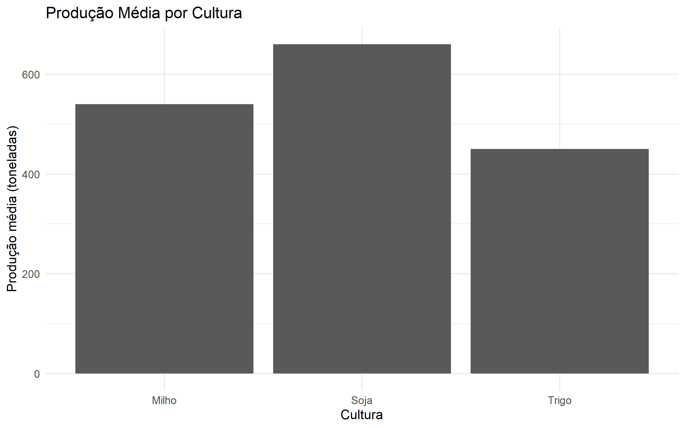
:::

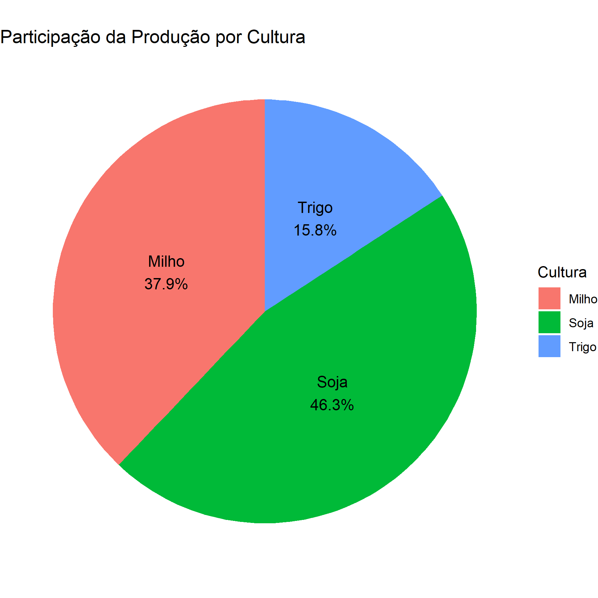

Para mais exemplos de representações gráficas, recomenda-se o material [Representações Gráficas](https://www.ufrgs.br/probabilidade-estatistica/slides/slides_1/1-3_Representacoes%20graficas.pdf) do site de Probabilidade e Estatística EAD da UFRGS, além dos materiais suplementares no Moodle. Dois aplicativos interativos também são recomendados: [Análise Exploratória — Variáveis Quantitativas](https://istats.shinyapps.io/EDA_quantitative/) e [Análise Exploratória — Variáveis Categóricas](https://istats.shinyapps.io/EDA_categorical/).

# Distribuição de frequências: histograma e boxplot

## Histograma

O **histograma** é a representação gráfica mais usada para visualizar a distribuição de uma variável quantitativa: os dados são agrupados em faixas (classes) e a altura de cada barra representa a frequência de observações naquela faixa.

Quando um valor está muito distante do restante dos dados — um **outlier** (valor extremo) — ele aparece isolado no histograma, geralmente afastado do "corpo" principal da distribuição:

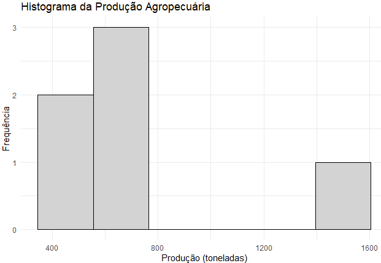

## Boxplot

Antes de discutir boxplots propriamente, vale revisar rapidamente as medidas de posição que os compõem (quartis, mediana) — assunto que será aprofundado na próxima seção (Estatística Descritiva - Medidas). O **boxplot** (ou diagrama de caixa) resume a distribuição de uma variável quantitativa através de cinco números: mínimo, primeiro quartil, mediana, terceiro quartil e máximo, além de sinalizar explicitamente a presença de outliers (geralmente marcados como pontos fora dos "bigodes" da caixa):

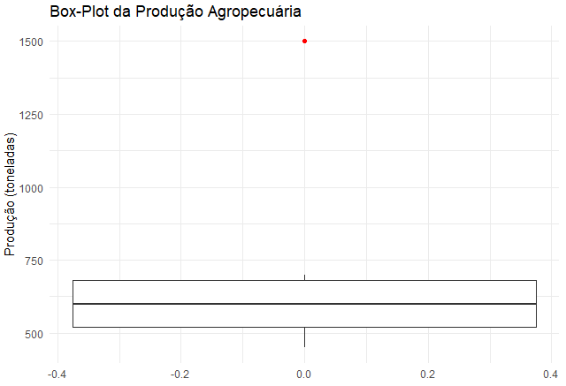

Note como o mesmo conjunto de dados do histograma acima aparece resumido de forma mais compacta no boxplot — a caixa concentra a maior parte dos dados, e o outlier fica claramente destacado como um ponto isolado.

# Para saber mais

Para mais exemplos interessantes de representações gráficas, recomenda-se acessar o material [Representações Gráficas](https://www.ufrgs.br/probabilidade-estatistica/slides/slides_1/1-3_Representacoes%20graficas.pdf), bem como os materiais suplementares no Moodle e os aplicativos interativos [EDA_quantitative](https://istats.shinyapps.io/EDA_quantitative/) e [EDA_categorical](https://istats.shinyapps.io/EDA_categorical/).
