# Introdução

Este material cobre as **Semanas 5 e 6** do plano de ensino: noções de probabilidade, axiomas, probabilidade condicional e sua aplicação, eventos independentes, distribuição normal e suas aplicações. Como complemento, a página também introduz as distribuições t de Student e F de Snedecor — que reaparecerão nas páginas de Testes de Hipóteses e ANOVA — sempre ilustradas com exemplos motivacionais de Agronomia e Zootecnia.

Slides originais disponíveis [AQUI](https://github.com/renanxcortes/teaching/raw/refs/heads/main/Metodos_Estatisticos/slides/semana_5_a_6.pptx).

Para aprofundamento teórico, recomenda-se a leitura de [Probabilidade: introdução e teoremas](https://www.ufrgs.br/probabilidade-estatistica/slides/slides_1/1-6_Probabilidade_introducao%20e%20teoremas.pdf) e [Probabilidade condicional e Bayes](https://www.ufrgs.br/probabilidade-estatistica/slides/slides_1/1-7_Probabilidade_condicional%20e%20bayes.pdf) (exceto os itens de Teorema da Probabilidade Total e Teorema de Bayes, fora do escopo desta disciplina), além do item 3 (Distribuição Normal) de [Variáveis aleatórias contínuas e distribuições](https://www.ufrgs.br/probabilidade-estatistica/slides/slides_2/2-2_Var%20aleatorias%20continuas%20e%20distribuicoes.pdf).

# Noções de Probabilidade

## Mas... por que estudar probabilidade?

Em resumo, de maneira simplificada:

$$
\text{Estatística} = \text{Matemática} + \text{Erro}
$$

Se conseguimos estudar/medir esse "erro" com probabilidade, temos uma informação útil — é exatamente essa a ponte entre a Estatística Descritiva, que vimos até aqui, e a Estatística Inferencial, que veremos a partir de agora.

## Conceitos fundamentais

- **Probabilidade**: mede o grau de incerteza associado a eventos aleatórios.
- **Experimento aleatório**: processo cujo resultado não é previsível com certeza.
- **Espaço amostral** (notação $\Omega$ ou $S$): conjunto de todos os resultados possíveis de um experimento aleatório.
- **Realização** de um elemento do espaço amostral (notação $x$).
- **Evento**: subconjunto do espaço amostral (usualmente denotado por letras como $A$, $B$, $C$, ...).

**Exemplo:** a ocorrência de chuva em um dia de plantio é um evento aleatório — não sabemos com certeza se vai chover, mas podemos atribuir uma probabilidade a esse evento com base em dados históricos e modelos meteorológicos.

Um exemplo simples de espaço amostral e eventos climáticos: suponha que, para um determinado dia, temos $P(A) = 0{,}4$ (40% de chance de chuva), $P(B) = 0{,}5$ (50% de chance de sol) e $P(C) = 0{,}1$ (10% de chance de neve). Note que $P(A) + P(B) + P(C) = 1$ — os três eventos esgotam o espaço amostral (**axioma de que a probabilidade do espaço amostral inteiro é igual a 1**).

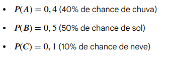

## Um exemplo de referência (combinatória simples)

Para revisar a definição clássica de probabilidade (número de casos favoráveis sobre número de casos possíveis) em um espaço amostral finito, considere o seguinte exemplo, adaptado do material de referência [bendeivide.github.io/book-estbasica](https://bendeivide.github.io/book-estbasica/): considere o nascimento de **três bezerros em sequência**, observando o sexo de cada um (macho ou fêmea). O espaço amostral tem $n=8$ eventos simples, $\Omega = \{(M,M,M), (M,M,F), (M,F,M), (F,M,M), (M,F,F), (F,M,F), (F,F,M), (F,F,F)\}$. Defina o evento $A$: "nascer exatamente duas fêmeas" e o evento $B$: "nascer pelo menos uma fêmea".

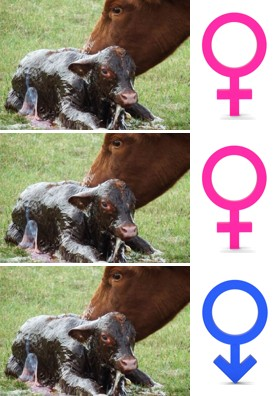

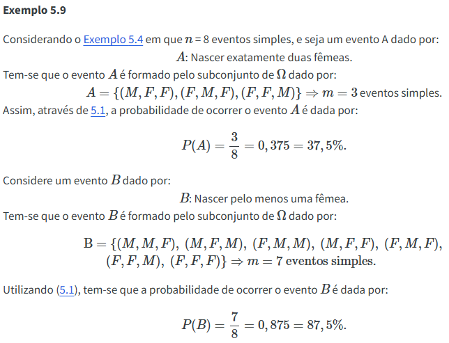

Esse tipo de raciocínio — contar quantos resultados do espaço amostral satisfazem o evento de interesse e dividir pelo total de resultados possíveis — é a base da definição clássica (ou "de Laplace") de probabilidade, válida quando todos os resultados do espaço amostral são igualmente prováveis.

# Probabilidade Condicional

A **probabilidade condicional** mede a probabilidade de um evento $A$ ocorrer, *dado que* já sabemos que outro evento $B$ ocorreu. Formalmente:

$$
P(A \mid B) = \frac{P(A \cap B)}{P(B)}, \quad \text{com } P(B) > 0
$$

onde $A \cap B$ (a **interseção** de $A$ e $B$) representa a ocorrência simultânea dos dois eventos:

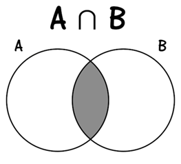

## Exemplo: diagnóstico de doença em rebanho

Este é um dos exemplos mais importantes da disciplina para entender probabilidade condicional na prática, e ilustra por que interpretar corretamente o resultado de um teste diagnóstico não é tão trivial quanto parece.

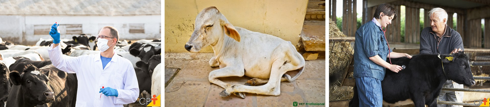

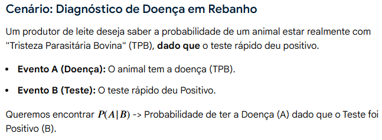

Considere um teste rápido para diagnóstico de **Tristeza Parasitária Bovina (TPB)** aplicado a 100 vacas de um rebanho. A tabela de contingência a seguir mostra o resultado real (com ou sem a doença) cruzado com o resultado do teste:

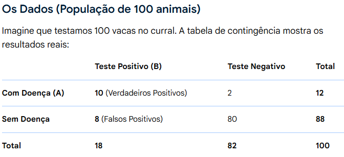

Repare que, dos 18 animais que testaram positivo, apenas 10 estão de fato doentes — os outros 8 são **falsos positivos**. Isso significa que, se um animal testar positivo, a probabilidade de ele estar *realmente* doente não é 100%, mesmo que o teste pareça "bom" à primeira vista (apenas 12 vacas do rebanho de fato têm a doença, e o teste "acerta" 90 dos 100 casos no total). O cálculo formal, usando a definição de probabilidade condicional:

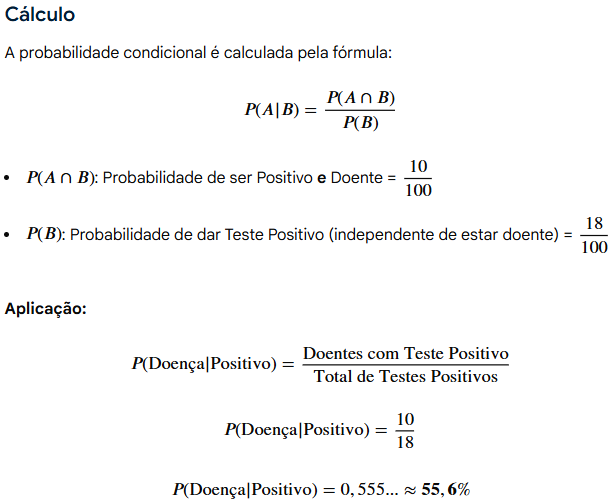

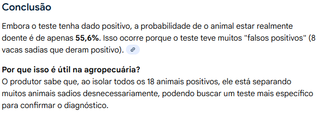

**Por que isso é útil na agropecuária?** O produtor sabe que, ao isolar todos os 18 animais que testaram positivo, está separando muitos animais sadios desnecessariamente — o que pode motivar a busca por um teste mais específico para confirmar o diagnóstico antes de tomar decisões custosas (como o descarte de um animal). Este mesmo tipo de raciocínio aparece em qualquer teste diagnóstico — de doenças humanas a testes de qualidade industrial — e é a essência do chamado *paradoxo do falso positivo*.

Para quem quiser se aprofundar no raciocínio por trás desse tipo de exemplo (na perspectiva do Teorema de Bayes), recomenda-se fortemente [este vídeo do canal Veritasium](https://www.youtube.com/watch?v=R13BD8qKeTg).

# Eventos Independentes

Dois eventos $A$ e $B$ são **independentes** quando a ocorrência de um não fornece nenhuma informação sobre a probabilidade de ocorrência do outro — ou seja, $P(A \mid B) = P(A)$, o que equivale a $P(A \cap B) = P(A) \times P(B)$.

## Exemplo: o caso das sementes e da máquina

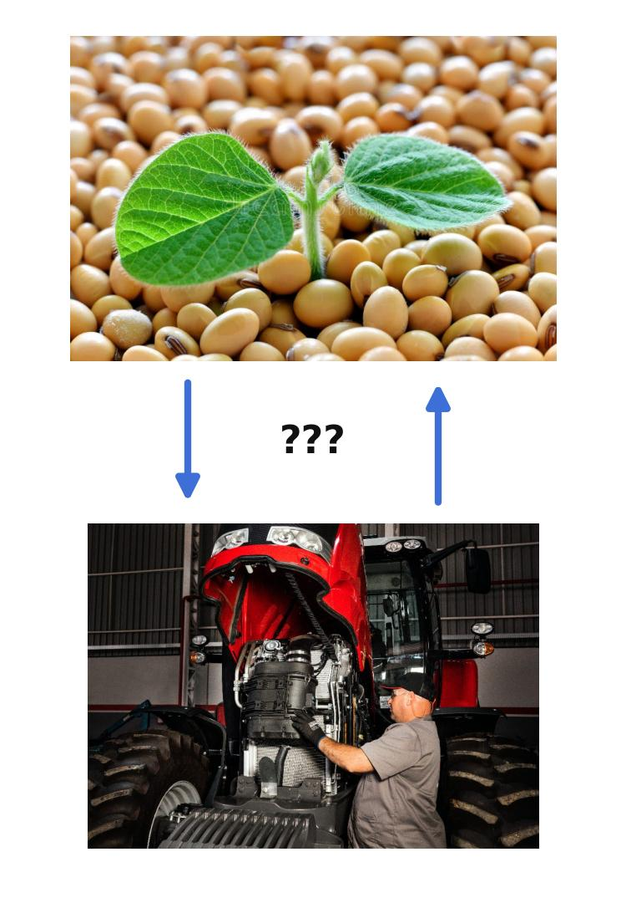

Um produtor rural quer saber a probabilidade de dois processos distintos darem certo no mesmo dia:

1. **Evento A (Germinação)**: uma semente de soja germinar em um vaso de teste, com taxa de germinação de 90% ($P(A) = 0{,}9$).
2. **Evento B (Manutenção)**: um trator, que acabou de sair da revisão, não apresentar falhas mecânicas, com probabilidade de 95% ($P(B) = 0{,}95$).

**Por que são independentes?** O fato da semente de soja germinar no laboratório não tem nenhuma relação biológica ou física com o funcionamento do motor do trator no campo. Saber que a semente germinou não dá nenhuma pista extra sobre se o trator vai quebrar ou não — logo, $P(A \cap B) = P(A) \times P(B) = 0{,}9 \times 0{,}95 = 0{,}855$ (85,5% de chance de que ambos os processos deem certo no mesmo dia).

Esse tipo de raciocínio contrasta diretamente com o exemplo anterior (diagnóstico de doença), em que evento (ter a doença) e evento (testar positivo) são claramente **dependentes** — saber o resultado do teste muda nossa crença sobre a doença. Comparar os dois exemplos lado a lado ajuda a fixar a diferença entre eventos dependentes e independentes, um dos pontos mais frequentemente confundidos por quem está aprendendo probabilidade pela primeira vez.

# Distribuição Normal

Para a parte conceitual da distribuição Normal, o material suplementar do Moodle é a referência principal, complementado por [este vídeo](https://www.youtube.com/watch?v=8kDmCdkRtCw&list=PLtp3GnkVc7KiqrD6r9S23Twjl5aaCRmNb&index=7) e pelo item 3 (Distribuição Normal) de [Variáveis aleatórias contínuas e distribuições](https://www.ufrgs.br/probabilidade-estatistica/slides/slides_2/2-2_Var%20aleatorias%20continuas%20e%20distribuicoes.pdf). Gráficos interativos da distribuição normal estão disponíveis em [istats.shinyapps.io/NormalDist](https://istats.shinyapps.io/NormalDist/), parte do portal [artofstat.com/web-apps](https://artofstat.com/web-apps).

A distribuição normal (ou "curva em sino") é a distribuição de probabilidade contínua mais importante da Estatística, caracterizada por dois parâmetros: a média $\mu$ (que define o centro da curva) e o desvio padrão $\sigma$ (que define sua dispersão). Uma observação $X$ pode ser padronizada através do **escore $Z$**:

$$
Z = \frac{X - \mu}{\sigma}
$$

que informa a quantos desvios padrão a observação está distante da média — permitindo consultar tabelas de probabilidade padronizadas (tabela $Z$) independentemente da escala original da variável.

## Aplicação: peso de bovinos ao abate

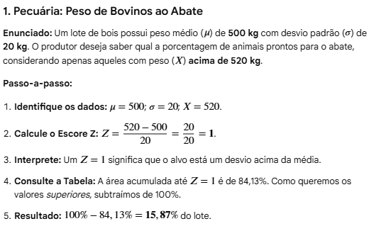

**Enunciado:** um lote de bois possui peso médio ($\mu$) de 500 kg, com desvio padrão ($\sigma$) de 20 kg. O produtor deseja saber qual a porcentagem de animais prontos para o abate, considerando apenas aqueles com peso ($X$) acima de 520 kg.

**Passo a passo:**

1. Identifique os dados: $\mu = 500$; $\sigma = 20$; $X = 520$.
2. Calcule o escore $Z$: $Z = \dfrac{520 - 500}{20} = \dfrac{20}{20} = 1$.
3. Interprete: $Z=1$ significa que o valor-alvo está um desvio padrão acima da média.
4. Consulte a tabela normal padrão: a área acumulada até $Z=1$ é 84,13%. Como queremos os valores *superiores*, subtraímos de 100%.
5. Resultado: $100\% - 84{,}13\% = 15{,}87\%$ do lote está pronto para o abate segundo esse critério.

Este mesmo procedimento — padronizar com o escore $Z$ e consultar a tabela normal — é a base de praticamente todas as aplicações da distribuição normal que veremos ao longo da disciplina, incluindo os testes de hipótese das próximas semanas (teste $z$) e o cálculo de intervalos de confiança. Vale a pena explorar o aplicativo [NormalDist](https://istats.shinyapps.io/NormalDist/) para visualizar como a área sob a curva muda conforme alteramos $\mu$, $\sigma$ e os limites de integração.

## Outros exemplos motivacionais

O mesmo procedimento (calcular o escore $Z$ e consultar a tabela normal) se aplica a praticamente qualquer variável contínua que se distribua aproximadamente como um "sino" em torno de uma média — o que é extremamente comum em variáveis biológicas mensuradas na Agronomia e na Zootecnia.

**Exemplo (Agronomia) — produtividade de soja.** Em uma lavoura, a produtividade de soja segue aproximadamente uma distribuição normal com média $\mu = 55$ sacas/ha e desvio padrão $\sigma = 6$ sacas/ha. O produtor quer saber qual a proporção da área plantada com produtividade insatisfatória, definida como abaixo de 45 sacas/ha. O escore $Z = \dfrac{45-55}{6} = -1{,}67$, e a área abaixo de $Z=-1{,}67$ na tabela normal é de aproximadamente 4,75% — ou seja, cerca de 4,75% da lavoura deve produzir abaixo do patamar considerado satisfatório.

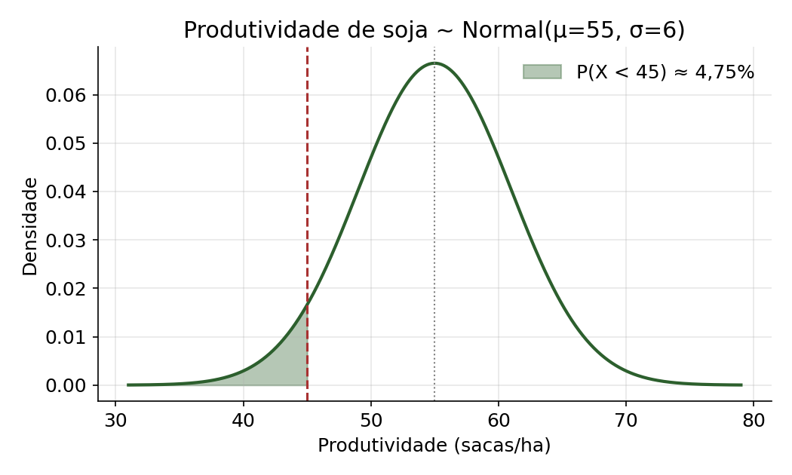

**Exemplo (Zootecnia) — produção de leite.** Em um rebanho leiteiro, a produção diária de leite por vaca segue aproximadamente uma distribuição normal com média $\mu = 25$ L/dia e desvio padrão $\sigma = 4$ L/dia. O produtor quer identificar vacas de baixo desempenho, definidas como as que produzem menos de 18 L/dia — candidatas a serem investigadas (saúde, nutrição) ou descartadas do plantel. O escore $Z = \dfrac{18-25}{4} = -1{,}75$, e a área abaixo de $Z=-1{,}75$ é de aproximadamente 4,01% — ou seja, cerca de 4% do rebanho se enquadra nesse critério de baixo desempenho.

Repare que, nos dois exemplos, o raciocínio é idêntico ao do exemplo dos bovinos acima — muda apenas o contexto (grão vs. animal) e os valores de $\mu$, $\sigma$ e do ponto de corte. Essa é a grande vantagem de padronizar com o escore $Z$: uma única tabela (ou um único software) resolve qualquer problema de distribuição normal, independentemente da escala ou unidade da variável original.

# Distribuição t de Student

Até aqui, sempre assumimos que o desvio padrão populacional $\sigma$ era conhecido — o que raramente acontece na prática. Quando $\sigma$ é **desconhecido** e precisa ser estimado a partir do desvio padrão amostral $s$, e a amostra é **pequena** (regra prática: $n \leq 30$, já usada na seção de Testes de Hipóteses), o escore padronizado não segue mais exatamente uma distribuição normal — ele passa a seguir uma **distribuição t de Student**, com $n-1$ graus de liberdade (gl):

$$
T = \frac{\bar{X} - \mu}{s/\sqrt{n}} \sim t_{(n-1)}
$$

A distribuição t de Student tem o mesmo formato de sino, centrado em 0, mas com **caudas mais pesadas** do que a normal — refletindo a incerteza adicional de estimarmos $\sigma$ a partir de uma amostra pequena. Quanto maior o número de graus de liberdade (ou seja, quanto maior a amostra), mais a distribuição t se aproxima da normal padrão — para $n>30$, a diferença já é praticamente desprezível, o que justifica a "regra do $n>30$" usada para decidir entre o teste $z$ e o teste $t$.

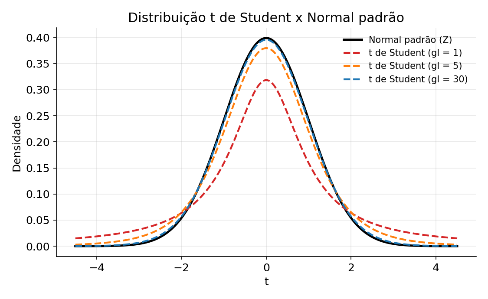

## Exemplo (Agronomia): teor de proteína em silagem

Um pesquisador coleta $n=10$ amostras de silagem de milho e mede o teor de proteína bruta, obtendo média amostral $\bar{X} = 8{,}2\%$ e desvio padrão amostral $s = 0{,}6\%$. Como a variância populacional é desconhecida e a amostra é pequena ($n=10$), a distribuição de referência para construir um intervalo de confiança para a média populacional é a t de Student, com $gl = n - 1 = 9$ graus de liberdade — e não a normal padrão.

O valor crítico $t_{0{,}975; \, 9} = 2{,}262$ é maior do que o correspondente valor crítico da normal padrão, $z_{0{,}975} = 1{,}96$ — essa diferença é exatamente o "preço" pago pela incerteza extra de estimar $\sigma$ com uma amostra pequena. O intervalo de confiança de 95% para a média populacional é dado por:

$$
IC(\mu; 95\%) = \bar{X} \pm t_{0{,}975;9} \times \frac{s}{\sqrt{n}} = 8{,}2 \pm 2{,}262 \times \frac{0{,}6}{\sqrt{10}} = 8{,}2 \pm 0{,}43
$$

ou seja, o intervalo de confiança de 95% para o teor médio de proteína bruta na silagem é aproximadamente $(7{,}77\%; \, 8{,}63\%)$.

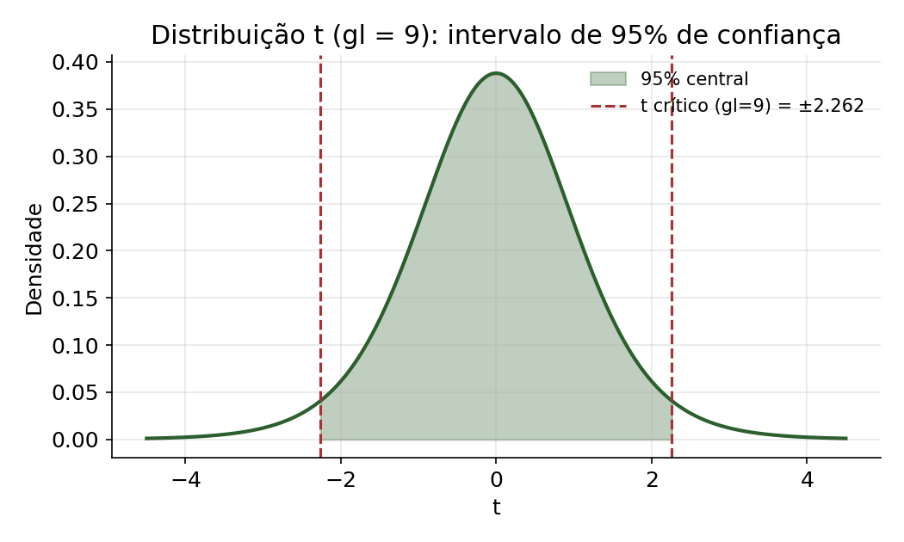

Esse mesmo raciocínio — usar a distribuição t ao invés da normal quando a amostra é pequena e $\sigma$ é desconhecido — é a base do teste $t$ de Student que veremos na página de [Teste de Hipóteses: Teste z e Teste t de Student](5_teste_hipoteses_z_t.qmd), e reaparece constantemente em experimentos agronômicos e zootécnicos, nos quais o número de repetições (parcelas experimentais, animais) costuma ser pequeno. Um aplicativo interativo para visualizar a distribuição t está disponível em [istats.shinyapps.io/tdist](https://istats.shinyapps.io/tdist/).

# Distribuição F de Snedecor

A **distribuição F de Snedecor** surge naturalmente quando comparamos a variabilidade (variância) de duas populações ou de dois grupos experimentais. Ela é definida como a razão entre duas variâncias amostrais independentes:

$$
F = \frac{s_1^2}{s_2^2} \sim F_{(gl_1, \, gl_2)}, \qquad gl_1 = n_1 - 1, \;\; gl_2 = n_2 - 1
$$

onde $gl_1$ e $gl_2$ são os graus de liberdade associados, respectivamente, ao numerador e ao denominador da razão. Diferentemente da normal e da t (simétricas em torno de zero), a distribuição F **só assume valores positivos** (afinal, é uma razão de variâncias, que são sempre não negativas) e é **assimétrica à direita**, com o formato exato dependendo dos dois graus de liberdade:

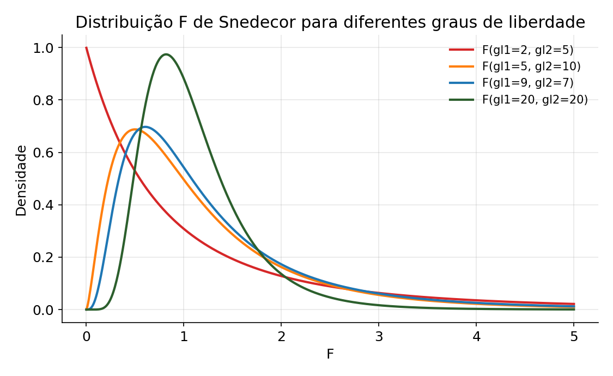

## Exemplo (Zootecnia): comparação da variabilidade de ganho de peso entre duas rações

Um zootecnista testa duas rações (A e B) para o ganho de peso de suínos em fase de terminação. Na ração A, $n_1 = 10$ animais, com variância amostral $s_1^2 = 25 \text{ kg}^2$; na ração B, $n_2 = 8$ animais, com variância amostral $s_2^2 = 9 \text{ kg}^2$. Antes de comparar as médias de ganho de peso entre as duas rações (por exemplo, com um teste $t$), é importante verificar se as variâncias dos dois grupos podem ser consideradas homogêneas — um pressuposto do teste $t$ com variâncias iguais (e também da ANOVA, como vimos na página anterior).

Calcula-se a estatística F como a razão entre a maior e a menor variância amostral:

$$
F = \frac{s_1^2}{s_2^2} = \frac{25}{9} = 2{,}78, \qquad gl_1 = 9, \;\; gl_2 = 7
$$

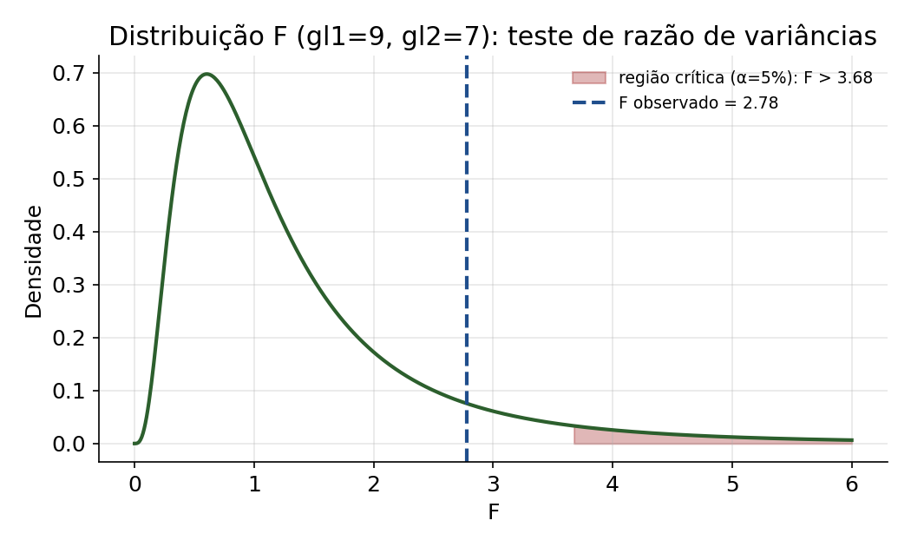

Consultando a tabela F (ou calculando em R com `qf(0.95, 9, 7)`), o valor crítico é $F_{0{,}05; \, 9,7} \approx 3{,}68$. Como o F observado ($2{,}78$) é menor que o F crítico ($3{,}68$), não há evidência suficiente para rejeitar a hipótese de que as variâncias do ganho de peso são homogêneas entre as duas rações — é razoável prosseguir com um teste $t$ assumindo variâncias iguais.

Esta é exatamente a mesma lógica que sustenta o teste F das tabelas de ANOVA vistas na página de [Teste de Hipóteses: ANOVA](6_anova.qmd): lá, o F comparava a variabilidade **entre tratamentos** com a variabilidade **dentro dos tratamentos** (o erro experimental); aqui, comparamos diretamente a variabilidade entre dois grupos. Em ambos os casos, um valor de F "grande" (muito maior que 1) indica que a razão entre as duas fontes de variabilidade dificilmente ocorreria só por acaso. Um aplicativo interativo para visualizar a distribuição F está disponível em [istats.shinyapps.io/FDist](https://istats.shinyapps.io/FDist/).
