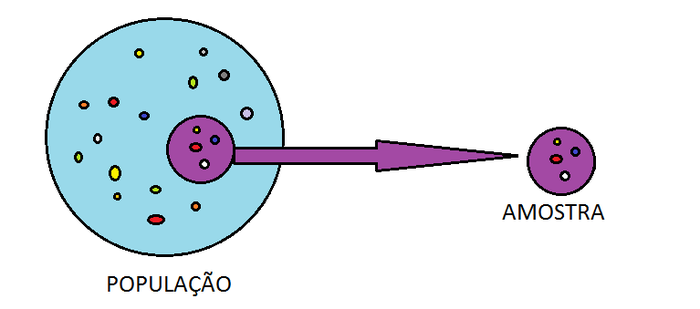
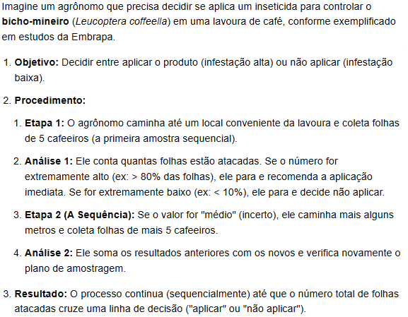
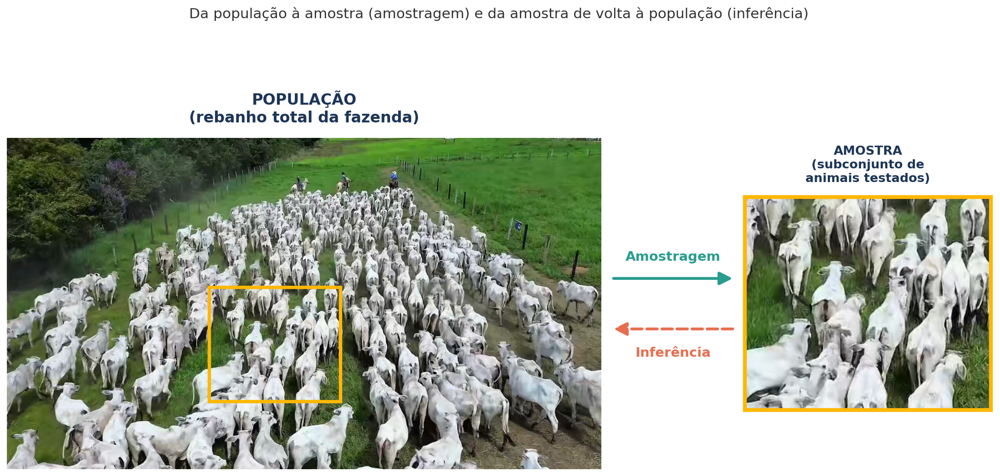

# Introdução

Este material cobre as **Semanas 7 e 8** do plano de ensino: revisão de amostra vs. população, amostragem aleatória simples (randomização), amostragem não aleatória (conveniência, intencional, sequencial e por cotas), introdução à estimação (estimadores, estimativas e parâmetros), estimação por ponto e por intervalo, e intervalo de confiança para a média e para proporção.

Slides originais disponíveis [AQUI](https://github.com/renanxcortes/teaching/raw/refs/heads/main/Metodos_Estatisticos/slides/semana_7_a_8.pptx).

Alguns materiais desta seção são inspirados em Pedro A. Barbetta, *Estatística Aplicada às Ciências Sociais*, 6ª ed., Editora da UFSC, 2006.

# Amostra vs. população: relembrando

- **População**: conjunto total de indivíduos ou observações de interesse.
- **Amostra**: subconjunto representativo (ou não) da população.

A intuição de sempre: *"um chef de cozinha prova seu prato com uma colherada antes de servir toda a panela"*. Exemplo de população: todo o rebanho bovino de uma fazenda. Exemplo de amostra: 30 animais selecionados para avaliação. O estudo de como selecionar essa amostra — a **amostragem** — faz parte da Inferência Estatística, e é o assunto central desta seção.

## Censo vs. amostragem

- **Censo**: estudo através da observação de **todos** os elementos da população.
- **Amostragem**: estudo por meio da observação de uma amostra (processo de seleção da amostra).

**Por que fazer amostragem?** Economia; menor tempo; maior qualidade nos dados levantados (é mais fácil garantir qualidade em uma amostra pequena do que em uma população inteira); a população pode ser infinita (ou impossível de acessar por completo); e, de modo geral, é mais fácil obter resultados satisfatórios com uma amostra bem planejada.

**Quando fazer censo?** Quando a população é pequena (o tamanho da amostra ficaria muito próximo do da população); quando se exige o resultado exato; ou quando já se dispõe dos dados de toda a população (por exemplo, registros administrativos completos).

# Técnicas de Amostragem

Existem duas grandes famílias de técnicas de amostragem:

- **Amostragem probabilística (aleatória)**: a probabilidade de um elemento da população ser escolhido é conhecida. Usa alguma forma de sorteio (aleatoriedade).
- **Amostragem não-probabilística (não-aleatória)**: não se conhece, a priori, a probabilidade de um elemento da população vir a pertencer à amostra.

## Amostragem Aleatória Simples (AAS)

É a técnica mais comum e "desejável" de amostragem probabilística. Faz-se uma lista da população e sorteiam-se os elementos que farão parte da amostra (pode-se utilizar uma tabela de números aleatórios). Propriedade básica: cada subconjunto da população com o mesmo número de elementos tem a mesma chance de ser incluído na amostra — em particular, cada elemento da população tem probabilidade $p = n/N$ de pertencer à amostra. Um exemplo popular de AAS: os 6 números sorteados na Mega-Sena são uma amostragem aleatória simples das 60 dezenas.

**Exemplo:** suponha que você tenha $N=100$ vacas e sorteie aleatoriamente $n=10$ vacas, onde todas têm a mesma probabilidade de serem sorteadas ($p = 10/100 = 10\%$ cada).

A AAS é frequentemente considerada o "padrão ouro" para reduzir o viés de seleção e garantir que todos os membros de uma população tenham chances iguais de serem escolhidos. No entanto, nem sempre é a "melhor" técnica em todos os cenários, pois sua eficácia depende muito do tamanho da população, da homogeneidade dos elementos e dos recursos disponíveis para realizar o sorteio.

## Amostragem não-probabilística: conveniência

Técnica de pesquisa em que a seleção dos elementos da amostra (plantas, animais, solos, etc.) é feita com base na facilidade de acesso, proximidade ou disponibilidade imediata para o pesquisador, e não por sorteio aleatório. Pode conter **vieses** em suas estimativas — um viés é um erro sistemático (constante) que faz com que uma estimativa seja sempre maior ou sempre menor do que o valor real que se quer descobrir.

## Amostragem não-probabilística: intencional

Técnica em que o pesquisador escolhe propositalmente os elementos da amostra com base em seu próprio conhecimento, julgamento profissional ou em critérios específicos, acreditando que esses elementos fornecerão as informações mais relevantes para o estudo. Tem alta suscetibilidade a vieses — pode não representar a média da população, pois ignora casos "típicos" ou ruins, focando apenas no que o pesquisador quer investigar. Como vantagem, é rápida e barata.

**Exemplo:** imagine uma pesquisadora que quer saber a qualidade do café de uma fazenda de 100 hectares. Ela não vai querer colher um fruto de cada árvore ao acaso — ela vai diretamente às árvores que estão mais maduras e com os melhores frutos, porque seu objetivo é avaliar a qualidade *máxima* da colheita atual. Ela intencionalmente escolheu o que melhor representava o seu objetivo (mas essa amostra não deve ser usada, por exemplo, para estimar a qualidade *média* de toda a colheita).

## Amostragem não-probabilística: sequencial

Técnica em que o pesquisador escolhe a amostra em sequência, e o tamanho da amostra ($n$) **não é definido previamente**. Suponha que você está testando a qualidade de produtos em uma linha de montagem: pega-se um produto, verifica-se, depois pega-se outro e verifica-se, continuando esse processo um por um até ter certeza se o lote é bom ou ruim.

**Características:** a amostra é coletada em etapas — após cada item (ou grupo) coletado, analisa-se o dado para decidir "já sei o suficiente para concluir?" ou "preciso de mais amostras?". O tamanho final não é fixo, permitindo parar assim que os resultados se tornarem conclusivos, economizando tempo e recursos.

**Exemplo aplicado — controle de pragas:**

Imagine um agrônomo que precisa decidir se aplica um inseticida para controlar o bicho-mineiro (*Leucoptera coffeella*) em uma lavoura de café, conforme exemplificado em estudos da Embrapa:

1. **Objetivo**: decidir entre aplicar o produto (infestação alta) ou não aplicar (infestação baixa).
2. **Etapa 1**: o agrônomo caminha até um local conveniente da lavoura e coleta folhas de 5 cafeeiros (a primeira amostra sequencial).
3. **Análise 1**: conta quantas folhas estão atacadas. Se o número for extremamente alto (ex.: > 80% das folhas), ele para e recomenda a aplicação imediata; se for extremamente baixo (ex.: < 10%), ele para e decide não aplicar.
4. **Etapa 2 (a sequência)**: se o valor for "médio" (incerto), ele caminha mais alguns metros e coleta folhas de mais 5 cafeeiros, somando os resultados anteriores com os novos.
5. **Resultado**: o processo continua sequencialmente até que o número total de folhas atacadas cruze uma linha de decisão ("aplicar" ou "não aplicar").

## Amostragem não-probabilística: por cotas

Etapas: classificar a população, determinar a proporção da população para cada classe, e fixar cotas em observância à proporção das classes consideradas. É utilizada quando não existe um cadastro da população que possibilite o sorteio necessário para a amostragem aleatória, mas, ao mesmo tempo, existe informação suficiente sobre o perfil populacional (por exemplo, dados de um Censo do IBGE anterior). É um método considerado não-probabilístico, muito comum em pesquisa eleitoral e de mercado — por exemplo, entrevistar 75% de adultos e 25% de idosos, se essa for a proporção conhecida da população. Material complementar: [Amostragem por Cotas (UFPB)](http://www.de.ufpb.br/~tarciana/MPIE/Aula10.pdf).

# Tamanho da amostra ($n$) e tamanho da população ($N$)

Uma pergunta recorrente ao planejar um estudo: quão grande a amostra $n$ precisa ser, dado o tamanho da população $N$ (ou mesmo quando $N$ é desconhecido/infinito)? O tamanho de amostra necessário depende, entre outros fatores, da variabilidade da característica de interesse na população, da margem de erro tolerada e do nível de confiança desejado — assunto que será formalizado a seguir, no cálculo do intervalo de confiança.

# Introdução à Estimação

Retomando o exemplo motivacional já visto na Semana 1-2: população é o rebanho total de vacas de uma fazenda, e a característica $X$ observável é, por exemplo, "tem a doença da vaca louca? Sim ou não". O ciclo população → amostragem → amostra → inferência se aplica aqui de forma direta.

- **População**: é o conjunto de elementos para os quais desejamos que as conclusões da pesquisa sejam válidas, com a restrição de que esses elementos possam ser observados ou mensurados sob as mesmas condições. Muitas vezes chamamos de "população" todo o conjunto de observações da variável de interesse.
- **Parâmetro**: medida que descreve certa característica dos elementos da população (uma média, uma proporção, etc.). Por exemplo, a proporção *verdadeira* de vacas com a doença da vaca louca em todo o rebanho.
- **Amostra**: parte dos elementos de uma população (ou parte das possíveis observações de uma variável de interesse).
- **Amostragem**: o processo de seleção da amostra.
- **Estimativa**: valor calculado com base na amostra, usado com a finalidade de avaliar aproximadamente um parâmetro.

Esquematicamente: a partir da população, fazemos uma amostragem que resulta em uma amostra (por exemplo, o "teste da vaca louca" aplicado a $x_1, x_2, x_3, \dots$ animais, com resultados "tem"/"não tem"). Dessa amostra calculamos uma **estatística/estimativa** $\hat{p}$, que aproxima o **parâmetro** populacional $p$ desconhecido. O resultado é reportado como:

$$
p = \hat{p} \pm \text{Erro Amostral}
$$

## Estimação de parâmetros

Como os estimadores dependem da amostra aleatória sorteada, eles **também são considerados variáveis aleatórias**. Logo, é importante avaliar como eles se comportariam caso tivéssemos obtido diferentes amostras da mesma população — esse estudo é chamado de **distribuição amostral dos estimadores**, e é a base teórica que permite construir intervalos de confiança (a incerteza de uma estimativa vem justamente da variabilidade que ela teria se repetíssemos o processo de amostragem muitas vezes).

Os maiores detalhamentos sobre distribuição amostral são ancorados nos materiais suplementares do Moodle. Dois aplicativos didáticos são especialmente recomendados para desenvolver intuição visual sobre o tema: [Sampling Distribution (Univ. Aberdeen)](https://shiny.abdn.ac.uk/Stats/apps/) e [Sampling Distribution / Inference / Explore Coverage (Art of Stat)](https://artofstat.com/web-apps).

**Exemplo aplicado — estimação de proporção:** retomando o exemplo do rebanho e da doença da vaca louca, a imagem abaixo situa visualmente os dois sentidos do processo. A foto completa do rebanho representa a **população** (todos os animais da fazenda); o recorte em destaque representa a **amostra** (o subconjunto de animais efetivamente testados). A **amostragem** é o caminho que vai da população até a amostra — sorteamos alguns animais dentre todos; a **inferência** é o caminho inverso — a partir do resultado observado na amostra (por exemplo, $\hat{p}$ = proporção de animais doentes entre os testados), concluímos algo sobre o parâmetro $p$ da população inteira, que nunca chegamos a observar por completo.

# Intervalo de Confiança

Para esta parte da matéria, o material de referência principal é [Estimação (UFRGS EAD)](https://www.ufrgs.br/probabilidade-estatistica/slides/slides_2/2-4_Estimacao.pdf) (também disponível no Moodle), que apresenta a construção formal do intervalo de confiança para a média e para a proporção populacional.

De forma geral, um **intervalo de confiança** para um parâmetro $\theta$ é construído como:

$$
\text{Estimativa pontual} \pm (\text{valor crítico}) \times (\text{erro padrão da estimativa})
$$

O "valor crítico" depende do nível de confiança escolhido (tipicamente 95%) e da distribuição amostral do estimador (por exemplo, a distribuição normal ou a distribuição $t$ de Student, que será formalizada na próxima seção, sobre testes de hipótese). Quanto maior o tamanho da amostra $n$, menor tende a ser o erro padrão e, portanto, mais estreito (mais preciso) o intervalo de confiança — a mesma lógica que motiva a pergunta sobre "tamanho de amostra necessário" feita anteriormente.

Novamente, os aplicativos [Sampling Distribution / Inference / Explore Coverage (Art of Stat)](https://artofstat.com/web-apps) são altamente recomendados para visualizar, de forma interativa, o que significa dizer que um intervalo de confiança de 95% "cobre o parâmetro verdadeiro em 95% das repetições do processo de amostragem" — uma das ideias mais frequentemente mal-interpretadas de toda a Estatística Inferencial.
