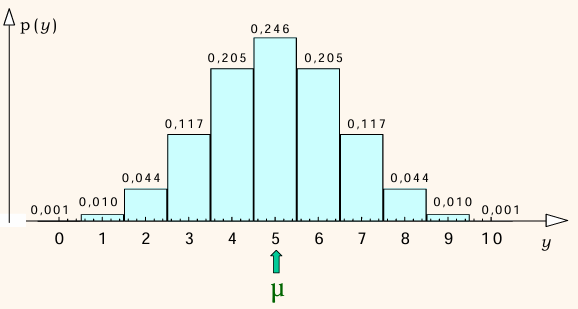
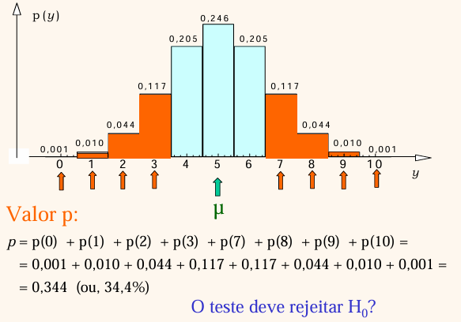
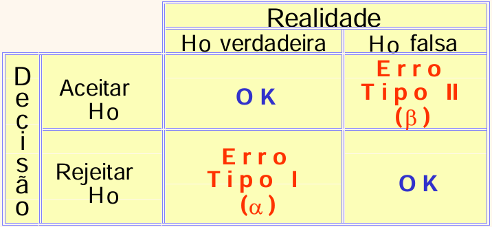

# Introdução

Este material cobre as **Semanas 9 e 10** do plano de ensino: conceitos fundamentais de teste de hipóteses, teste para a média populacional (teste $z$ com variância conhecida ou $n>30$; teste $t$ de Student com variância desconhecida e $n$ até 30), teste $t$ para amostras pareadas, teste $z$/$t$ para amostras independentes, e análise contextualizada de artigo científico.

Slides originais disponíveis [AQUI](https://github.com/renanxcortes/teaching/raw/refs/heads/main/Metodos_Estatisticos/slides/semana_9_a_10.pptx).

Alguns materiais desta seção são adaptados de Pedro A. Barbetta, *Estatística Aplicada às Ciências Sociais*, 6ª ed., Editora da UFSC, 2006.

# Testes de Hipótese: Conceitos Fundamentais

A lógica geral de um teste de hipótese segue o mesmo ciclo já visto nas semanas anteriores — população, amostra, amostragem — acrescido de uma etapa de decisão: partimos de uma **população** sobre a qual temos uma hipótese que queremos colocar à prova; coletamos uma **amostra**, cujos dados servirão de base para aceitar ou rejeitar essa hipótese; e, a partir da amostragem, chegamos à **decisão do teste estatístico**.

## Hipótese nula e hipótese alternativa

Todo teste de hipótese contrapõe duas afirmações sobre a população:

- **Hipótese nula ($H_0$)**: a afirmação "padrão" ou de "não-efeito", que assumimos verdadeira até que haja evidência suficiente para rejeitá-la.
- **Hipótese alternativa ($H_1$)**: a afirmação que estamos, de fato, interessados em sustentar com os dados.

**Exemplos aplicados:**

- *Problema:* Em uma região em estudo, a propensão de fumar nos homens é diferente da das mulheres? $H_0$: a proporção de homens fumantes é igual à de mulheres fumantes, na população em estudo. $H_1$: essas proporções são diferentes.
- *Problema:* Um agrônomo deseja saber se uma nova cultivar de soja (Cultivar B) produz mais que a cultivar tradicional (Cultivar A). $H_0$: a produtividade entre os dois cultivares é igual, na população em estudo. $H_1$: a produtividade entre os dois cultivares é diferente.

- *Problema:* um pesquisador quer saber se o pH médio de uma amostra de solo em um talhão é diferente de 6,0 (por exemplo, encontrou uma média amostral de 6,3). $H_0$: o pH médio populacional do talhão é igual a 6,0. $H_1$: o pH médio é diferente de 6,0.

## Exemplo de referência: a moeda desequilibrada

Para fixar a lógica do teste de hipótese de forma bem concreta, considere o exemplo clássico da moeda: suspeita-se que uma moeda não seja perfeitamente equilibrada (probabilidade de cara $\neq$ probabilidade de coroa $\neq 0{,}5$). Definindo o parâmetro $\pi$ = probabilidade de cara:

$$
H_0: \pi = 0{,}5 \qquad \text{vs.} \qquad H_1: \pi \neq 0{,}5
$$

**Amostragem para o exemplo:** realiza-se $n=10$ lançamentos da moeda. A estatística do teste é $Y$ = número total de caras nos 10 lançamentos. Na amostra observada, obtivemos 7 caras (e 3 coroas). Qual deve ser a decisão do teste — aceitar $H_0$ ou rejeitar $H_0$ em favor de $H_1$?

### Distribuição de referência

O que pode ocorrer na amostra de $n=10$ lançamentos, **se $H_0$ for verdadeira** (moeda honesta)? Nesse caso, $Y$ segue uma distribuição binomial com $n=10$ e $\pi=0{,}5$. A ideia central de um teste de hipótese é comparar o resultado observado (7 caras) com essa distribuição de referência — se o resultado for muito "estranho" para essa distribuição, o teste rejeita $H_0$.

### Valor-p

O **valor-p** é a probabilidade da estatística de teste acusar um resultado tão ou mais distante do esperado por $H_0$ quanto o da amostra observada. Em outras palavras, um valor-p muito baixo significa que seria muito improvável que aquela amostra (no exemplo, 7 caras) tivesse vindo da distribuição assumindo $H_0$ verdadeira (moeda honesta). O valor-p é calculado com base na distribuição de referência:

$$
p = p(0) + p(1) + p(2) + p(3) + p(7) + p(8) + p(9) + p(10) = 0{,}344 \; (34{,}4\%)
$$

## Nível de significância e regra de decisão

Em Estatística nunca trabalhamos com erro zero — "na prática", nunca saberemos com certeza absoluta se a moeda é verdadeiramente honesta ou não. Para decidir entre aceitar ou rejeitar $H_0$, precisamos primeiro estabelecer qual "grau de erro" estamos dispostos a cometer: o **nível de significância**, representado pela letra grega $\alpha$.

- **Nível de significância ($\alpha$)**: é a probabilidade de o teste rejeitar $H_0$ quando $H_0$ for, na verdade, verdadeira (uma decisão errada). É comum usar $\alpha = 0{,}05$ (5%), arbitrado pelo(a) pesquisador(a).
- **Regra de decisão baseada no valor-p**:
  - se valor-p $> \alpha$: **aceita** $H_0$;
  - se valor-p $\leq \alpha$: **rejeita** $H_0$, em favor de $H_1$.

**Voltando ao exemplo da moeda:** como valor-p $= 0{,}344$ não é uma probabilidade desprezível frente a $\alpha = 5\%$, é mais prudente **não rejeitar $H_0$** e assumir que a moeda é honesta.

## Um pouco da "filosofia" por trás das interpretações

Quando o teste **rejeita** $H_0$ em favor de $H_1$, a probabilidade de estarmos tomando a decisão errada é, no máximo, igual ao nível de significância $\alpha$ adotado — temos, portanto, "certa garantia" da veracidade de $H_1$.

A interpretação é um pouco diferente quando o teste **aceita** a hipótese nula $H_0$ (valor-p $> \alpha$): dizemos que os dados *estão em conformidade* com a hipótese nula. Isso não implica que $H_0$ seja realmente verdadeira, mas sim que os dados não mostraram evidência suficiente para rejeitá-la — por isso, continuamos acreditando em sua veracidade até prova em contrário (Barbetta, 2006).

## Tipos de erro em um teste estatístico

Como toda decisão estatística envolve incerteza, existem dois tipos possíveis de erro, organizados em uma tabela 2×2 cruzando a decisão tomada com a realidade (desconhecida) do parâmetro:

- **Erro Tipo I** (probabilidade $\alpha$): rejeitar $H_0$ quando $H_0$ é, na verdade, verdadeira — um "falso alarme". É o erro que controlamos diretamente ao escolher o nível de significância.
- **Erro Tipo II** (probabilidade $\beta$): aceitar $H_0$ quando $H_0$ é, na verdade, falsa — deixar passar um efeito real que existia. Está relacionado ao conceito de **poder do teste** ($1-\beta$): a capacidade do teste de detectar corretamente um efeito real, quando ele de fato existe.

Existe uma tensão inerente entre os dois tipos de erro: para um tamanho de amostra fixo, reduzir $\alpha$ (ser mais rigoroso para rejeitar $H_0$) tende a aumentar $\beta$ (maior chance de deixar passar um efeito real), e vice-versa. Aumentar o tamanho da amostra é, em geral, a forma mais eficaz de reduzir os dois tipos de erro simultaneamente — outra conexão direta com a discussão de tamanho de amostra da seção anterior.

# Testes de Hipótese: comparação de médias

Para os demais tópicos do cronograma — teste $z$ e teste $t$ de Student para a média populacional (com variância conhecida ou desconhecida), teste $t$ para amostras pareadas, e teste $z$/$t$ para amostras independentes (variâncias iguais ou diferentes) — usaremos como referência principal o material [Testes de Hipóteses: Médias (UFRGS EAD)](https://www.ufrgs.br/probabilidade-estatistica/slides/slides_3/3-2_Testes%20de%20Hipoteses_Medias.pdf).

A ideia central, no entanto, é sempre a mesma que construímos passo a passo acima com o exemplo da moeda: (1) formular $H_0$ e $H_1$; (2) calcular uma estatística de teste a partir da amostra; (3) compará-la com sua distribuição de referência (normal, para o teste $z$; $t$ de Student, para o teste $t$) para obter o valor-p; e (4) decidir, com base em $\alpha$, se rejeitamos ou não $H_0$. A diferença entre teste $z$ e teste $t$ está na distribuição de referência usada: o teste $z$ assume que a variância populacional é conhecida (ou que $n>30$, pela aproximação assintótica), enquanto o teste $t$ de Student é usado quando a variância populacional é desconhecida e precisa ser estimada a partir da própria amostra — situação típica em experimentos agronômicos e zootécnicos com poucas repetições.
