# Introdução

Este material cobre as **Semanas 11 a 15** do plano de ensino: princípios de experimentação, Análise de Variância (ANOVA) para o Delineamento Inteiramente Casualizado (DCC) e para o Delineamento em Blocos Casualizados (DBC), com respectivos testes de comparações múltiplas, experimentos fatoriais (com e sem blocos) e delineamento em parcelas subdivididas, sempre ilustrados com exemplos de artigos científicos.

O conteúdo desta página é baseado em material didático elaborado por **Paula Bracco** (adaptado do material da prof. Lisiane Selau), especificamente voltado ao ensino de Análise de Variância aplicada à experimentação agronômica. Os exemplos em R reproduzidos ao longo da página vêm da coleção de scripts do professor (pasta `codigos/`, com prefixo `area_3`), aplicados aos mesmos exemplos apresentados nos slides. Todos os materiais originais — slides e scripts — estão disponíveis para download ao final desta página, na seção [Materiais e Referências](#materiais-e-referências).

# Princípios da Experimentação

A **Estatística Experimental** tem por objetivo o planejamento, a execução, a análise e a interpretação dos resultados obtidos em um experimento. Na agricultura, a experimentação pretende responder perguntas como: qual o melhor cultivar para se plantar (maior rendimento)? Qual o efeito de diferentes herbicidas (menos pragas)? Qual a melhor técnica de semeadura (maior rendimento)?

Para ser o mais eficiente possível, o experimento deve ser planejado a partir de uma metodologia científica apropriada. O **delineamento (ou planejamento) experimental** é o processo de planejar o experimento de modo que todos os dados apropriados sejam coletados, resultando em conclusões objetivas e válidas — dados apropriados sendo aqueles que possam ser analisados através de métodos estatísticos.

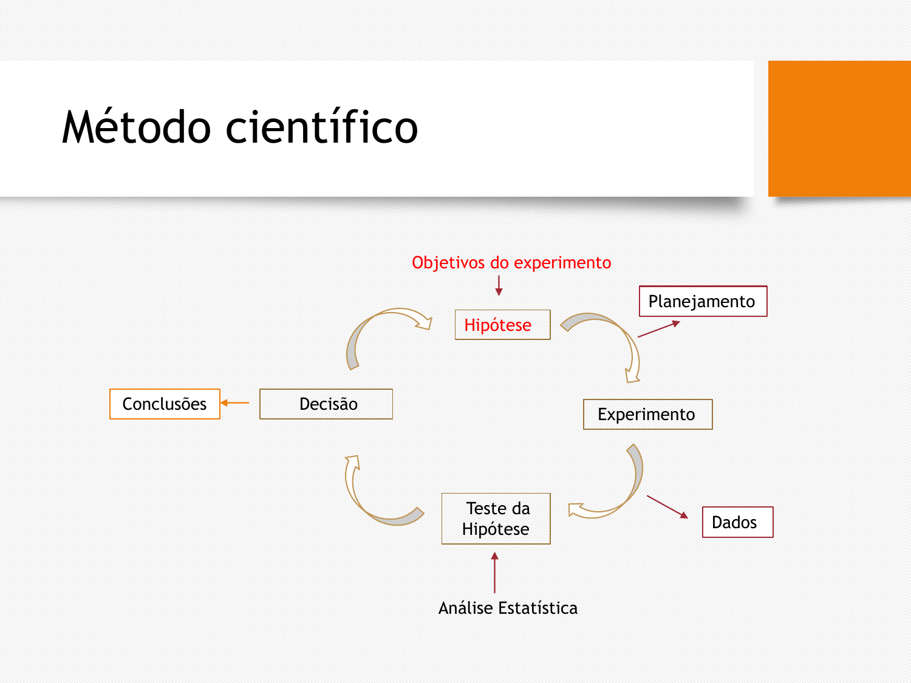

O objetivo do experimento é que ele seja o mais controlado possível, ou seja, que a única diferença sistemática entre os grupos comparados seja o fator/tratamento de interesse (tipo de semente, tipo de herbicida, quantidade de nutriente do solo, etc.). Como nenhum experimento é 100% controlado, sempre existirão fatores que podem diferir entre os grupos e que não conseguimos controlar (pequenas variações nas lâminas de irrigação, em infestações por pragas, na fertilidade dos solos) — o efeito desses fatores não controlados sobre a resposta de interesse é chamado de **variação aleatória, ao acaso ou residual**.

## Planejamento do experimento

O planejamento de um experimento envolve, essencialmente, quatro decisões:

1. **Variável resposta**: qual característica será estudada (altura ou comprimento das plantas, produção de grãos/rendimento, etc.).
2. **Fatores e níveis**: quais fatores afetam essa resposta e quais os níveis de cada fator — importante identificar quais podem e quais não podem ser controlados (variedade, adubação, irrigação, qualidade da semente, temperatura, incidência de luz, etc.). Em um **experimento simples**, apenas um fator é estudado (os demais são mantidos constantes); em **experimentos complexos** (fatoriais), estudamos simultaneamente o efeito de dois ou mais fatores.
3. **Unidade experimental (ou parcela)**: onde os diferentes níveis do tratamento são aplicados — idealmente as unidades experimentais devem ser as mais semelhantes/uniformes possível, para reduzir a variação aleatória. Exemplos: uma área de campo, um vaso com solo, uma sementeira, uma placa de Petri, um tubo de ensaio, uma árvore, uma folha da planta.
4. **Número de repetições**: depende do número de tratamentos utilizados; é usual que os experimentos possuam pelo menos 3 repetições.

## Princípios básicos da experimentação

**Repetição.** O princípio da repetição consiste na reprodução do experimento básico. O fato de um tratamento se comportar melhor que outro em uma única unidade experimental pouco ou nada significa, pois pode ter havido um comportamento superior por simples acaso — por isso, consideramos o comportamento médio de cada tratamento ao longo de várias parcelas. As repetições são necessárias para estimar o **erro experimental** (a variabilidade da resposta entre unidades experimentais que receberam o mesmo tratamento) e para avaliar, de forma mais precisa, o efeito de cada tratamento.

**Casualização (aleatorização).** É a distribuição dos tratamentos às unidades experimentais de forma casual (aleatória, randômica), para evitar que um determinado tratamento venha a ser beneficiado por sucessivas repetições em parcelas melhores. É a alocação dos tratamentos aleatoriamente sobre as unidades experimentais — sorteando qual unidade receberá cada tratamento e cada repetição.

::: {layout-ncol=2}
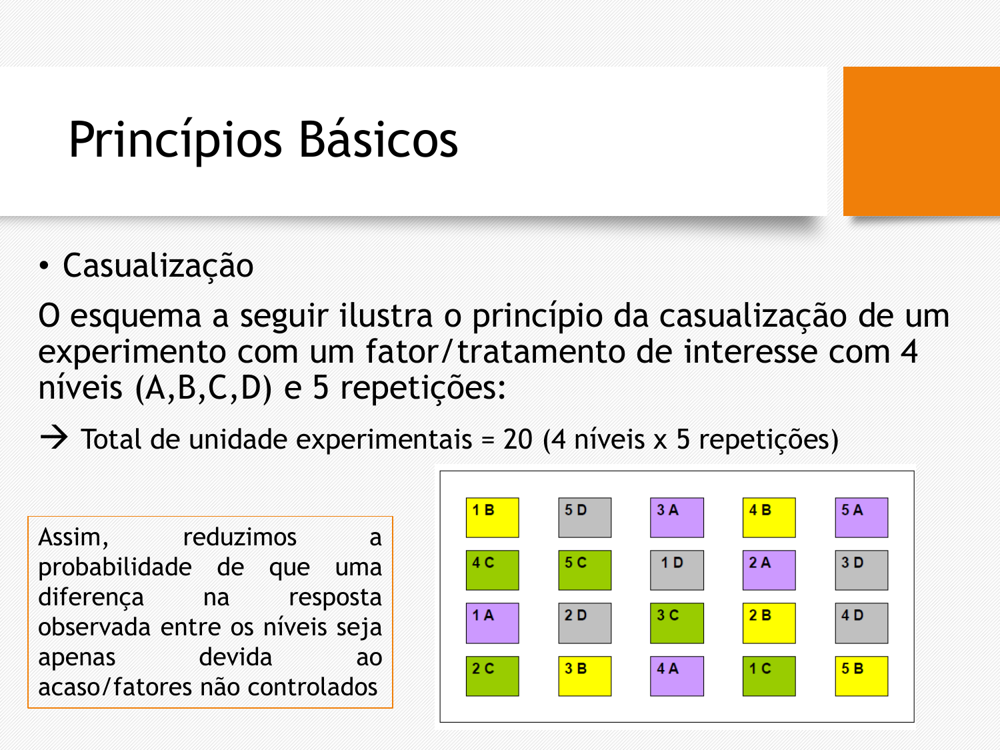

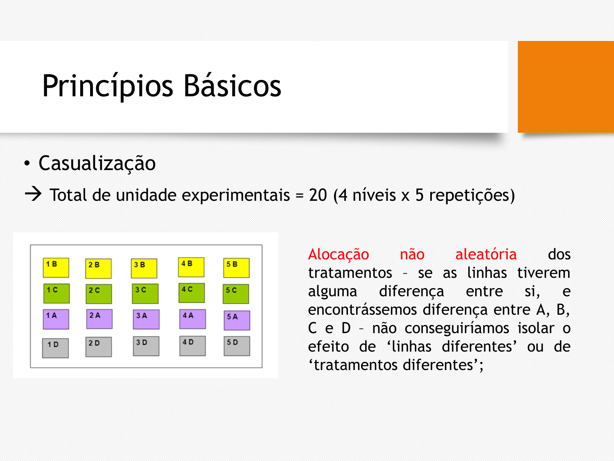
:::

**Controle local / blocos.** Não é de uso obrigatório: quando conhecemos um fator que pode ser uma fonte de variação, podemos controlá-lo com o uso de blocos. Trata-se da formação de grupos de unidades experimentais o mais homogêneos possível (cada grupo constitui um bloco), de modo a reduzir o erro experimental — os tratamentos são sorteados dentro de cada bloco.

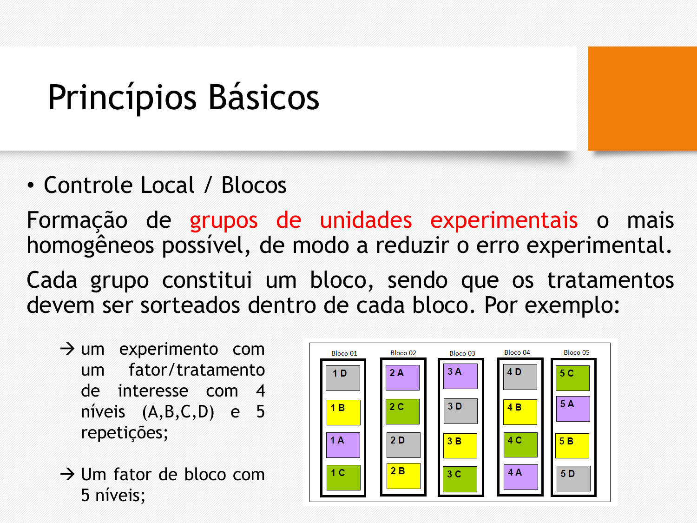

## ANOVA: a ideia geral

A **Análise de Variância (ANOVA)** é a técnica que nos permite decompor a variabilidade total da resposta (a variação da resposta de interesse entre todas as unidades experimentais) em partes atribuídas a: (i) variação devido a causas conhecidas e independentes (níveis do tratamento); (ii) variação relacionada a causas controladas pelo delineamento experimental (blocos, quando existirem); e (iii) uma porção residual, de origem desconhecida e natureza aleatória (devida aos fatores não controlados).

# Delineamento Inteiramente Casualizado (DCC)

O **Delineamento Completamente Casualizado (DCC)** é indicado quando as unidades experimentais são homogêneas, ou seja, não há fundamento lógico para a formação de blocos (grupos). Cada unidade recebe, por sorteio, um dos tratamentos que deverão ser comparados — nenhuma restrição é imposta ao processo de casualização, que é feito considerando o conjunto completo das unidades experimentais.

## Exemplo de referência

Os dados a seguir referem-se ao rendimento (t/ha) de 4 variedades de cana-de-açúcar (A, B, C e D) em um experimento de competição, com 6 repetições por variedade, instalado no DCC. Objetivo: identificar a(s) variedade(s) que produz(em) maior rendimento médio.

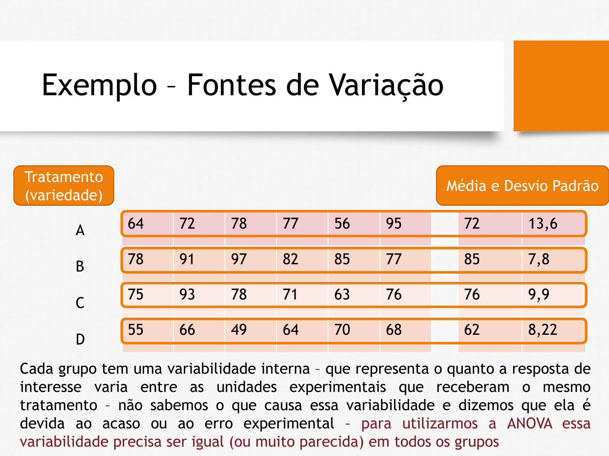

Cada grupo tem uma variabilidade interna (o quanto a resposta varia entre unidades que receberam o mesmo tratamento) — essa variabilidade é atribuída ao acaso ou erro experimental. Há também uma variabilidade **entre** grupos, medida pela dispersão das médias de cada grupo em torno da média geral — essa variabilidade tem uma causa conhecida: os diferentes tratamentos aos quais cada grupo foi exposto.

## Decomposição da variabilidade

No DCC, a variação total é decomposta em duas partes: devida aos tratamentos e devida ao erro experimental. A Soma de Quadrados Total é dada por:

$$
SQ_{Total} = \sum_i \sum_j \left(y_{ij} - \bar{y}_{..}\right)^2 = \underbrace{r\sum_i \left(\bar{y}_{i.} - \bar{y}_{..}\right)^2}_{SQ_{Tratamentos}} + \underbrace{\sum_i \sum_j \left(y_{ij} - \bar{y}_{i.}\right)^2}_{SQ_{Erro}}
$$

$SQ_{Tratamentos}$ representa a variação das médias dos tratamentos em torno da média geral; $SQ_{Erro}$ representa a variação dentro de cada tratamento (entre unidades experimentais que receberam o mesmo tratamento). Os graus de liberdade se decompõem de forma análoga: $(rt-1) = (t-1) + t(r-1)$, sendo $t$ o número de tratamentos e $r$ o número de repetições.

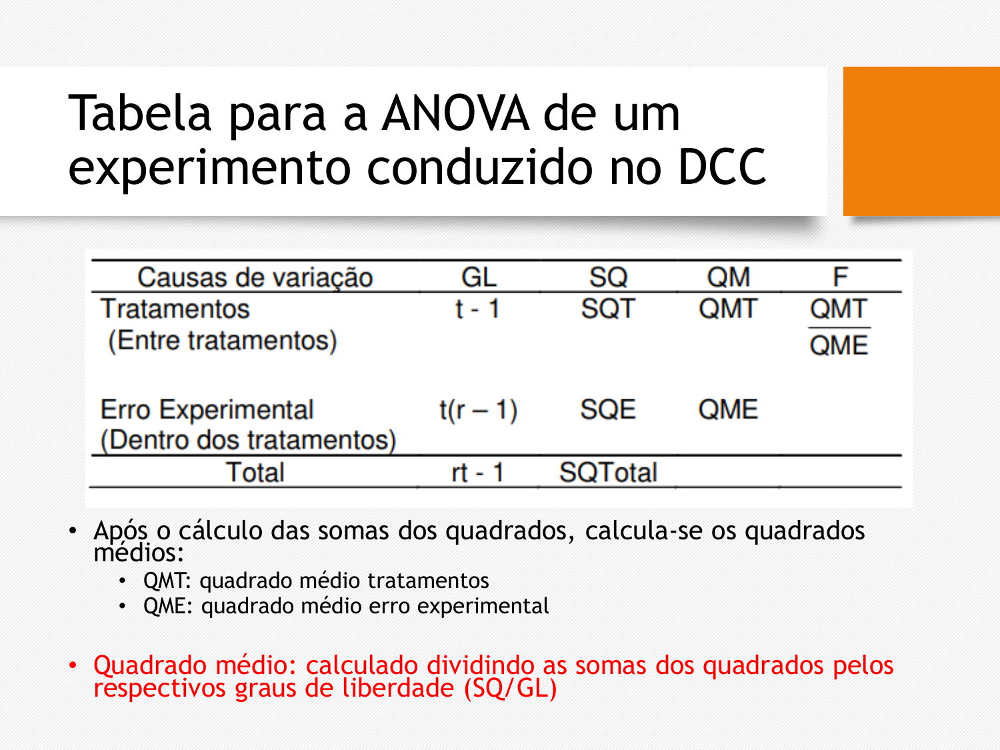

**Hipóteses do teste:**

$$
H_0: \mu_1 = \mu_2 = \ldots = \mu_t \qquad \text{vs.} \qquad H_A: \text{pelo menos uma média difere das demais}
$$

A estatística do teste é $F = QM_{Tratamento}/QM_{Erro}$. O $QM_{Erro}$ estima a variação ao acaso; o $QM_{Tratamento}$ estima a variação ao acaso **mais** a variação devida aos diferentes níveis do tratamento. Se a variação entre as médias dos tratamentos for semelhante à variação do erro experimental, $F$ será próximo de 1 e a diferença não será significativa; quanto maior $F$ em relação a 1, maior a evidência de que os tratamentos realmente diferem entre si.

## Resultado do exemplo

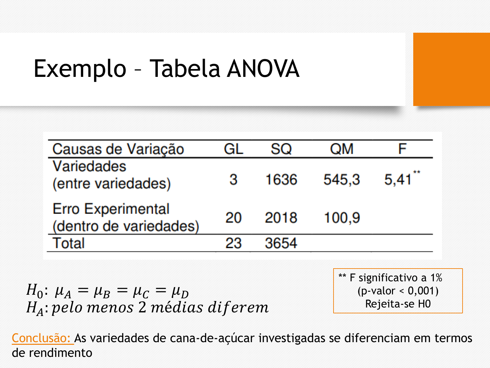

Como $F = 5{,}41 > F_{0{,}01(3,20)}$, rejeita-se $H_0$: as variedades de cana-de-açúcar investigadas se diferenciam em termos de rendimento. Mas rejeitar $H_0$ indica apenas que **pelo menos um** dos grupos difere dos demais — não indica **quais** grupos diferem entre si quando comparados dois a dois. Para isso, usa-se um teste de comparação múltipla (teste *post-hoc*), sendo o mais usado o **teste de Tukey** — similar ao teste $t$, mas controlando o nível de significância (erro Tipo I) ao longo de todas as comparações simultâneas.

**Coeficiente de determinação ($R^2$)**: mede a proporção da variação total explicada pela variação devida aos tratamentos, $R^2 = SQ_{Trat}/SQ_{Total}$. No exemplo, $R^2 = 1636/3654 = 0{,}4477$ — aproximadamente 45% da variação total do rendimento é explicada pela variação entre variedades.

**Coeficiente de Variação (CV)**: dá uma ideia da variabilidade aleatória (sem causa conhecida) do experimento, $CV = \sqrt{QM_{Erro}}/\bar{y}_{..} \times 100$. No exemplo, $CV = \sqrt{100{,}9}/73{,}75 = 13{,}62\%$. Como regra geral, experimentos de laboratório não devem ter CV muito maior que 10%, e experimentos de campo costumam ficar em torno de 30% — o mais importante é comparar o CV obtido com o de experimentos semelhantes na literatura.

**Vantagens do DCC**: é flexível quanto ao número de tratamentos e repetições (o número de repetições pode até variar de tratamento a tratamento, por exemplo por perda de observações durante a execução) e a análise estatística permanece simples mesmo quando o número de repetições não é balanceado.

## Exemplo em R

O workflow completo de uma ANOVA no DCC — estatísticas descritivas, gráfico exploratório, ajuste do modelo, diagnóstico das suposições e comparações múltiplas — pode ser reproduzido em R com o mesmo exemplo das variedades de cana-de-açúcar:

```r
# Pacotes utilizados
packages <- c("dplyr", "ggplot2", "tidyr", "car", "agricolae", "readr")
for (pkg in packages) {
  if (!requireNamespace(pkg, quietly = TRUE)) install.packages(pkg, dependencies = TRUE)
  library(pkg, character.only = TRUE)
}

# Dados: rendimento (t/ha) de 4 variedades de cana-de-açúcar
dados <- data.frame(A = c(64,72,68,77,56,95),
                     B = c(78,91,97,82,85,77),
                     C = c(75,93,78,71,63,76),
                     D = c(55,66,49,64,70,68))

# Reorganizando para o formato longo
dados2 <- tidyr::pivot_longer(dados, cols = c('A','B','C','D'),
                               names_to = 'Fator', values_to = 'Resposta') %>%
  mutate(Fator = factor(Fator))

# Estatísticas descritivas por grupo
dados2 %>%
  group_by(Fator) %>%
  summarise(count = n(), mean = mean(Resposta), sd = sd(Resposta), median = median(Resposta))

# Boxplot exploratório (com a média sobreposta)
ggplot(dados2, aes(x = Fator, y = Resposta, fill = Fator)) +
  geom_boxplot(alpha = 0.7) +
  stat_summary(fun = mean, geom = "point", size = 4, color = "black") +
  theme_minimal() +
  labs(title = "Distribuição da resposta por nível do fator", x = "Fator", y = "Resposta")

# Ajuste da ANOVA de um fator
modelo <- aov(Resposta ~ Fator, data = dados2)
summary(modelo)

# Diagnóstico das suposições
par(mfrow = c(2, 2)); plot(modelo); par(mfrow = c(1, 1))
shapiro.test(residuals(modelo))                  # normalidade dos resíduos
bartlett.test(Resposta ~ Fator, data = dados2)    # homogeneidade de variâncias (Bartlett)
car::leveneTest(Resposta ~ Fator, data = dados2)  # homogeneidade de variâncias (Levene)

# Médias por grupo e comparações múltiplas
model.tables(modelo, type = "means")
TukeyHSD(modelo)
plot(TukeyHSD(modelo))

# Alternativa com o pacote agricolae
agricolae::HSD.test(modelo, trt = 'Fator')
```

## Aplicações em artigos científicos {#dcc-artigos}

**Artigo 1 — Enxertia em mudas de baruzeiro** ([DOI: 10.5902/1980509869090](https://doi.org/10.5902/1980509869090)). Delineamento: DCC. Tratamento: 3 sistemas de condução (sacos plásticos a pleno sol, sacos plásticos sob sombrite 50%, tubetes em viveiros a pleno sol), com 36 repetições para cada tipo de enxertia. Unidade experimental: mudas. Respostas de interesse: altura, diâmetro e razão altura/diâmetro. Houve diferença significativa em todas as respostas quando os 3 grupos foram comparados; pelo teste de comparação múltipla, a altura média foi diferente entre **todos** os grupos, sendo a maior altura observada no grupo com enxertia de saco plástico a pleno sol.

**Artigo 2 — Irrigação em feijão-vagem** ([DOI: 10.1590/S0100-69162011000200012](https://doi.org/10.1590/S0100-69162011000200012)). Delineamento: DCC. Tratamento: reposição de água no solo, com 5 níveis (50%, 75%, 100%, 125% e 150%), 4 repetições cada. Unidade experimental: canteiro de 2,2 × 0,3 m. Respostas: produção, número de vagens, peso médio das vagens e número de sementes por vagem. As diferentes lâminas de irrigação foram uma fonte de variabilidade significativa para o número de vagens e para a produção. Como o tratamento é quantitativo (uma dose de água), os autores complementaram a ANOVA com uma **análise de regressão** — encontrando uma relação quadrática entre a lâmina de irrigação e o número de vagens por planta, com máximo estimado em 19,5 vagens/planta para uma lâmina de 200 mm.

# Delineamento em Blocos Casualizados (DBC)

Um **fator de ruído ou perturbação** é um fator de delineamento que provavelmente tem efeito na resposta, mas que não nos interessa avaliar diretamente — quando esse fator é conhecido e controlável, o **bloqueamento** permite eliminar seu efeito nas comparações estatísticas entre tratamentos.

O Delineamento em Blocos Casualizados (DBC) é um dos delineamentos mais usados nas pesquisas em diferentes áreas. É um delineamento com uma restrição na aleatorização: as unidades experimentais são primeiro organizadas em grupos homogêneos (blocos) e, então, os tratamentos são alocados aleatoriamente dentro de cada bloco — os tratamentos se repetem em todos os blocos. O objetivo é ter **heterogeneidade entre blocos e homogeneidade dentro dos blocos**, reduzindo a variância do erro experimental e aumentando a precisão das inferências.

## Estrutura da ANOVA no DBC

A variação total das observações $y_{ij}$ é decomposta em três partes: variação devida a tratamentos ($SQ_{Tratamentos}$), variação devida a blocos ($SQ_{Blocos}$) e variação devida ao erro experimental ($SQ_{Erro}$):

$$
\sum_i \sum_j \left(y_{ij}-\bar{y}_{..}\right)^2 = r\sum_i \left(\bar{y}_{i.}-\bar{y}_{..}\right)^2 + t\sum_j\left(\bar{y}_{.j}-\bar{y}_{..}\right)^2 + \sum_i\sum_j\left(y_{ij}-\bar{y}_{i.}-\bar{y}_{.j}+\bar{y}_{..}\right)^2
$$

| Causas da Variação | GL | SQ | QM | F |
|---|---|---|---|---|
| Blocos | $r-1$ | $SQB$ | $QMB$ | $QMB/QME$ |
| Tratamentos | $t-1$ | $SQT$ | $QMT$ | $QMT/QME$ |
| Erro experimental | $(t-1)(r-1)$ | $SQE$ | $QME$ | |
| Total | $rt-1$ | $SQ_{Total}$ | | |

O teste de significância da diferença entre as médias dos tratamentos é dado pelo teste $F = QMT/QME$, testando $H_0: \mu_1 = \mu_2 = \ldots = \mu_t$. É possível, de forma aproximada, calcular também $F = QMB/QME$ para os blocos — mas esse teste é discutível, pois a aleatorização foi feita para os tratamentos e não para os blocos, e geralmente não é reportado.

## Exemplo de referência: cultivares de trigo

Em um ensaio comparativo de 5 cultivares de trigo (A, B, C, D, E), usou-se o DBC com 4 repetições. O bloqueamento teve por finalidade controlar diferenças de fertilidade do solo no campo experimental. Os rendimentos de grão por parcela (t/ha) foram:

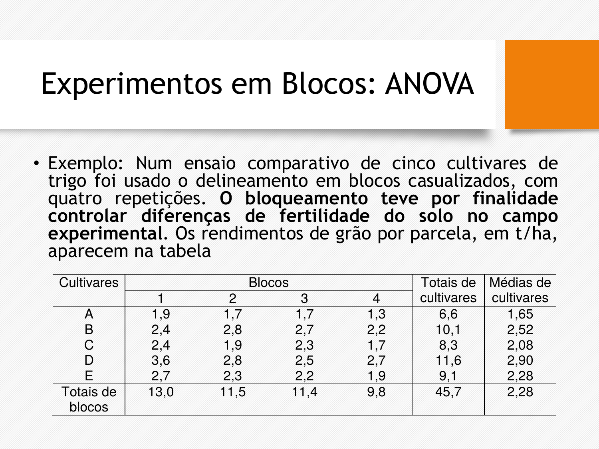

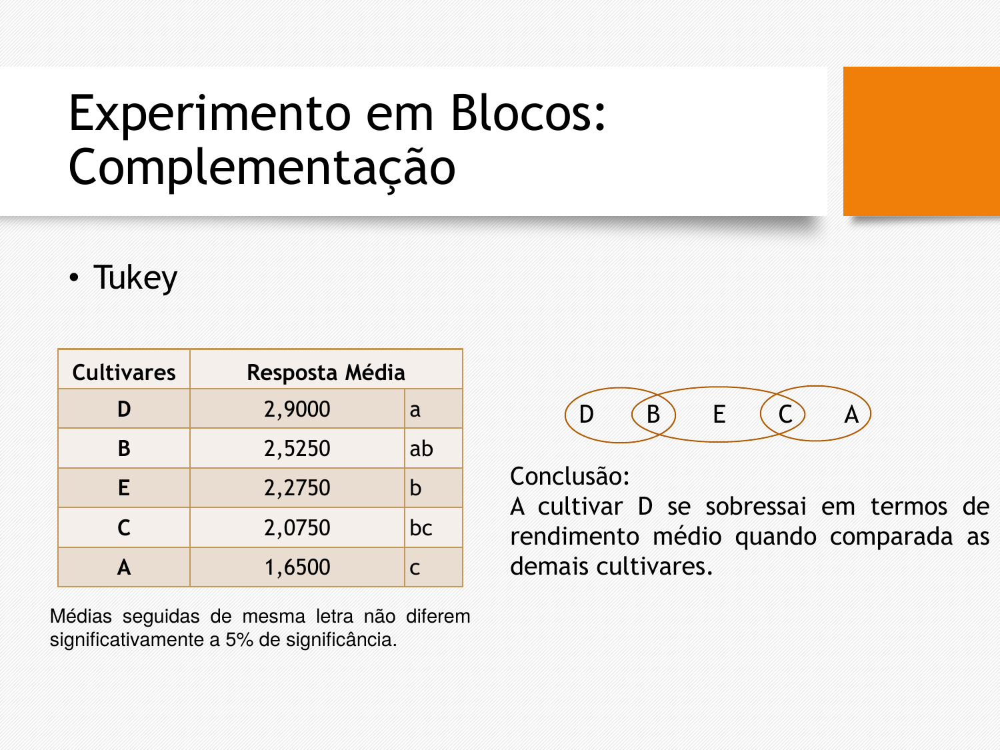

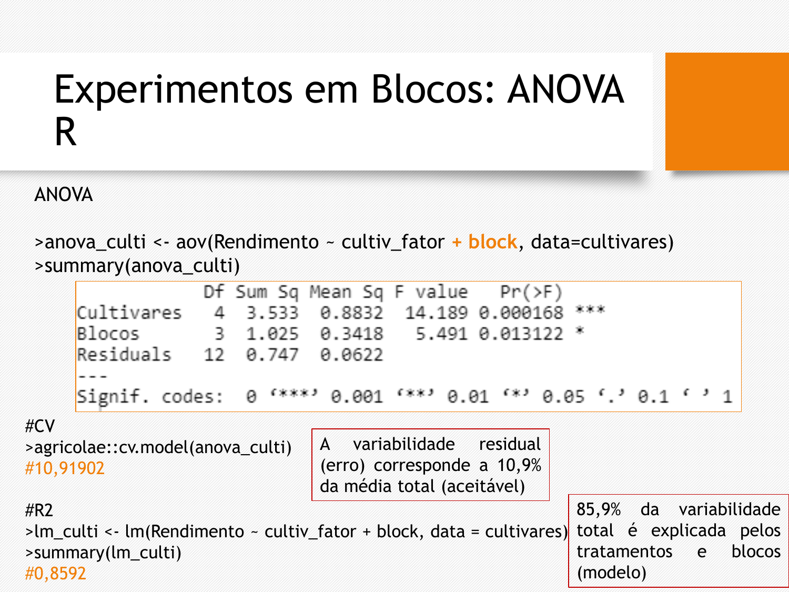

Complementando a ANOVA com o **teste de Tukey**, obtém-se o agrupamento das cultivares: D (2,90) > B (2,53), ambas superiores a E (2,28) e C (2,08), sendo A (1,65) a de menor rendimento — a cultivar D se sobressai em termos de rendimento médio quando comparada às demais.

Em R, essa análise pode ser conduzida com:

```r
anova_culti <- aov(Rendimento ~ cultiv_fator + block, data = cultivares)
summary(anova_culti)

# Teste de Tukey
agricolae::HSD.test(anova_culti, 'cultiv_fator', alpha = 0.05, console = TRUE)
plot(TukeyHSD(anova_culti))

# Coeficiente de variação e R²
agricolae::cv.model(anova_culti)
lm_culti <- lm(Rendimento ~ cultiv_fator + block, data = cultivares)
summary(lm_culti)
```

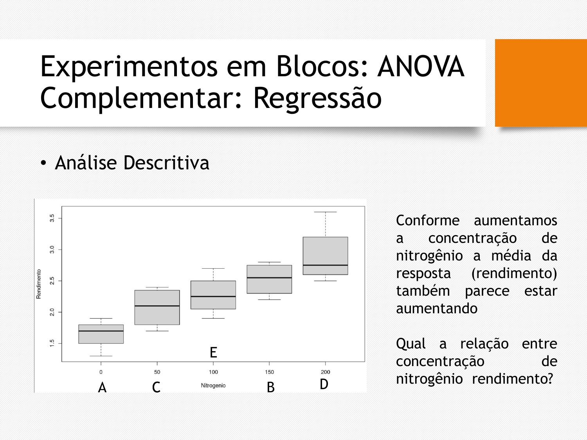

No exemplo, o coeficiente de variação foi de 10,9% (variabilidade residual aceitável) e 85,9% da variabilidade total do rendimento foi explicada pelo modelo (cultivares + blocos).

### Workflow completo em R

Reorganizando os mesmos dados em formato longo (um `Fator`, com 5 níveis, e um `Bloco`, com 4 níveis), o workflow completo — estatísticas descritivas, ajuste, diagnóstico e comparações múltiplas — fica:

```r
# Dados: rendimento (t/ha) das 5 cultivares de trigo, cada bloco com uma repetição de cada nível
dados <- data.frame(A = c(1.9, 1.7, 1.7, 1.3),
                     B = c(2.4, 2.8, 2.7, 2.2),
                     C = c(2.4, 1.9, 2.3, 1.7),
                     D = c(3.6, 2.8, 2.5, 2.7),
                     E = c(2.7, 2.3, 2.2, 1.9))

cultivares <- tidyr::pivot_longer(dados, cols = c('A','B','C','D','E'),
                                   names_to = 'Fator', values_to = 'Resposta') %>%
  mutate(Fator = factor(Fator)) %>%
  mutate(Bloco = factor(rep(1:4, each = 5)))

cultivares %>%
  group_by(Fator) %>%
  summarise(count = n(), mean = mean(Resposta), sd = sd(Resposta), median = median(Resposta))

# Ajuste da ANOVA (fator + bloco)
anova_culti <- aov(Resposta ~ Fator + Bloco, data = cultivares)
summary(anova_culti)

# Diagnóstico
par(mfrow = c(2, 2)); plot(anova_culti); par(mfrow = c(1, 1))

# Comparações múltiplas
agricolae::HSD.test(anova_culti, 'Fator', alpha = 0.05, console = TRUE)
plot(TukeyHSD(anova_culti))
```

### Exemplo lúdico em sala de aula: comparação de sabores

Um experimento em blocos casualizados também pode nascer de uma atividade simples em aula. Sete participantes provaram três sabores (A, B, C) e atribuíram uma nota a cada um — cada **participante** funciona como um bloco (controlando a variação natural do paladar de cada avaliador), e o **sabor** é o tratamento de interesse:

```r
n_alunos_participantes <- 7
n_niveis_fator <- 3  # quantidade de sabores diferentes

# Notas atribuídas por cada participante a cada sabor
dados <- data.frame(Sabor_A = c(10, 8, 7, 10, 9, 9, 5.5),
                     Sabor_B = c(7, 9, 9, 9, 10, 10, 5),
                     Sabor_C = c(8, 9, 8, 7, 9, 9, 6))

dados_reorg <- tidyr::pivot_longer(dados,
                                    cols = c('Sabor_A', 'Sabor_B', 'Sabor_C'),
                                    names_to = 'Fator', values_to = 'Notas') %>%
  mutate(Fator = factor(Fator)) %>%
  mutate(Bloco = factor(paste0('Participante_', rep(1:n_alunos_participantes, each = n_niveis_fator))))

# Estatísticas descritivas por sabor e por participante
dados_reorg %>% group_by(Fator) %>% summarise(mean = mean(Notas), sd = sd(Notas))
dados_reorg %>% group_by(Bloco) %>% summarise(mean = mean(Notas), sd = sd(Notas))

# Boxplot das notas por sabor
ggplot(dados_reorg, aes(x = Fator, y = Notas, fill = Fator)) +
  geom_boxplot(alpha = 0.7) +
  stat_summary(fun = mean, geom = "point", size = 4, color = "black") +
  theme_minimal() +
  labs(title = "Distribuição das notas por sabor", x = "Sabor", y = "Nota")

# ANOVA (Sabor + Participante como bloco)
anova_blocos <- aov(Notas ~ Fator + Bloco, data = dados_reorg)
summary(anova_blocos)

# Comparações múltiplas
agricolae::HSD.test(anova_blocos, 'Fator', alpha = 0.05, console = TRUE)
plot(TukeyHSD(anova_blocos))
```

Esse tipo de experimento didático ilustra bem a lógica do bloqueamento: ao tratar cada participante como um bloco, isolamos a variação devida ao paladar individual (alguns avaliadores dão notas sistematicamente mais altas ou mais baixas que outros) da variação devida ao sabor em si — o que aumenta a precisão da comparação entre os sabores A, B e C.

**Complementação com regressão.** Quando o tratamento é uma variável quantitativa (por exemplo, doses de nitrogênio aplicadas ao solo), a ANOVA pode ser complementada por uma análise de regressão. No exemplo do nitrogênio: $\hat{y} = 2{,}18 + 0{,}0059x$, com $R^2 = 83{,}5\%$ — a cada Kg/ha de nitrogênio aplicado, estima-se um incremento médio de 5,9 g/ha no rendimento de trigo, independente do bloco.

## Aplicação em artigo científico {#dbc-artigo}

**Artigo 3 — Nutrientes do solo em cassava (mandioca)** ([acesso ao artigo](https://irjaes.com/wp-content/uploads/2020/10/IRJAES-V5N1P211Y20.pdf)). Tratamento: tipo de nutriente no solo/matéria orgânica, com 6 níveis; blocos: 6 variedades de cassava (cada variedade recebeu os 6 tipos de matéria). Resposta: crescimento (altura) das plantas. O efeito dos diferentes tipos de matéria orgânica foi significativo (p ≈ 0,000), mas o efeito das variedades usadas como bloco **não** foi significativo (p = 0,699) — sugerindo que, neste caso específico, talvez não fosse necessário ter usado o delineamento em blocos. Pelo teste de comparação múltipla, as matérias *cattle dung*, *palm waste*, NPK e *poultry waste* não diferiram entre si, mas apresentaram crescimento médio significativamente maior do que os solos com *green manure* e placebo.

# Experimentos Fatoriais

Em um **experimento fatorial**, dois ou mais fatores de tratamento são estudados simultaneamente — os tratamentos passam a ser as combinações dos níveis dos diferentes fatores (por exemplo, em um fatorial 2×2 com fatores A e B, cada um com 2 níveis, temos 4 tratamentos: $a_1b_1$, $a_1b_2$, $a_2b_1$, $a_2b_2$). Os fatores podem ser **qualitativos** (cultivares, rações, fármacos, dietas) ou **quantitativos** (doses de nitrato, temperatura, pressão).

Experimentos fatoriais são úteis em pesquisas exploratórias, para encontrar os fatores mais importantes em novas áreas de estudo, e principalmente para investigar **interações** entre fatores: a resposta a um fator depende do nível de um ou mais dos outros fatores.

## Efeito principal, efeito simples e interação

- **Efeito simples**: efeito de um fator dentro de cada nível do outro fator.
- **Efeito principal**: média dos efeitos simples.
- **Interação**: a magnitude do efeito adicional observado em um dos fatores, na presença de cada nível do outro fator — um efeito que não é produzido por nenhum dos fatores isoladamente.

Um exemplo clássico ilustra a ideia com o tempo de aprendizagem (minutos) segundo sexo e idade:

::: {layout-ncol=2}
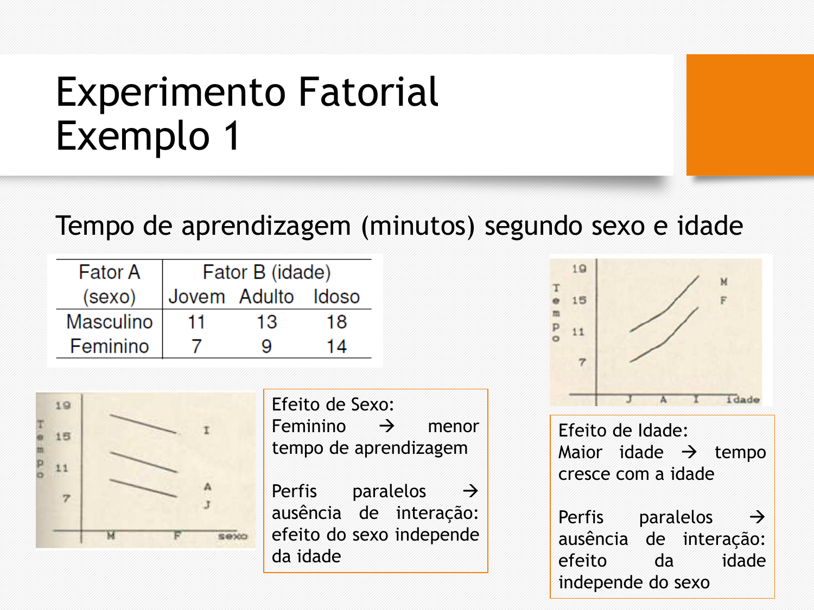

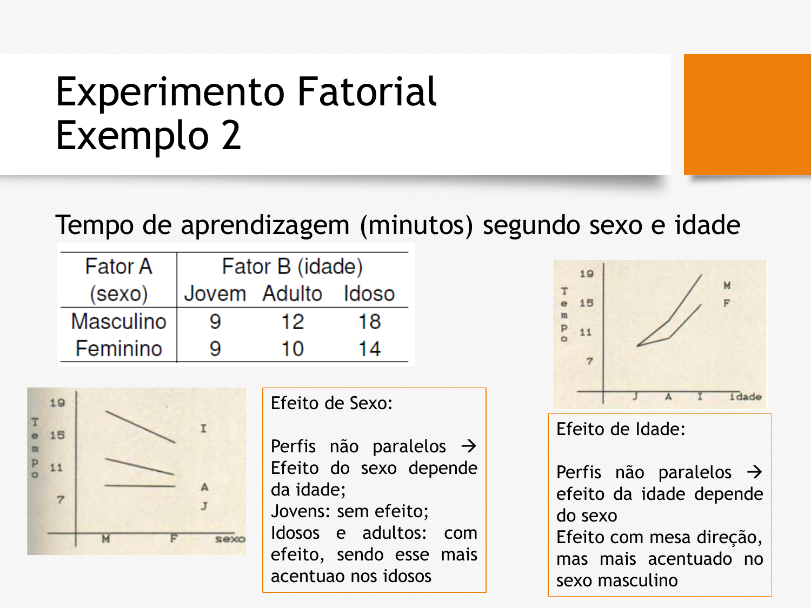
:::

Quando a interação é forte, os efeitos principais isolados podem até ser enganosos — o efeito "verdadeiro" de um fator só pode ser interpretado dentro de cada nível do outro fator.

**Vantagens** dos experimentos fatoriais: maior eficiência no uso dos recursos experimentais (permitem conclusões mais amplas sobre vários fatores simultaneamente); informação sobre interação entre fatores; e repetições intrínsecas (os níveis de um fator se repetem em cada nível do outro fator), aumentando a precisão das estimativas dos efeitos principais. **Desvantagens**: maior dificuldade em selecionar unidades experimentais homogêneas, dado o maior número de tratamentos (combinações); e, com muitos fatores, maior dificuldade na escolha e execução do delineamento.

## Exemplo: hormônio e sexo em cordeiros

Foi conduzido um experimento para avaliar o efeito do implante do hormônio Stilbestrol sobre o ganho de peso de cordeiros machos e fêmeas da raça Corriedale, em um intervalo de 180 dias após o implante.

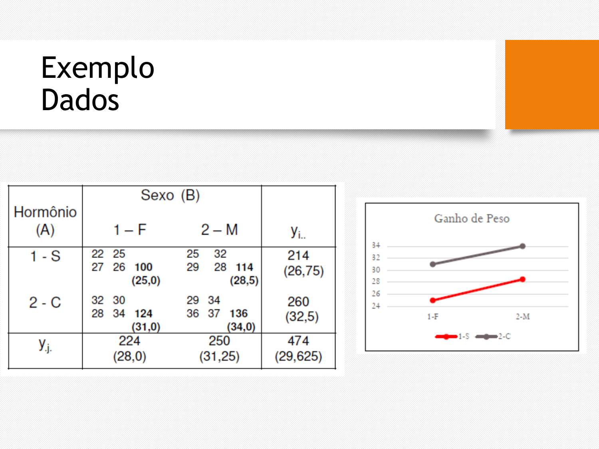

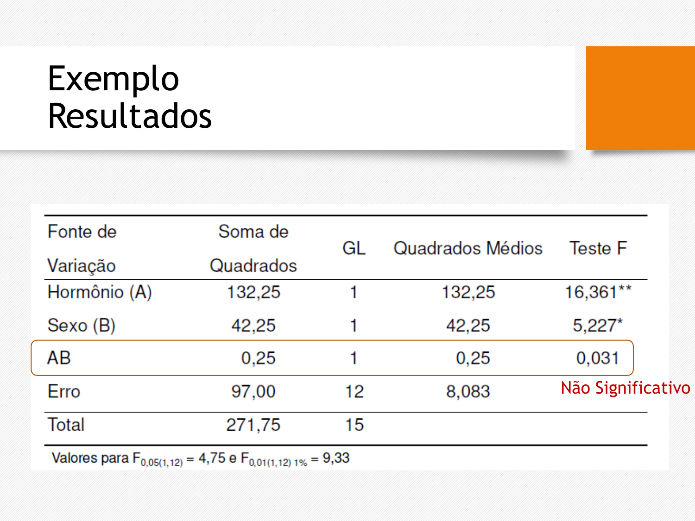

Como a interação Hormônio × Sexo não foi significativa, o efeito do hormônio não varia com o sexo (e vice-versa) — as conclusões devem se basear nos **efeitos principais**: os cordeiros que recebem hormônio ganham, em média, 5,75 kg a mais do que os que não recebem, independentemente do sexo; e há também um efeito principal significativo do sexo (diferença média de 3,25 kg).

Em R, esse exemplo pode ser reproduzido com:

```r
# Fator1: Hormônio Stilbestrol (S: Sem, C: Com); Fator2: Sexo (M, F)
dados <- data.frame(Resposta = c(22,25,27,26, 25,32,29,28, 32,30,28,34, 29,34,36,37),
                     Fator1 = c('S','S','S','S','S','S','S','S', 'C','C','C','C','C','C','C','C'),
                     Fator2 = c('F','F','F','F','M','M','M','M', 'F','F','F','F','M','M','M','M'))

# ANOVA fatorial (efeitos principais + interação)
anova_hormo <- aov(Resposta ~ Fator1 + Fator2 + Fator1:Fator2, data = dados)
summary(anova_hormo)

par(mfrow = c(2, 2)); plot(anova_hormo); par(mfrow = c(1, 1))

# Gráfico de interação (base R)
with(dados, interaction.plot(x.factor = Fator1, trace.factor = Fator2, response = Resposta,
                              fun = mean, type = "b", pch = 19,
                              xlab = "Fator1", ylab = "Resposta média", trace.label = "Fator2"))

# Comparações múltiplas para cada fator
agricolae::HSD.test(anova_hormo, 'Fator1', alpha = 0.05, console = TRUE)
agricolae::HSD.test(anova_hormo, 'Fator2', alpha = 0.05, console = TRUE)
```

## Fatorial cruzado em blocos

Quando o experimento fatorial é conduzido em blocos, a fonte de variação devida aos blocos é conhecida e controlável, reduzindo a variabilidade atribuída ao erro. Exemplo: em um experimento fatorial instalado em blocos casualizados com 4 repetições, avaliaram-se os fatores Adubo Mineral (não/sim) e Adubo Orgânico (não/sim); o bloqueamento teve por finalidade controlar diferenças de fertilidade do solo.

```r
# Resposta: rendimento; FatorA = Mineral (não/sim), FatorB = Orgânico (não/sim); 4 blocos
dados <- data.frame(Resposta = c(18, 19.6, 20.6, 19.2, 8.6, 15.0, 21, 19.6,
                                  9.4, 14.6, 18.6, 18.4, 11.4, 15.8, 20.6, 20.2),
                     Bloco = rep(c('1','2','3','4'), each = 4),
                     Mineral = rep(c('1','1','2','2'), times = 4),
                     Organico = rep(c('1','2','1','2'), times = 4))

anova_adubo <- aov(Resposta ~ Mineral + Organico + Mineral:Organico + Bloco, data = dados)
summary(anova_adubo)
plot(anova_adubo)

# Gráfico de interação (nos dois sentidos)
medias <- dados %>% group_by(Mineral, Organico) %>% summarise(Media = mean(Resposta), .groups = "drop")

ggplot(medias, aes(x = Mineral, y = Media, color = Organico, group = Organico)) +
  geom_point(size = 3) + geom_line(linewidth = 1) +
  labs(title = "Gráfico de interação", y = "Resposta média", x = "Mineral") +
  theme_minimal(base_size = 14)

# Tabela de médias e comparações múltiplas
model.tables(anova_adubo, type = "means")
agricolae::HSD.test(anova_adubo, 'Mineral', alpha = 0.05, console = TRUE)
agricolae::HSD.test(anova_adubo, 'Organico', alpha = 0.05, console = TRUE)

# Comparações múltiplas de Tukey entre as 4 combinações (efeitos simples)
library(lsmeans)
comparacoes <- lsmeans(anova_adubo, pairwise ~ Mineral/Organico, adjust = "tukey")
comparacoes
```

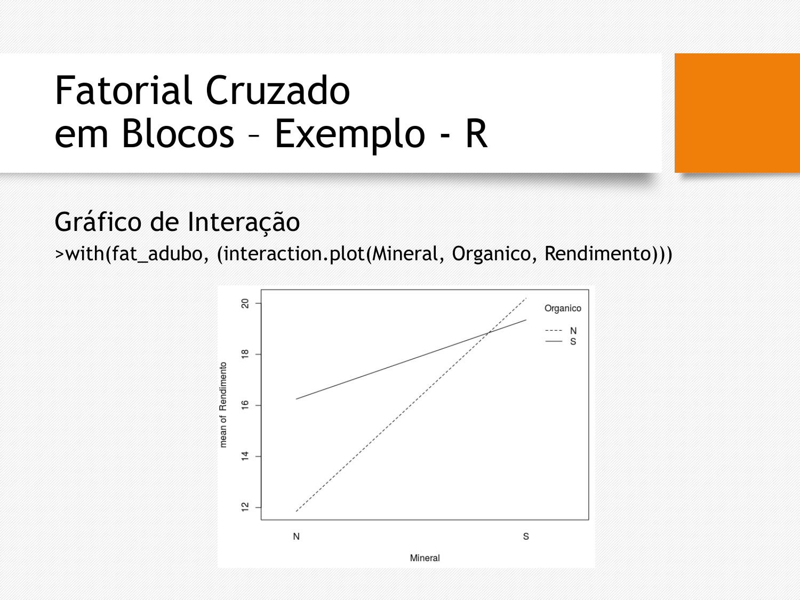

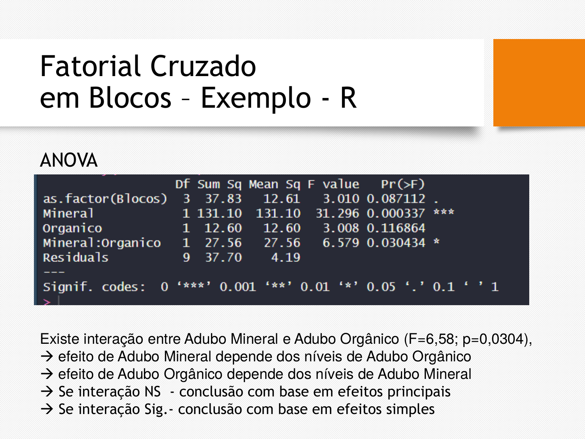

Havendo interação significativa, a conclusão deve ser baseada nos **efeitos simples** (comparações par a par entre as 4 combinações, obtidas acima com `lsmeans`), e não apenas nos efeitos principais isolados: neste exemplo, o efeito do Adubo Mineral foi mais efetivo do que o do Adubo Orgânico, sendo a aplicação de Adubo Mineral a mais indicada para maximizar o rendimento.

## Experimentos fatoriais com três fatores

O mesmo raciocínio se estende para três (ou mais) fatores simultâneos — com a diferença de que, além dos três efeitos principais, passam a existir três interações duplas (A×B, A×C, B×C) e uma interação tripla (A×B×C). Como exemplo didático dessa extensão — já que o material de Paula Bracco cobre o caso de dois fatores — usamos um exemplo clássico do livro *Design and Analysis of Experiments*, de Douglas Montgomery: um engarrafador de refrigerante deseja entender as fontes de variação na altura de enchimento das garrafas, controlando três variáveis do processo — percentual de carbonatação (Fator A: 10, 12, 14), pressão de operação da enchedora (Fator B: 25, 30) e velocidade da linha, em garrafas por minuto (Fator C: 200, 250).

```r
dados <- data.frame(
  Resposta = c(-3,-1,-1,1,-1,0,0,1,0,2,2,6,
                1,1,3,5,5,7,7,10,4,6,9,11),
  FatorA = factor(rep(c('10', '12', '14'), c(12, 8, 4))),
  FatorB = factor(rep(c('25', '25', '30', '30'), times = 6)),
  FatorC = factor(rep(c('200', '250'), times = 12))
)

# ANOVA fatorial completa: 3 efeitos principais + 3 interações duplas + 1 interação tripla
anova_drink <- aov(Resposta ~ FatorA * FatorB * FatorC, data = dados)
summary(anova_drink)

par(mfrow = c(2, 2)); plot(anova_drink); par(mfrow = c(1, 1))

# Gráficos de interação dois a dois (mantendo o terceiro fator fixo)
interaction.plot(dados$FatorA, dados$FatorB, dados$Resposta,
                  xlab = "Fator A (carbonatação)", ylab = "Resposta média", trace.label = "Fator B")
interaction.plot(dados$FatorA, dados$FatorC, dados$Resposta,
                  xlab = "Fator A (carbonatação)", ylab = "Resposta média", trace.label = "Fator C")
interaction.plot(dados$FatorB, dados$FatorC, dados$Resposta,
                  xlab = "Fator B (pressão)", ylab = "Resposta média", trace.label = "Fator C")

# Médias ajustadas para gráficos de interação por painel (usando emmeans)
library(emmeans)
medias <- as.data.frame(emmeans(anova_drink, ~ FatorA * FatorB * FatorC))

ggplot(medias, aes(x = FatorA, y = emmean, color = FatorB, group = FatorB)) +
  geom_point(size = 3) + geom_line(linewidth = 1) +
  facet_wrap(~ FatorC) +
  labs(title = "Interação Fator A × Fator B", subtitle = "Painéis por Fator C",
       x = "Carbonatação (%)", y = "Média ajustada", color = "Pressão") +
  theme_bw()
```

A leitura dos resultados segue a mesma lógica do caso com dois fatores: interpretamos primeiro a interação tripla (se significativa, as interações duplas — e os efeitos principais — devem ser interpretadas dentro de cada nível do terceiro fator); se a interação tripla não for significativa, passamos a interpretar as interações duplas; e, na ausência de qualquer interação, interpretamos diretamente os três efeitos principais.

# Delineamento em Parcelas Subdivididas

O delineamento em **parcelas subdivididas** (*split-plot*) é útil quando a aleatorização completa de todos os fatores é pouco prática. Exemplo motivador: um engenheiro quer avaliar o efeito da composição e do tempo de cozimento sobre a resistência de tijolos cerâmicos — um fatorial cruzado 4×3 completamente aleatorizado exigiria escolher ao acaso 1 composição, escolher ao acaso 1 tempo e colocar 1 tijolo no forno, repetindo esse processo 36 vezes: pouco prático e pouco econômico.

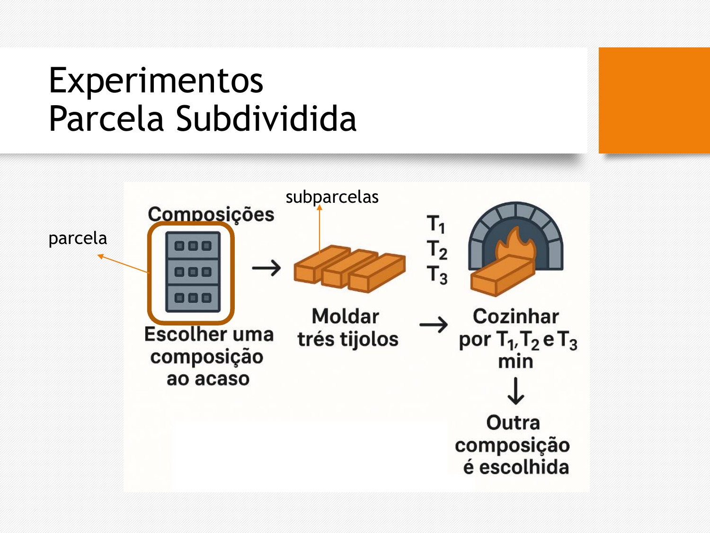

A alternativa prática — moldar todos os tijolos de uma composição de uma só vez — deixaria os efeitos da composição confundidos com as condições ambientais/temporais em que cada lote foi produzido. A solução do delineamento em parcelas subdivididas é: escolher uma composição ao acaso, moldar três tijolos e cozinhar cada um por um tempo diferente; escolher outra composição e repetir; e repetir todo o processo para as demais repetições. São feitas **duas randomizações**: primeiro, qual unidade experimental (parcela) recebe cada composição; depois, dentro de cada parcela, qual subparcela recebe cada tempo de cozimento.

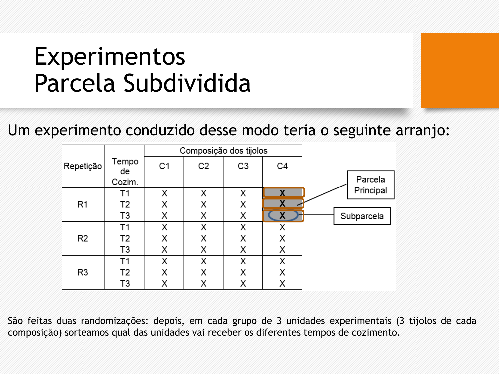

- **Parcela principal**: unidade experimental do fator alocado na parcela (neste exemplo, a composição).
- **Subparcela**: unidade experimental do fator alocado dentro da parcela (neste exemplo, o tempo de cozimento).

## Vantagens, desvantagens e quando usar

**Vantagem**: aumento da precisão das comparações entre níveis do fator alocado na subparcela e da interação entre os fatores, em relação a um fatorial cruzado equivalente. **Desvantagens**: o fator alocado na parcela principal é medido com menor precisão do que seria em um experimento fatorial; e há maior complexidade na análise estatística, principalmente quando há perda de observações.

O delineamento em parcelas subdivididas é indicado quando: um dos fatores é mais difícil de manejar/alterar (por exemplo, tipo de solo, sistema de cultivo) — esse fator vai para a parcela principal, que exige parcelas maiores; o estudo envolve medidas repetidas ao longo do tempo (avaliações semanais ou mensais — como no caso "dias após o transplantio", que veremos a seguir); há maior interesse (maior precisão desejada) em um dos fatores — esse vai para a subparcela; ou os recursos experimentais são limitados e o número de parcelas precisa ser otimizado.

## Estrutura da ANOVA

A análise se divide em duas partes — uma para a parcela principal (fator A) e outra para a subparcela (fator B e a interação A×B):

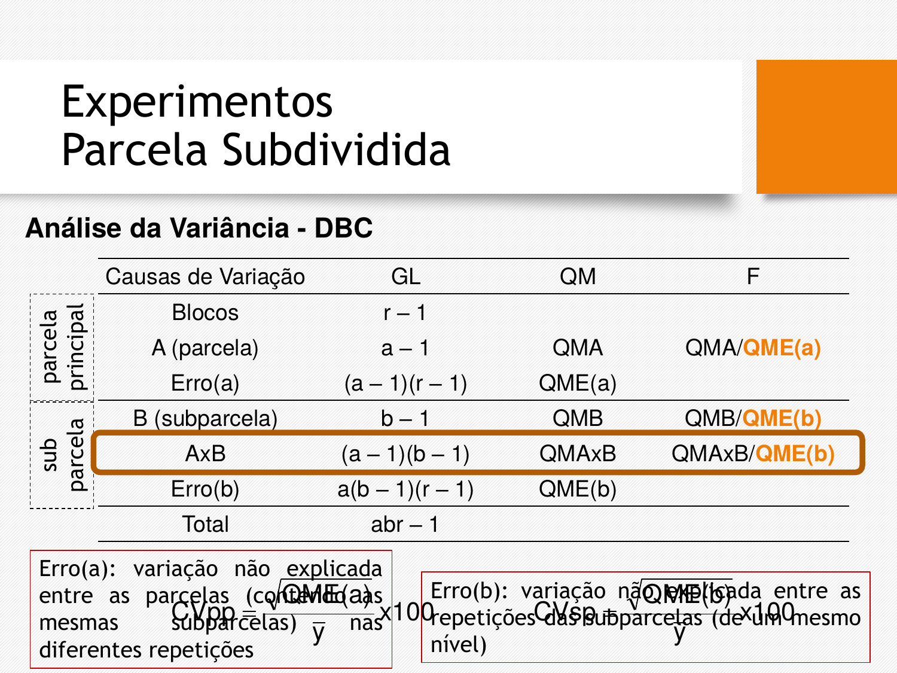

O **Erro(a)** representa a variação não explicada entre as parcelas (com as mesmas subparcelas) nas diferentes repetições, e é usado para testar o fator A (parcela principal): $F = QMA/QME(a)$. O **Erro(b)** representa a variação não explicada entre as repetições das subparcelas (de um mesmo nível de A), e é usado para testar o fator B (subparcela) e a interação A×B: $F = QMB/QME(b)$ e $F = QM_{AxB}/QME(b)$. Como o Erro(b) tende a ser menor que o Erro(a), o fator alocado na subparcela — e a interação — são estimados com maior precisão.

## Exemplo em R: resistência à tração do papel

Em R, a estrutura de dois erros (Erro(a) para a parcela principal, Erro(b) para a subparcela) é declarada explicitamente com o termo `Error()` dentro do `aov()`. O exemplo a seguir — também um clássico do livro de Montgomery — avalia a resistência à tração do papel em função do método de preparo da polpa (fator da parcela principal, 3 níveis) e da temperatura de cozimento (fator da subparcela, 4 níveis), em 3 repetições (blocos):

```r
# Whole-plot factor: método de preparo da polpa (3 níveis)
# Subplot factor: temperatura de cozimento (4 níveis)
# Réplicas (blocos): 3
paper <- data.frame(
  Replicate = factor(rep(1:3, each = 12)),
  Method = factor(rep(rep(c(1,2,3), each = 4), 3)),
  Temperature = factor(rep(c(200,225,250,275), 9)),
  Strength = c(
    # Réplica 1
    30,35,37,36,  34,41,38,42,  29,26,33,36,
    # Réplica 2
    28,32,40,41,  31,36,42,40,  31,30,32,40,
    # Réplica 3
    31,37,41,40,  35,40,39,44,  32,34,39,45
  )
)

# Erro(a) = Replicate/Method (parcela principal); Erro(b) = resíduo (subparcela)
paper.aov <- aov(Strength ~ Method * Temperature + Error(Replicate/Method), data = paper)
summary(paper.aov)
```

A saída do `summary()` retorna duas tabelas de ANOVA separadas — uma dentro de `Error: Replicate:Method` (o Erro(a), usado para testar o efeito do Método) e outra dentro de `Error: Within` (o Erro(b), usado para testar o efeito da Temperatura e a interação Método×Temperatura) — exatamente a estrutura de dois estratos de erro apresentada acima.

## Exemplo de referência: métodos de plantio e espaçamento em soja

Um experimento avaliou o efeito de Métodos de Plantio (4 níveis: convencional — M1, plantio direto com herbicida A — M2, B — M3, C — M4) e Espaçamento entre linhas em cm (4 níveis: 17, 34, 51 e 68 — E1 a E4) sobre o rendimento de soja. Os métodos de plantio constituíram as parcelas principais, arranjadas em blocos casualizados com 4 repetições, e os espaçamentos, as subparcelas (4 repetições por parcela; 16 repetições por subparcela).

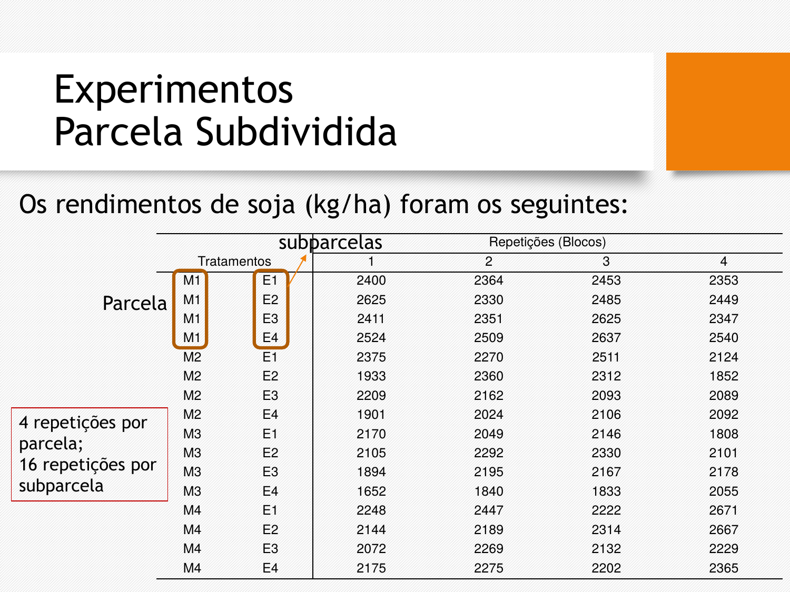

## Aplicação em artigo científico {#split-plot-artigo}

**Cobertura de solo (TNT) e dias após o transplantio em planta ornamental** ([DOI: 10.1590/S1806-66902013000400016](https://doi.org/10.1590/S1806-66902013000400016)). Nas parcelas, os tratamentos se constituíram de dois sistemas de cultivo (com e sem cobertura de solo em polipropileno preto, TNT); nas subparcelas, as épocas de amostragem das plantas: 14, 28, 42, 56, 70, 84, 98 e 112 dias após o transplantio (DAT), com 4 repetições. Foram avaliados o acúmulo de massa seca em diferentes partes da planta, área foliar e taxas de crescimento.

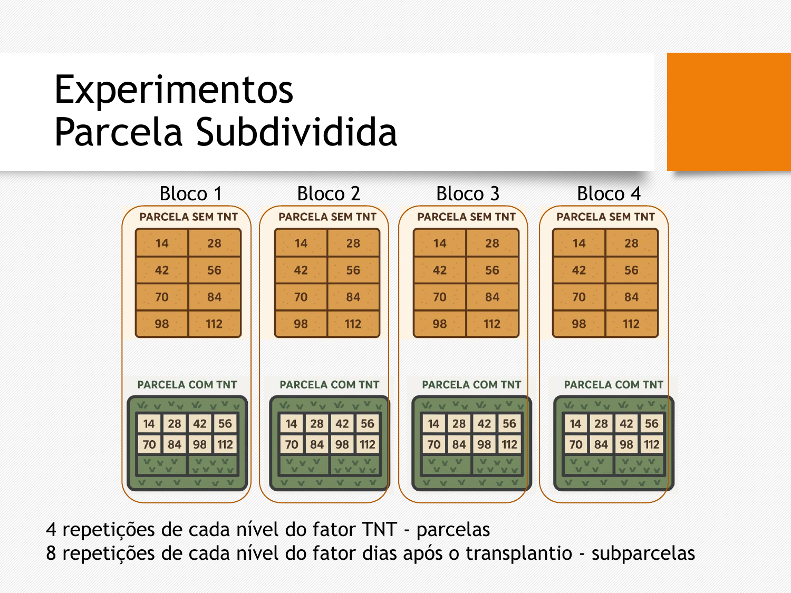

**Principais resultados**: o efeito de TNT (fator da parcela principal) não foi significativo para nenhuma das respostas avaliadas, e não houve interação significativa entre TNT e dias após o transplantio — ou seja, a cobertura de solo não influenciou o acúmulo de massa seca, a área foliar ou as taxas de crescimento. Já o efeito de dias após o transplantio (fator da subparcela, quantitativo) foi significativo para praticamente todas as respostas, sendo complementado por análise de regressão: por exemplo, os frutos se comportaram como dreno preferencial da planta, chegando ao final do ciclo (112 DAT) com 47,77% do total da massa seca acumulada.

# Exercício complementar: ANOVA em R

Como exercício de fixação, considere um DCC avaliando o efeito de 5 concentrações de um determinado composto (15, 20, 25, 30 e 35) sobre a resistência de fibras de algodão, com 5 repetições cada:

```r
dados <- NULL
dados$Concentracao <- c(15,15,15,15,15,20,20,20,20,20,25,25,25,25,25,30,30,30,30,30,35,35,35,35,35)
dados$Repeticao <- c(1,2,3,4,5,1,2,3,4,5,1,2,3,4,5,1,2,3,4,5,1,2,3,4,5)
dados$Resistencia <- c(7,7,15,11,9,12,17,12,18,18,14,18,18,19,19,19,25,22,19,23,7,10,11,15,11)
dados <- as.data.frame(dados)

# ANOVA (DCC)
anova <- aov(Resistencia ~ factor(Concentracao), data = dados)
summary(anova)

# Comparações múltiplas de Tukey
library(agricolae)
tukey_res <- HSD.test(anova, trt = 'factor(Concentracao)')
tukey_res
```

Script completo disponível para download na seção de materiais abaixo.

# Materiais e Referências {#materiais-e-referências}

O conteúdo desta página foi construído a partir do material didático "Análise de Variância" elaborado por **Paula Bracco**, adaptado do material da prof. Lisiane Selau. Slides originais (PDF):

- [1. Introdução aos Experimentos](https://github.com/renanxcortes/teaching/raw/refs/heads/main/Metodos_Estatisticos/slides/anova/1_introducao_experimentos.pdf)
- [2. Delineamento Inteiramente Casualizado (DCC)](https://github.com/renanxcortes/teaching/raw/refs/heads/main/Metodos_Estatisticos/slides/anova/2_dcc.pdf)
- [3. Delineamento em Blocos Completos (DBC)](https://github.com/renanxcortes/teaching/raw/refs/heads/main/Metodos_Estatisticos/slides/anova/3_blocos_completos.pdf)
- [4. Experimentos Fatoriais](https://github.com/renanxcortes/teaching/raw/refs/heads/main/Metodos_Estatisticos/slides/anova/4_experimentos_fatoriais.pdf)
- [5. Experimentos em Parcela Subdividida](https://github.com/renanxcortes/teaching/raw/refs/heads/main/Metodos_Estatisticos/slides/anova/5_parcela_subdividida.pdf)
- [Script R: exemplo de ANOVA (resistência de fibras de algodão)](https://github.com/renanxcortes/teaching/raw/refs/heads/main/Metodos_Estatisticos/slides/anova/algodao_resistencia.R)

Os demais exemplos em R reproduzidos ao longo da página vêm da coleção de scripts do professor (pasta `codigos/`, prefixo `area_3`):

- [Script: ANOVA no DCC (variedades de cana-de-açúcar)](https://github.com/renanxcortes/teaching/raw/refs/heads/main/Metodos_Estatisticos/codigos/anova/area_3_1_anova_DCC.R)
- [Script: ANOVA no DBC (cultivares de trigo)](https://github.com/renanxcortes/teaching/raw/refs/heads/main/Metodos_Estatisticos/codigos/anova/area_3_2_anova_DCC_blocos_casualizados.R)
- [Script: ANOVA no DBC — experimento lúdico (comparação de sabores)](https://github.com/renanxcortes/teaching/raw/refs/heads/main/Metodos_Estatisticos/codigos/anova/area_3_2_anova_DCC_blocos_casualizados_experimento_ludico.R)
- [Script: experimentos fatoriais com dois fatores (hormônio×sexo; adubo mineral×orgânico em blocos)](https://github.com/renanxcortes/teaching/raw/refs/heads/main/Metodos_Estatisticos/codigos/anova/area_3_3_fatorial_dois_fatores.R)
- [Script: experimentos fatoriais com três fatores](https://github.com/renanxcortes/teaching/raw/refs/heads/main/Metodos_Estatisticos/codigos/anova/area_3_4_fatorial_tres_fatores.R)
- [Script: parcela subdividida / split-plot](https://github.com/renanxcortes/teaching/raw/refs/heads/main/Metodos_Estatisticos/codigos/anova/area_3_5_split_plot.R)

**Artigos científicos utilizados como exemplos de aplicação:**

- Enxertia em mudas de baruzeiro — [DOI: 10.5902/1980509869090](https://doi.org/10.5902/1980509869090)
- Irrigação em feijão-vagem — [DOI: 10.1590/S0100-69162011000200012](https://doi.org/10.1590/S0100-69162011000200012)
- Nutrientes do solo em cassava (mandioca) — [artigo completo](https://irjaes.com/wp-content/uploads/2020/10/IRJAES-V5N1P211Y20.pdf)
- Cobertura de solo (TNT) em planta ornamental — [DOI: 10.1590/S1806-66902013000400016](https://doi.org/10.1590/S1806-66902013000400016)
